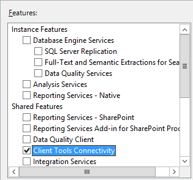

::: moniker range=">= tfs-2017"
   
::: moniker-end 

::: moniker range="<=tfs-2015"
If you're installing TFS 2015 or earlier version, install SQL Server Client Tools Connectivity on the application-tier server.

::: moniker-end 