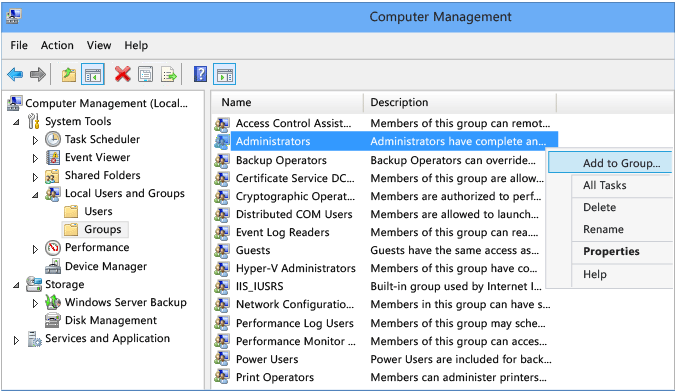
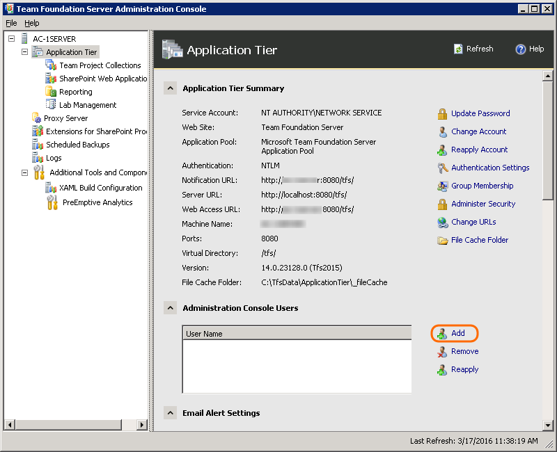

# Add server-level administrators to Azure DevOps on-premises

[!INCLUDE [temp](../_shared/version-tfs-all-versions.md)]

Azure DevOps provides three built-in security groups and one role to manage administrative tasks. They correspond to: 

- Team administrator role  
- Project Administrator group  
- Project Collection Administrator group  
- Azure DevOps Server or TFS Server Administrators group

This article describes how to add users to the Azure DevOps Server or TFS Server Administrators group. For information on adding users to other admin groups or roles, see the following: 

- [Set permissions at the project- or collection-level](/azure/devops/security/set-project-collection-level-permissions).
- [Add a team administrator](/azure/devops/settings/add-team-administrator).

For an overview of administrative tasks, see [About user, team, project, and collection-level settings](/azure/devops/settings/about-settings).

## Prerequisites 

- You must be a member of the Azure DevOps Server or TFS Server Administrators group in order to add a user to this group. 
 
## Add a user to the server administrators group

To perform system maintenance, schedule backups, add functionality, and other server administrative tasks,
TFS server administrators must be able to configure and control all aspects of TFS.
As a result, TFS server administrators require administrative permissions
in the software that TFS inter-operates with, in addition to TFS itself.

You can quickly grant these permissions to administrators by adding them to the **Team Foundation Administrators**
group in Team Foundation Server (TFS).

1. On the application-tier server, add the user to the local Administrators group.

   

2. In the TFS administration console and add the user to the set of users who can run the administration console.

   

   If you're running a standard single-server deployment,
   or a multi-server deployment without SharePoint or reporting, that's it!
   However, if you have multiple application tiers,
   you'll need to repeat these two steps on every application tier server.

   ::: moniker range="<= azure-devops-2019"
   And if you have reporting or other servers integrated with your Azure DevOps deployment,
   you might need to manually add administrative users to those products separately. 
   ::: moniker-end

   ::: moniker range="<= tfs-2017"
   And if you have SharePoint or reporting on other servers,
   you might need to manually add administrative users to those products separately. 
   ::: moniker-end

## Related articles 

::: moniker range=">= tfs-2018"  
- [About user, team, project, and collection-level settings](/azure/devops/settings/about-settings)  
- [Quickstart: Get started as an administrator in Azure DevOps](/azure/devops/user-guide/project-admin-tutorial)  
- [Change access levels](/azure/devops/security/change-access-levels)  
- [Grant permissions to view or create SQL Server reports in TFS](/azure/devops/report/admin/grant-permissions-to-reports)  

::: moniker-end  

::: moniker range="<= tfs-2017"  
- [About user, team, project, and collection-level settings](/azure/devops/settings/about-settings)  
- [Quickstart: Get started as an administrator in Azure DevOps](/azure/devops/user-guide/project-admin-tutorial)  
- [Change access levels](/azure/devops/security/change-access-levels)  
- [Grant permissions to view or create SQL Server reports in TFS](/azure/devops/report/admin/grant-permissions-to-reports)  
- [Set SharePoint site permissions](/azure/devops/security/set-sharepoint-permissions)  

::: moniker-end