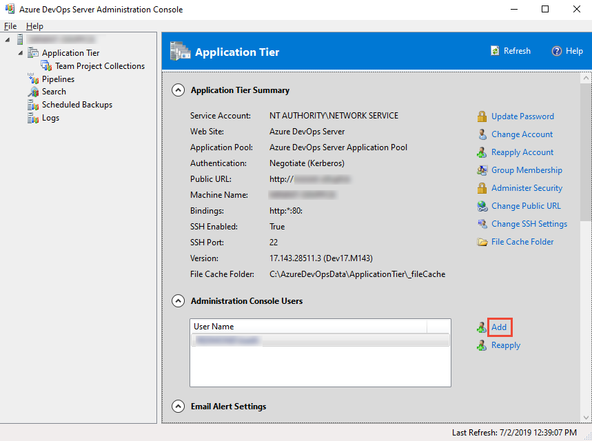

# Add server-level administrators to Azure DevOps Server

[!INCLUDE [temp](../_shared/version-tfs-all-versions.md)]

Azure DevOps provides one built-in role and three security groups to manage administrative tasks: 

- Team administrator role  
- Project Administrator group  
- Project Collection Administrator group  
- Team Foundation Administrators group

This article describes how to add users to the Team Foundation Administrators group. For information on adding users to other admin groups or roles, see: 

- [Set permissions at the project- or collection-level](/azure/devops/organizations/security/set-project-collection-level-permissions).
- [Add a team administrator](/azure/devops/organizations/settings/add-team-administrator).

For an overview of administrative tasks, see [About user, team, project, and collection-level settings](/azure/devops/settings/about-settings).

## Prerequisite

You must be a member of the Team Foundation Administrators group to add a user to this group. 
 
## Add a user to the server administrators group

To perform system maintenance, schedule backups, add functionality, and other server administrative tasks,
Azure DevOps Server administrators must be able to configure and control all aspects of Azure DevOps Server.
As a result, Azure DevOps Server administrators require administrative permissions
in the software that Azure DevOps Server inter-operates with, in addition to Azure DevOps Server itself.

You can quickly grant these permissions to administrators by adding them to the **Team Foundation Administrators**
group in Azure DevOps Server.

1. On the application-tier server, add the user to the local Administrators group.

   

2. In the Azure DevOps Server administration console, add the user to the set of users who can run the administration console.

::: moniker range="azure-devops-2019"

   [!div class="mx-imgBorder"]  
      

::: moniker-end

   

If you're running a standard single-server deployment,
or a multi-server deployment without SharePoint or reporting, you're done!

However, if you have multiple application tiers,
you'll need to repeat these two steps on every application tier server.

::: moniker range=">= tfs-2013"

If you have reporting or other servers integrated with your Azure DevOps deployment,
you may need to manually add administrative users to those products separately. 

::: moniker-end

::: moniker range="<= tfs-2017"

If you have SharePoint Products on other servers,
you may need to manually add administrative users to those products separately. 

::: moniker-end

## Related articles 

::: moniker range=">= tfs-2018"  

- [About user, team, project, and collection-level settings](/azure/devops/settings/about-settings)  
- [Quickstart: Get started as an administrator in Azure DevOps](/azure/devops/user-guide/project-admin-tutorial)  
- [Change access levels](/azure/devops/security/change-access-levels)  
- [Grant permissions to view or create SQL Server reports in Azure DevOps Server](/azure/devops/report/admin/grant-permissions-to-reports)  

::: moniker-end  

::: moniker range="<= tfs-2017"  

- [About user, team, project, and collection-level settings](/azure/devops/settings/about-settings)  
- [Quickstart: Get started as an administrator in Azure DevOps](/azure/devops/user-guide/project-admin-tutorial)  
- [Change access levels](/azure/devops/security/change-access-levels)  
- [Grant permissions to view or create SQL Server reports in Azure DevOps Server](/azure/devops/report/admin/grant-permissions-to-reports)  
- [Set SharePoint site permissions](/azure/devops/security/set-sharepoint-permissions)  

::: moniker-end