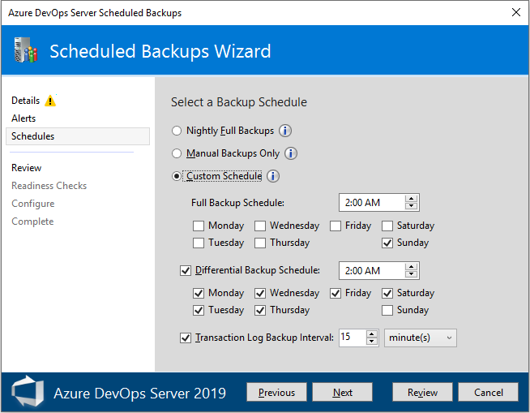
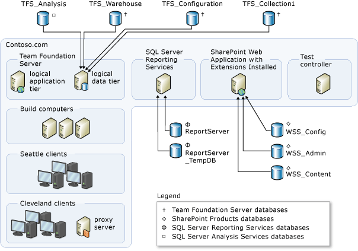

# Back up and restore databases 

[!INCLUDE [temp](../../_shared/version-tfs-all-versions.md)]

You should back up the databases for your Azure DevOps Server regularly, to lessen the risk of losing productivity or data due to equipment failure or other unexpected events. The **Scheduled Backups Wizard** makes it easy to back up your databases, which are part of the Azure DevOps Server data tier and are stored in SQL Server. All the information required for restoring an Azure DevOps Server deployment is stored in those databases. There's no need to back up Azure DevOps client computers or application-tier servers.

::: moniker range=">= azure-devops-2019"

  

::: moniker-end

::: moniker range="<= tfs-2018"

  

::: moniker-end

For an overview of Azure DevOps databases, see [Understand backing up Azure DevOps Server](backup-db-architecture.md). The following articles provide procedures for backing up and restoring Azure DevOps Server databases.

::: moniker range=">= azure-devops-2019"

> [!div class="mx-tdCol2BreakAll"]
>
> | Task | Procedures |
> | --- | --- |
> |**Back up your data** |<ul><li>[Create a backup schedule and plan](config-backup-sched-plan.md)</li><li>[Manually back up Azure DevOps Server](manually-backup-tfs.md)</li></ul> |
> | **Restore databases from backup**|<ul><li>[Restore a deployment to new hardware](tut-single-svr-home.md)</li><li>[Restore data to the same location](restore-data-same-location.md)</li></ul>  |
> | **Recover from a hardware failure on the application tier** |<ul><li>[Restore an application-tier server](restore-application-tier-server.md)</li><li>[Refresh the data caches on client computers](refresh-data-caches.md)</li></ul>  | 

::: moniker-end

::: moniker range=">= tfs-2017 <= tfs-2018"

> [!div class="mx-tdCol2BreakAll"]
>
> | Task | Procedures |
> | --- | --- |
> |**Back up your data** |<ul><li>[Create a backup schedule and plan](config-backup-sched-plan.md)</li><li>[Manually back up Azure DevOps Server](manually-backup-tfs.md)</li></ul> |
> | **Restore databases from backup**|<ul><li>[Restore a deployment to new hardware](tut-single-svr-home.md)</li><li>[Restore data to the same location](restore-data-same-location.md)</li></ul>  |
> | **Recover from a hardware failure on the application tier** |<ul><li>[Restore an application-tier server](restore-application-tier-server.md)</li><li>[Refresh the data caches on client computers](refresh-data-caches.md)</li></ul>  | 

::: moniker-end

::: moniker range="<= tfs-2015"

> [!div class="mx-tdCol2BreakAll"]
>
> | Task | Procedures |
> | --- | --- |
> |**Back up your data** |- [Create a backup schedule and plan](config-backup-sched-plan.md) - [Manually back up Azure DevOps Server](manually-backup-tfs.md) |
> | **Restore databases from backup**|- [Restore a deployment to new hardware](tut-single-svr-home.md) - [Restore data to the same location](restore-data-same-location.md) |
> | **Recover from a hardware failure on the application tier** |- [Restore an application-tier server](restore-application-tier-server.md) - [Refresh the data caches on client computers](refresh-data-caches.md) | 
> | **Back up and restore Lab Management** |  - [Restore Lab Management components](restore-lab-management-components.md) |

::: moniker-end

<a name="same-server" />

## Restore data to the same server
You can restore data from a backup to the same server and instance of SQL Server for Azure DevOps Server from which that data was backed up. For example, you might want to restore a corrupted set of databases to the last known good state.

::: moniker range="tfs-2013"

> [!TIP]
> If your original deployment used the Enterprise or Datacenter editions of SQL Server, and you want to restore databases to a server running Standard edition, you must use a backup set that was made with SQL Server compression disabled. To turn off compression, follow the steps in this [Microsoft Knowledge Base article](http://go.microsoft.com/fwlink/?LinkId=253758).

::: moniker-end

To restore data to another server or another instance of SQL Server, see [Restore a deployment to new hardware](tut-single-svr-home.md). 

::: moniker range="<= tfs-2017"

> [!NOTE]   
> If you use SharePoint Products in your deployment, when you restore data, you do not have to restore the websites that are automatically generated based on the data for each project. The data for the project portals is contained in the restored databases.

::: moniker-end

The steps to restore data to the same server or servers vary based on how Azure DevOps Server is installed and configured. The procedures in this article are structured for a moderately complex deployment of Azure DevOps Server, as the following illustration shows:

If your topology does not entirely match this example, you may have to adjust the steps in this procedure. For example, if you have a deployment where all components are installed on a single physical server, you would perform all procedures on that server. If databases for project collections are deployed on more than one server, perform the steps to restore each collection database on the appropriate server. For more information about which components might be deployed on each server, see the following articles:

- [Understand Azure DevOps Server databases, deployment topologies, and backup](backup-db-architecture.md) 
- [Azure DevOps Server architecture](../../architecture/architecture.md)
- [Examples of simple topology](../../architecture/examples-simple-topo.md)
- [Examples of moderate topology](../../architecture/examples-moderate-topo.md) 
- [Examples of complex topology](../../architecture/examples-complex-topo.md) 

<a name="diff-server" />

## Restore data to a different server

You can restore the data for your deployment of Azure DevOps Server to a different server or instance from where it was
originally stored. For
example, you want to upgrade your data-tier server, or hardware on the
original server failed. To help ensure successful recovery of data in
this scenario, you should configure marked transactions as part of your
backup strategy. For more information, see [Back up Azure DevOps Server](manually-backup-tfs.md).

To restore data to a different server, you must perform different
steps than those that you perform to restore data to the same server.
For more information about how to restore data to the same server or
servers, see [Restore data to the same location](restore-data-same-location.md). For
information about how to restore a single-server deployment after
hardware fails, see [Restore a single server deployment to new hardware](tut-single-svr-home.md). If your deployment uses
SharePoint Products, you must perform additional steps to back up and
restore its databases, as described in the procedures in this article.

<!--- QUESTION: THIS APPEARS TO NO LONGER BE AVAILABLE 
> [!NOTE]   
> You can automate some procedures in this articles by using wizards provided with in the
> September 2010 release of power tools for Azure DevOps Server. These
> wizards help simplify the process for backing up and restoring your
> deployment. However, they do not help back up or restore Visual Studio
> Lab Management, and you should not use them to back up or restore the
> databases for SharePoint Products or Microsoft Project Server. For more
> information, see the following page on the Microsoft website: [Azure DevOps Server Power Tools September 2010](http://go.microsoft.com/fwlink/?LinkId=202027).      

-->            

The steps to restore data to different servers or
instances vary, based on how Azure DevOps Server is installed and
configured. For example, the procedures in this article apply to restoring only the databases for Azure DevOps
Server in a moderately complex deployment, as the following illustration
shows:

Your topology does not have to match this example to
follow the procedures in this article, but you may have to
adjust the steps. For example, if your deployment has all
components installed on a single physical server, perform
all procedures on the server that is running Azure DevOps Server. If
databases for project collections were originally deployed on more
than one server, perform the steps to restore each database on
the server or servers that you specify. You do not have to restore the
databases in the same configuration as before, but you must restore each
database. You must also restore the databases for SharePoint Products,
Microsoft Project Server, and SQL Server Reporting Services in some
cases, such as if they were all hosted on a server that failed. For more
information about which components might be deployed on each server, see
the following articles:

-   [Understanding backing up Azure DevOps Server](backup-db-architecture.md)
-   [Azure DevOps Server architecture](../../architecture/architecture.md)
-   [Examples of simple topology](../../architecture/examples-simple-topo.md)
-   [Examples of moderate topology](../../architecture/examples-moderate-topo.md)
-   [Examples of complex topology](../../architecture/examples-complex-topo.md)

## Q & A

**Q: Where can I learn more about backups in Azure DevOps Server?**

**A:** You can learn more about the kinds of backups available in [Understand Azure DevOps Server databases, deployment topologies, and backup](backup-db-architecture.md).

**Q: Are there situations where I wouldn't want to use the Scheduled Backups tool?**

**A:** The Scheduled Backups tool is designed to meet the needs of most deployments. You might need to configure backups manually if your deployment has security restrictions that prevent the use of the tool or has other requirements for backing up databases (for example, for auditing purposes). For more information, see [Manually back up Azure DevOps Server](manually-backup-tfs.md).

**Q: I deployed Azure DevOps Server across multiple servers. How do I restore it?**

**A:** The steps for restoring Azure DevOps Server in a multiple-server deployment are essentially the same as described in the tutorial for [restoring data to a single server](tut-single-svr-home.md). The process is also the same as the process described in a [restoration-based move](../move-clone-hardware.md).

**Q: Can I move Azure DevOps Server?**

**A:** Yes, you can [move Azure DevOps Server to new hardware](../move-clone-hardware.md). You can also [change its environment](../move-across-domains.md), such as its domain.

**Q: Data-tier? Application-tier? What are those? Where can I learn more about Azure DevOps Server architecture?**

**A:** Learn more about how Azure DevOps Server works in [Azure DevOps Server architecture](../../architecture/architecture.md).

**Q: Can't I just touch up the databases manually?**

**A:** No. Unless you are following the procedure for [manually backing up the databases](manually-backup-tfs.md), modifying any Azure DevOps Server database can invalidate your support agreement. It can cause data loss, make it impossible to upgrade or patch Azure DevOps Server, or cause other severe problems.

