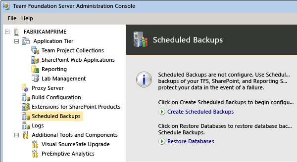
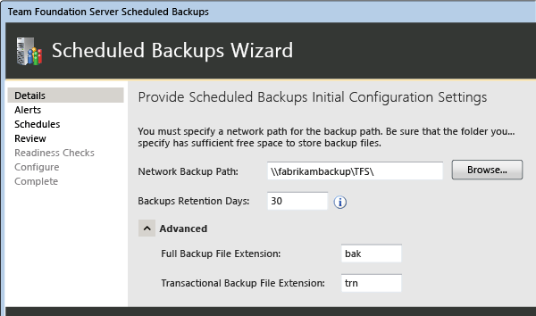
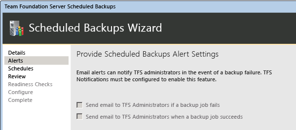
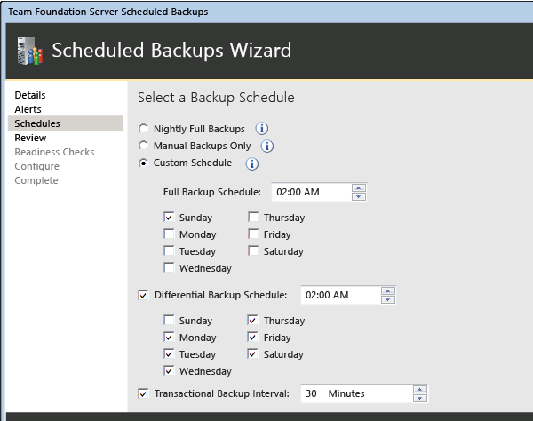
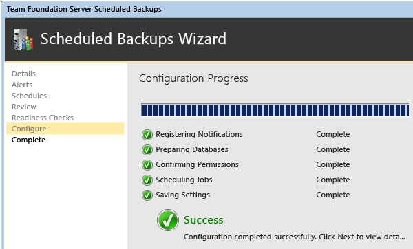

# Configure a backup schedule and plan for Team Foundation Server

[!INCLUDE [temp](../../_shared/version-tfs-all-versions.md)]

If you administer systems, you're probably already familiar with all the
reasons why a good backup set is crucial. No one wants to be the
administrator of a server that goes down without a complete set of
backups in place. Fortunately, you can back up data for your Azure DevOps on-premises deployment by using the
Scheduled Backups tool in the administration console. If you regularly
back up [these databases](backup-db-architecture.md), you reduce the risk of losing productivity or
data because of equipment failure or other unexpected events. 

::: moniker range="<= tfs-2017"
Unlike
previous methods, this tool also backs up the SharePoint databases that
TFS uses, if TFS is configured to use SharePoint.
::: moniker-end

> [!Important]
> If you are using the Enterprise or Datacenter edition of SQL Server and
> you want to restore the collection and configuration databases to a
> Standard edition of SQL Server, then before you make the backup, you
> must turn off SQL Server compression by following the steps in the
> [Microsoft Knowledge Base article](http://go.microsoft.com/fwlink/?LinkId=253758).

## Create a backup

1.  If you're not an administrator for Azure DevOps, a member of the SQL Server
    System Administrators group, and (if your deployment uses
    SharePoint Products) a member of the Farm Administrators group, [get those permissions now](../add-administrator.md).

    In addition, the Azure DevOps service account (TFSService) must have SQL
    Server Perform Back Up and Create Maintenance Plan permissions set
    to Allow on each instance of SQL Server that hosts the databases
    that you want to back up, and Full Control on the network share,
    folder, or storage device where the backups will be kept.

2.  Open the Azure DevOps Server Administration Console, choose the **Scheduled Backups** page, and launch the wizard for
    creating a backup schedule.

    

3.  Backups must be stored on a network-accessible location, and both the account that configures the scheduled backup and the Azure DevOps service TFS must have Full Control for that location. You can
    also choose how long a backup set will be kept and the file
    extensions used for backup types.

    

4.  If your server is configured with SMTP support, you can select email
    alerts for specific events. If not, all selections will be dimmed.

    

5.  Choose between two default schedules, or create your own
    custom schedule.

    

6.  Complete the wizard. If your deployment uses reporting, you will be
    prompted for a password in order to back up the encryption key
    for reporting.

    

7.  Once you've configured the scheduled backups, you can allow them
    to run as scheduled. You can also choose to take an immediate
    backup, which will back up your data right away while leaving your
    plan in place. This is particularly recommended if your scheduled
    backups will not occur for a significant amount of time, or if you
    do not already have a recent backup available.

> [!Note]
> If another administrator chooses to take an immediate backup, that 
> administrator must also have Full Control on the location where the
> backups are saved.                                                 

## Q and A

###Q: Where can I learn more about backups?

**A:** You can learn more about the kinds of
backups available in [Understand backing up Team Foundation Server](backup-db-architecture.md)

### Q: I don't want to use the Scheduled Backups tool. Are there other methods for backing up the system?

**A:** Yes. You can [manually create backup plans](manually-backup-tfs.md).

### Q: How do I restore from backups?

**A:** You use the **Restore** tool, but the steps
vary depending on whether you need to [restore data to a new server](tut-single-svr-home.md), or whether
you want to [restore data to the same server](restore-data-same-location.md).

### Q: Can I move my application-tier server(s)? 

**A:** Yes, you can [move Azure DevOps Server to new hardware](../move-clone-hardware.md). You can
also [change its environment](../move-across-domains.md), such as
its domain.

