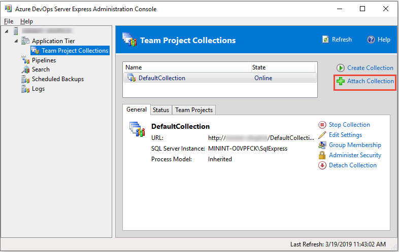

---
title: Move a project collection
titleSuffix: Azure DevOps Server
description: Move a project collection
ms.topic: conceptual
ms.manager: jillfra
ms.author: aaronha
author: aaronhallberg
ms.prod: devops-server
ms.technology: tfs-admin
monikerRange: '>= tfs-2013'
ms.date: 05/22/2019
--- 

# Move a project collection

[!INCLUDE [temp](../_shared/version-tfs-all-versions.md)]

You can move a project collection from one deployment of Azure DevOps Server to another. For example:

- You have more than one deployment of Azure DevOps Server in your organization, and you want to move a collection to another deployment to better align with your business needs.  
- You want to move the collection to a remote office that has its own deployment of Azure DevOps Server.  
- You want to expand your deployment of Azure DevOps Server by adding another instance of SQL Server to it, and you want to distribute existing collections between the instances.
- You need to incrementally upgrade your deployment by detaching an individual project collection from a deployment of Azure DevOps Server running an earlier version, and then move it to a server running the current version of Azure DevOps Server. (One common reason for this is some teams may need to migrate to a newer version of Azure DevOps Server, while others must remain on an older version for tools or projects reasons.) In this scenario, you must also then upgrade each project within the collection by using the Configure Features wizard. For more information, see [Configure features after an Azure DevOps Server upgrade](/azure/devops/work/customize/configure-features-after-upgrade). The Configure Features wizard has been deprecated for Azure DevOps Server 2019. You can only run the wizard on TFS 2018 and earlier versions. Projects defined on Azure DevOps Services update automatically with each service upgrade.

The steps to move a collection will depend on the particular configuration of the deployment that hosted the collection and the deployment to which you move it. For example, if you move a collection to a new domain, you will need to add users from that domain to the appropriate groups at the collection level and the project level. Similarly, if you move a collection to a deployment of Azure DevOps Server that uses a different SharePoint web application, you'll either need to move the site collection database that supports the collection to that SharePoint web application, or add the SharePoint web application that supports the collection to the deployment of Azure DevOps Server to which you have moved it. 

> [!NOTE]
> Integration with Sharepoint Products has been deprecated for TFS 2018 and later versions.

Here's how to move an entire project collection. To move part of a collection, see [Split a project collection](split-team-project-collection.md).

## Prerequisites

Before you start your move, make sure that you're an administrator on the servers and in the software used by both the deployment you're moving from, and the one you're moving to. If you're not an administrator, [get added as one](add-administrator.md).

## 1. Detach the collection

Before you move a collection, first detach it from the deployment of Azure DevOps Server on which it is running. It's very important to not skip this step. When you detach a collection, all jobs and services are stopped, and then the collection database is stopped. In addition, the detach process copies over the collection-specific data from the configuration database and saves it as part of the project collection database. This configuration data is what allows the collection database to be attached to a different deployment of Azure DevOps Server. If that data is not present, you cannot attach the collection to any deployment of Azure DevOps Server except the one from which it originated.

> [!NOTE]
>  Detaching a collection prevents users from accessing any projects in that collection.

1.  Open the administration console for Azure DevOps on the server that hosts the collection to move, and in **Project Collections**, highlight that collection.

2.  On the **General** tab, select **Detach Collection**.  

	::: moniker range=">= azure-devops-2019"
	
	::: moniker-end 
	::: moniker range="<= tfs-2018"
	
	::: moniker-end  

    The **Detach Project Collection Wizard** opens.

3.  (Optional) On the **Provide a servicing message for the project collection** page, in **Servicing Message**, provide a message for users who may try to connect to projects in this collection.

4.  Select **Next**.

5.  On the **Review settings that will be used to detach project collection** page, review the details.

6.  To change any settings, select **Previous**. If they appear to be correct, select **Verify**.

7.  When all the readiness checks have completed successfully, select **Detach**.

8.  On the **Monitor the project collection detach progress** page, when all processes have completed, select **Next**.

    

9.  (Optional) On the **Review supplemental information for this project collection** page, either select or note the location of the log file.

10. Select **Close**.

    The project collection no longer appears in the list of collections in the administration console.

    

## 2. Back up the collection database

After you have detached the collection, back up its database to move it to the other server. To perform this task, use the tools that are provided with SQL Server.

-   For information about this task, see [Back up and restore databases in SQL Server](http://go.microsoft.com/fwlink/?LinkId=115430) and [Create a backup schedule and plan](backup/config-backup-sched-plan.md). Be sure to select the version of SQL Server that matches your deployment.

> [!IMPORTANT]
> You can only restore a database to the same version or a more recent version of SQL Server. You can't restore a SQL Server database to an earlier version of the product  
> If your original deployment used the Enterprise or Datacenter editions of SQL Server, and you want to restore databases to a server running Standard edition, you must use a backup set that was made with SQL Server compression disabled. Unless you disable data compression, you will not be able to restore Enterprise or Datacenter edition databases to a server running Standard edition. To turn off compression, follow the steps in [Disable SQL Server data compression in Azure DevOps databases](http://go.microsoft.com/fwlink/?LinkId=253758).

## 3. Move the collection database

As part of moving the collection, you must restore, copy, or otherwise move the collection database to an instance of SQL Server that is configured to support the deployment of Azure DevOps Server to which you're moving the collection. You can select whichever method you prefer to move the database.

For more information about moving a database to another instance of SQL Server, see:

- [Use the Copy Database Wizard](/sql/relational-databases/databases/use-the-copy-database-wizard)
- [Copy databases with Backup and Restore](/sql/relational-databases/databases/copy-databases-with-backup-and-restore)

## 4. Attach the collection

After you restore the collection database, you can attach the collection to the preferred deployment of Azure DevOps Server. If the deployment you're moving to uses reporting, a reporting folder and default reports are built for the collection you're attaching as part of the process.

> [!NOTE]
> Warnings will appear when you attach the collection if your deployment uses SharePoint Products and the service account for Azure DevOps Server is not a member of the Farm Administrators group, or if your deployment uses reporting and you've already created a reporting folder and path that is identical to the previous deployment's folder and path. This is expected behavior, and you can proceed.

1.  Open the administration console for Azure DevOps on the server that hosts the application tier for the deployment to which you're moving the collection.

2.  Select **Project Collections**, and then select **Attach Collection**.

	::: moniker range=">= azure-devops-2019"  
	  
	::: moniker-end  
	::: moniker range="<= tfs-2018"
	
	::: moniker-end  

    The **Attach Project Collection Wizard** opens.

3.  On the **Select the project collection database to attach** page, in **SQL Server Instance**, provide the name of the server and the instance that hosts the collection database, if it is not already listed.

    

4.  In the **Databases** list, select the collection database to attach, and then select **Next**.

5.  On the **Enter the project collection information** page, provide a name for the collection in **Name** if one is not already present.

6.  (Optional) In **Description**, provide a description of the collection.

7.  Select **Next**.

8.  On the **Review settings that will be used to attach the project collection** page, review the information.

9.  To change any settings, select **Previous**. If all the settings are correct, select **Verify**.

10. When all the readiness checks have completed successfully, select **Attach**.

11. On the **Monitor the project collection attach progress** page, when all processes have completed, select **Next**.

12. (Optional) On the **Review supplemental information for this project collection** page, select or note the location of the log file.

13. Select **Close**.

    The project collection appears in the list of collections in the administration console. The SharePoint web application that supported this collection in its original deployment will appear in the list of web applications.

    

14. (Optional) Modify or remove the web application from the list of web applications. For more information, see [Modify or remove access between a SharePoint web application and Azure DevOps Server](modify-remove-access-sharepoint.md).

## 5. Configure the moved project collection

You can skip this procedure if you moved the collection in the same domain, and intend to use the same web application that previously supported the collection, **and** you want to allow access for the administrators of that collection to this deployment of Azure DevOps Server.

After you have moved a collection, update the web application and permission groups for that collection with the appropriate settings.

### Configure the moved collection

-   Open each tab for the project collection and, if necessary, modify the settings to reflect the services and locations to match the locations of the resources on the current Azure DevOps Server. This is particularly important to do for SharePoint and reporting resources. If you see errors, make sure that your account has the permissions required for administrators of project collections, and that any other project collection administrators have been added as needed.

    For information about this task, see [Modify a project collection](manage-project-collections.md) and [Set administrator permissions for project collections](add-administrator.md).

## 6. Configure projects

You can skip this procedure if you moved the collection in the same domain and you want to allow access for the users of projects in that collection to this deployment of Azure DevOps Server.

After you configure administrators for the moved collection, either you or those administrators must add users and groups to the projects in that collection. Depending on your deployment, you may also need to configure permissions for those users in SharePoint Products and Reporting Services.

### Add users to projects

-   For information about this task, see [Add users to projects](/devops/security/add-users-team-project).

### Add resources to moved projects

-   For more information about this task, see [Configure resources to support projects](admin-quick-ref.md).

## Q & A

### Q: My Azure DevOps Server deployment uses reporting. How do I move reports along with moving a collection?

**A:** First, you'll need to save or export any reports you want to move from the report server that supported the collection in its original deployment. Then you'll need to upload each report manually to the report server that will support the moved collection, which can be a lengthy process. Consider whether you want to upload all reports or whether a subset of reports will meet your business needs. You do not have to upload all reports or any reports, but only those reports that you upload will be available after the move process is completed.

You'll also need to rebuild the warehouse and analysis services cube on the original deployment after you've moved the collection, so the original deployment doesn't keep trying to build reports for a collection that is no longer there.

#### Move reports

1.  Export or save the reports you want to move from the report server that supported the collection in its original deployment. For more information, see [Export reports](https://msdn.microsoft.com/library/dd239307.aspx) and [Save reports](https://msdn.microsoft.com/library/dd255213.aspx).

2.  Upload each report that you want to move to the appropriate folder on the report server that supports the collection in its new environment in Report Manager.

    For more information, see [Upload files to a folder](/sql/reporting-services/report-server/upload-files-to-a-folder).

3.  In Report Manager, edit each report to change the data source to the new report server.

<!-- TBD (not found)   For more information, see [How to: Configure data source properties for a report]().  -->

#### Rebuild the data warehouse and Analysis Services

1.  Open the administration console for Azure DevOps.

2.  In the navigation bar, select **Reporting**.

3.  In **Reporting**, select **Start Rebuild**.

4.  In the **Rebuild the Warehouse and Analysis Services Databases** dialog box, select **OK**.

    > [!NOTE]
    > The warehouses will finish rebuilding and the data will finish repopulating after the Start Rebuild action completes. Depending on the size of your deployment and the amount of data, the entire process may take several hours to complete.

::: moniker range="<= tfs-2017"

### Q: How do I move a collection that uses SharePoint Products?

**A:** To move a project collection that uses a SharePoint web application, you must move both the project collection itself and the SharePoint site collection that supports the project collection. The site collection must be moved to the web application that will support the project collection in the new deployment. Specifically, you must [back up the site collection database](https://technet.microsoft.com/library/ee748617(v=office.15).aspx) and then [move the site collection database](https://technet.microsoft.com/library/cc825328(v=office.15).aspx). Once you've done that and attached the moved project collection to its destination Azure DevOps Server, you'll need to repair the connection between that Azure DevOps Server and its SharePoint web application to ensure that the attached collection connects to the moved site collection. You’ll also need to make sure that the SharePoint tab for the project collection points to that site collection database.

> [!NOTE]
> If you are moving the collection between deployments that use SharePoint Products, it is strongly recommended that the service account for Azure DevOps Server be a member of the Farm Administrators group in SharePoint Products in both deployments. Otherwise, you may experience errors when you attempt to detach or attach the collection.  
> You can move a project collection without granting this membership to the service account for Azure DevOps Server. However, errors will appear when you attach the collection, and you will need to perform additional steps to reconnect projects with their portals. Even if your operational requirements generally restrict granting this membership to the service account, you should consider adding the service account to the Farm Administrators group for the duration of the move operation.

1.  Open the administration console for Azure DevOps, select **SharePoint Web Applications**, and in the list of web applications, select the web application that supports the collection that you just attached.

    The **Repair Connection** button appears after you select a web application in the list.

2.  Select **Repair Connection**, and in the **Repair the connection to a SharePoint Web Application** dialog box, select **Repair**.

3.  In **Project Collections**, select the moved project collection, select the SharePoint Products tab, and modify the settings to point to the site collection database.

::: moniker-end

### Q: How do I move a team project collection that includes deployment pools and/or deployment groups?

**A:** When you move the collection to another deployment, for each deployment pool in the source having a deployment group in the detached collection,
a new deployment pool is automatically provisioned in the target instance. In case of Azure DevOps Server 2019 or later, the name of automatically provisioned deployment pool is the same as in the source instance. 
In prior versions, the deployment pool name is in the format `<project name-deployment-group name>`. 
In case of conflicts, a random GUID is appended to the deployment pool name. 

Once the move is complete:

-   There is a possibility of multiple deployment pools being created. You can merge the duplicate pools using the TfsConfig command.
For example, `TfsConfig.exe deploymentpool /migrateDeploymentGroups /fromPool:<Source Pool Name> /toPool:<Target Pool Name>`
-   You need to reconfigure the agents with the new deployment pool. Here is a sample [deployment agent reconfiguration script]( https://github.com/Microsoft/devops-project-samples/tree/master/DeploymentAgentReconfigurationScripts) for your reference.

::: moniker range="<= tfs-2015"
### Q: How do I move a project collection that includes Lab Management?

**A:** If you moved the collection to a different domain or intend to use a different System Center Virtual Machine Manager (SCVMM), you must delete the virtual machines, templates, project host groups, and project library shares from the collection database before you start the move, and recreate them in Microsoft Test Manager after the move.

> [!NOTE]
> Lab Management has been deprecated for TFS 2017 and later versions.
::: moniker-end

#### Delete the Lab Management resources before moving the collection

-   For information about how to remove all group hosts, library shares, and environments from a specified project collection, see [TFSConfig Lab /Delete command](../command-line/tfsconfig-cmd.md#lab-delete) with the **/External** option.

#### Configure Lab Management resources after moving the collection

1.  Configure the application tier for Azure DevOps.

    For more information, see [Configure Lab Management for SCVMM environments](config-lab-scvmm-envs.md).

2.  Recreate the golden master virtual machines and templates in the new SCVMM and import virtual machines and templates into the project collection.

    For more information, see [How to: Create and store virtual machines and templates ready for Lab Management](https://msdn.microsoft.com/library/ee702479(v=vs.120).aspx).

3.  Recreate the environments for each project.

    For more information, see [Create an SCVMM environment by using stored virtual machines and templates](https://msdn.microsoft.com/library/ee518915(v=vs.120).aspx).

### Q: How do I restrict access to select functions in a project?

**A:** Users who have permissions to access one project within a collection can view other projects within that collection, even if they don't have permissions to modify work items or perform other actions in that project. You can [Grant or restrict access to select features and functions](/azure/devops/security/restrict-access) for creating or modifying select artifacts, as well as restrict them from seeing projects, by specifically creating groups and configuring restrictions on those groups. 
