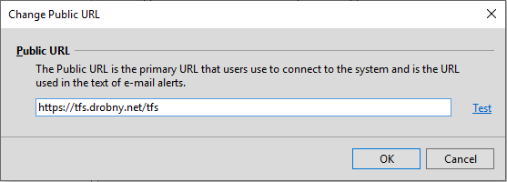

---
title: Open the Administration Console
titleSuffix: Azure DevOps Server & TFS
description: How to open the Azure DevOps Server Administration Console or Team Foundation Server Administration Console 
ms.manager: jillfra
ms.author: kaelli
author: aaronhallberg
ms.prod: devops-server
ms.technology: tfs-admin
monikerRange: '>= tfs-2013'
ms.date: 03/05/2019
--- 

# Open the Administration Console 

[!INCLUDE [temp](../_shared/version-tfs-all-versions.md)]

<!--- UPDATE LINKS TO THIS topic -->

You can configure and manage various aspects of your Azure DevOps on-premises deployment by using the administration console. For example, you can add a server for hosting project portals, create and modify project collections, and change the service account used for Azure DevOps Server, previously named Visual Studio Team Foundation Server (TFS). 

::: moniker range=">= azure-devops-2019"  
The Azure DevOps Server Administration Console is installed when you install one or more of the following components on a server:  
-  an application-tier for Azure DevOps Server  
- the extensions for SharePoint Products  
- Team Foundation Build  
- Visual Studio Lab Management  
::: moniker-end  

::: moniker range="tfs-2018"  
The Team Foundation Server Administration Console is installed when you install one or more of the following components on a server:  
- an application-tier for Team Foundation Server  
- Team Foundation Build  
::: moniker-end  

::: moniker range="tfs-2017"  
The Team Foundation Server Administration Console is installed when you install one or more of the following components on a server:  
- an application-tier for Team Foundation Server  
- Team Foundation Build  
- the extensions for SharePoint Products  

::: moniker-end

::: moniker range="<= tfs-2015"  
The Team Foundation Server Administration Console is installed when you install one or more of the following components on a server:  
- an application-tier for Team Foundation Server  
- Team Foundation Build  
- the extensions for SharePoint Products  
- Visual Studio Lab Management  
::: moniker-end  

## Prerequisites

::: moniker range=">= azure-devops-2019"
- You must be a member of the local Administrators group on the server where you want to open the console, and either a member of the **Azure DevOps Server Administrators** group or your **Edit Server-Level Information** permission must be set to **Allow**. See [Add server-level administrators to Azure DevOps on-premises](add-administrator.md).
- If all of your components are installed on a single server, the
administration console provides management nodes for all components in
your deployment. If, however, your deployment uses multiple servers, you
must open the console on the server that is running the component that
you want to manage.
::: moniker-end

::: moniker range="<= tfs-2018"
- You must be a member of the local Administrators group on the server where you want to open the console, and either a member of the **Team Foundation Administrators** group or your **Edit Server-Level Information** permission must be set to **Allow**. See [Add server-level administrators to Azure DevOps on-premises](add-administrator.md).
- If all of your components are installed on a single server, the
administration console provides management nodes for all components in
your deployment. If, however, your deployment uses multiple servers, you
must open the console on the server that is running the component that
you want to manage.
::: moniker-end

## Open from the Start menu

::: moniker range=">= azure-devops-2019"
To open the administration console from the Windows **Start** menu on a server that is running one or more Azure DevOps components, enter and choose **Azure DevOps Server Administration Console**.  On older versions of Windows, you may need to choose **All Programs**, then choose **Microsoft Team Foundation Server**, and then choose **Team Foundation Server Administration Console**.

::: moniker-end

::: moniker range="<= tfs-2018"
To open the administration console from the Windows **Start** menu on a server that is running one or more Azure DevOps components, enter and choose **Tean Foundation Server Administration Console**.  On older versions of Windows, you may need to choose **All Programs**, then choose **Microsoft Team Foundation Server**, and then choose **Team Foundation Server Administration Console**.
::: moniker-end

> [!NOTE]
> If the console doesn't appear as a menu option, you might not have permission to open it. You can try to open it at a command prompt, but you might not be able to access some or all of the administration console's functionality.
 
The administration console opens. You might have to wait briefly for all the information to populate throughout the nodes of the console.

## Open from the command prompt

> [!TIP]
> You can open the administration console at a command prompt even if you do not have all the required permissions to view or modify some or all of the information that the console shows.

::: moniker range=">= azure-devops-2019"
1. On a server that is running one or more Azure DevOps components, open a Command Prompt window running as an administrator, and change directories to the tools directory for Team Foundation Server.

	By default, the tools directory is located in `Drive:\Program Files\Azure DevOps Server <version>\Tools`.

	For example, for Azure DevOps Server 2019 the directory is: 

	`Drive:\Program Files\Azure DevOps Server 2019\Tools` 

2. Type **TFSMgmt.exe** and press ENTER.

	The administration console opens. You might have to wait briefly for all the information to populate throughout the nodes of the administration console.

::: moniker-end

::: moniker range="<= tfs-2018"
1. On a server that is running one or more Azure DevOps components, open a Command Prompt window running as an administrator, and change directories to the tools directory for Team Foundation Server.

	By default, the tools directory is located in `Drive:\Program Files\TFS <version>\Tools`.

	For example, for TFS 2018 the directory is: 

	`Drive:\Program Files\TFS 2018\Tools` 

2. Type **TFSMgmt.exe** and press ENTER.

	The administration console opens. You might have to wait briefly for all the information to populate throughout the nodes of the administration console.

::: moniker-end

## View installed updates on your server

To determine what updates have been installed, you can open the
administration console or view the version number of
a particular file.

1.  Open the administration console and choose **Application Tier** and review the version numbers
    listed for the application-tier and data-tier.  

	::: moniker range=">= azure-devops-2019"  
	  
	::: moniker-end  
	::: moniker range="<= tfs-2018"  
      
	::: moniker-end  

2.  To learn when the software was installed, choose **Installed Updates**.

If the administration console provides isn't available, for example
during an Azure DevOps upgrade, you can view the file version number of the **Microsoft.TeamFoundation.Admin.dll** file.  

::: moniker range=">= azure-devops-2019"   
1.  Open Windows Explorer (or File Explorer), and browse to `Drive:\Program Files\Azure DevOps Server 2019\Tools`  
::: moniker-end  
::: moniker range="<= tfs-2018"  
1.  Open Windows Explorer (or File Explorer), and browse to `Drive:\Program Files\\Microsoft Team Foundation Server 2018\Tools`  
::: moniker-end  

2.  Expand the sub-menu for **Microsoft.TeamFoundation.Admin.dll**, and then
    choose **Properties**.

3.  Choose the **Details** tab, and review the
    information under **File Version**.

<a id="public-url" />
## View or change the Public URL
Prior to changing the Public URL, review [Web site settings and security for Azure DevOps on-premises](websitesettings.md). 
 
> [!IMPORTANT]  
> Changing the Public URL impacts your end users. While we recommend converting from HTTP to HTTPS bindings, Visual Studio client connections will need to be re-established and old bookmarks will no longer resolve. Coordinate changes of this sort with your users to avoid significant disruption.

0. From the **Azure DevOps Administration Console**>**Application Tier** node. The Public URL is listed under the **Application Tier Summary** section. 
	> [!div class="mx-imgBorder"]  
	>   

0. Choose **Change Public URL**. 

	> [!div class="mx-imgBorder"]  
	>   

	Change the URL and choose **Test** to verify.

## Q & A

### Q: Why do some of the fields say "Loading"?

**A:** On some servers, you might have to wait briefly for all the information to populate throughout the nodes of the console. This is more common on servers with minimal resources or in a multi-server deployment.

### Q: Why can't I perform certain tasks from the administration console?

**A:** You can only perform those tasks for which you have permissions. While you may have permission to open the admin console, you may not have all the permissions to run a task that the admin console supports. The console can be opened by anyone who has a valid user account on the server or servers on which the console is installed. However, you'll only be able to perform those functions for which you have the required permissions. 

## Related articles

- [Administrative tasks quick reference](admin-quick-ref.md)
- 
 