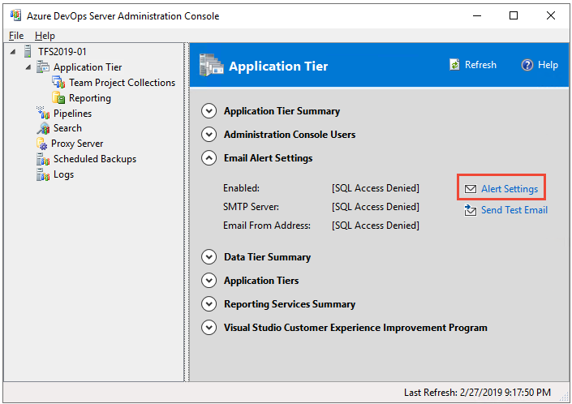
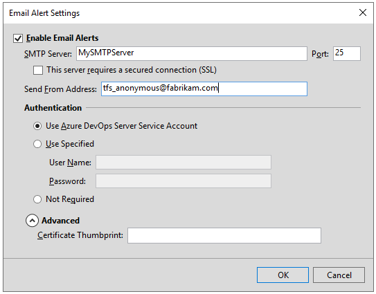
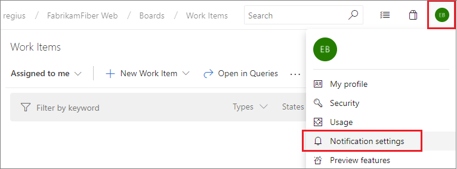

# Configure an SMTP server and customize email for alerts and feedback requests

[!INCLUDE [temp](../_shared/version-tfs-all-versions.md)]

For feedback requests and alerts to work, you must configure an SMTP server for Azure DevOps Server, previously named Visual Studio Team Foundation Server (TFS). The SMTP server supports the following features:

- [Personal notifications](/azure/devops/notifications/howto-manage-personal-notifications)  
- [Team and project notifications](/azure/devops/notifications/howto-manage-team-notificationss)  
- [Project collection-level notifications](/azure/devops/notifications/howto-manage-organization-notifications)   
- [Feedback requests](/azure/devops/project/feedback/get-feedback)  

## Prerequisites 

- To perform these procedures, you must be a member of the **Administrators** security group on the Azure DevOps application-tier server.

## Configure an SMTP server 

1.  If you aren't an Azure DevOps administrator, [get added as one now](add-administrator.md).

2.  Open the Azure DevOps Server Administration Console from the **Start** menu. Or, at a command prompt, type **TFSMgmt.exe**. For details, see [Open administration console](open-admin-console.md). 

3.  Choose **Alert Settings**.

	::: moniker range=">= azure-devops-2019"  
	  
	::: moniker-end  
	::: moniker range="<= tfs-2018"  
    
	::: moniker-end  

4.  Enable email alerts and specify the SMTP Server and the email address to use for sending emails.

	::: moniker range=">= azure-devops-2019"  
	  
	::: moniker-end  
	::: moniker range="<= tfs-2018"  
    
	::: moniker-end  

    If your deployment is configured to use SSL, then select the second checkbox and enter a certificate. See also [Setting up HTTPS with Secure Sockets Layer (SSL)](setup-secure-sockets-layer.md).

	> [!TIP]     
	>- Make sure your firewall is configured to allow communications between Azure DevOps and your SMTP server.  
	>- Your SMTP server must be configured to allow anonymous senders to send email, or you must have previously created an account specifically to use as the email account for alerts. If you specify the Azure DevOps service account (*TFSService*), this account must be a domain account with permission to send email.  
	>- If you used a system account (such as Network Service) as the Azure DevOps service account, leave the User and Password fields blank for the advanced configuration, and make sure that your SMTP server is configured to allow anonymous users to send mail. Alternately, specify an email-enabled domain account to use as the email account for alerts. If you do not, email notifications will not be sent. 

5.  To verify your configuration, [open your personal notifications](/azure/devops/notifications/howto-manage-personal-notifications). You might need to refresh your browser to see this option if you just recently enabled an SMTP server.

	::: moniker range=">= azure-devops-2019"
	  
	::: moniker-end
	::: moniker range="<= tfs-2018"
    
	::: moniker-end

	Create an alert and then perform an action that will trigger the alert. 

## Customize the format for email alerts

You can customize the format of email notifications, or alerts, that team members subscribe to. These notifications are sent when changes occur to work items, code reviews, source control files, and builds. To customize their format, you can modify their associated XSL transform files. In addition, your team members can configure *project alerts* in Team Web Access (TWA) for various notifications and specify whether they want HTML or plain text as the format.

Alert format transform files are stored in the following folder on the application-tier server:

::: moniker range=">= azure-devops-2019"  
*Drive*:\\%programfiles%\Azure DevOps Server 2019\Application Tier\TFSJobAgent\Transforms\1033  
::: moniker-end  
::: moniker range="tfs-2018"  
*Drive*:\\%programfiles%\Team Foundation Server 2018\Application Tier\TFSJobAgent\Transforms\1033  
::: moniker-end  
::: moniker range="tfs-2017"  
*Drive*:\\%programfiles%\Team Foundation Server 15.0\Application Tier\TFSJobAgent\Transforms\1033  
::: moniker-end  
::: moniker range="tfs-2015"  
*Drive*:\\%programfiles%\Team Foundation Server 14.0\Application Tier\TFSJobAgent\Transforms\1033  
::: moniker-end  
::: moniker range="tfs-2013"  
*Drive*:\\%programfiles%\Team Foundation Server 12.0\Application Tier\TFSJobAgent\Transforms\1033  
::: moniker-end  

You can use an XML editor, such as Visual Studio, to change any of the transform files. The following table lists the two transform files used when email notifications are sent for work item change events:

| Transform file | Format |
| --- | --- |
| WorkItemChangedEvent.xsl | HTML e-mail |
| WorkItemChangedEvent.plaintextXsl | plaintext e-mail |

The event service uses the .xsl and the plaintextXsl files to transform the XML data for an event into an e-mail message. Edit the .xsl file to get a different format for the email notification. For HTML-formatted email messages, the core layout for all events is stored in TeamFoundation.xsl. You should make a backup copy of any files that you want to change, and then test your changes. After you have made your changes, TFS will use the modified transform the next time it generates a notification for an event.

> [!NOTE]
> The content of the emails that are issued is automatically generated from the TeamFoundation.xsl file and the above WorkItemChangedEvent xsl files. Modifying the TeamFoundation.xsl file is not recommended. If you do modify the contents of this file, you must thoroughly test your modifications. Incorrect modifications of this file can result in the failure of TFS email alerts and cause you to be unable to view work items, changesets, or files in a Web browser.

### To modify the alert format for work item changes

1.  On your application-tier server, open the folder for the version you're running, for example: 

	::: moniker range=">= azure-devops-2019"  
	*Drive*:\\%programfiles%\Azure DevOps Server 2019\Application Tier\TFSJobAgent\Transforms\1033  
	::: moniker-end  

	::: moniker range="<= tfs-2018"  
	*Drive*:\\%programfiles%\Team Foundation Server 2018\Application Tier\TFSJobAgent\Transforms\1033  
	::: moniker-end  

2.  Open WorkItemChangedEvent.xsl in Notepad or other text editor.

3.  Edit the file to show the message that you want in the notification email.

    > [!NOTE]
    > You should make similar changes to the WorkItemChangedEvent.plaintextXsl for any users who have requested plaintext messages.
    
4.  Save the WorkItemChangedEvent.xsl file.

## Related articles

- [Manage personal notifications](/azure/devops/notifications/howto-manage-personal-notifications)  
- [Administrative tasks quick reference ](admin-quick-ref.md)  
- [TFSConfig ConfigureMail](../command-line/tfsconfig-cmd.md#configure-email)  
