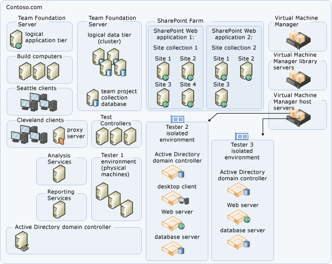
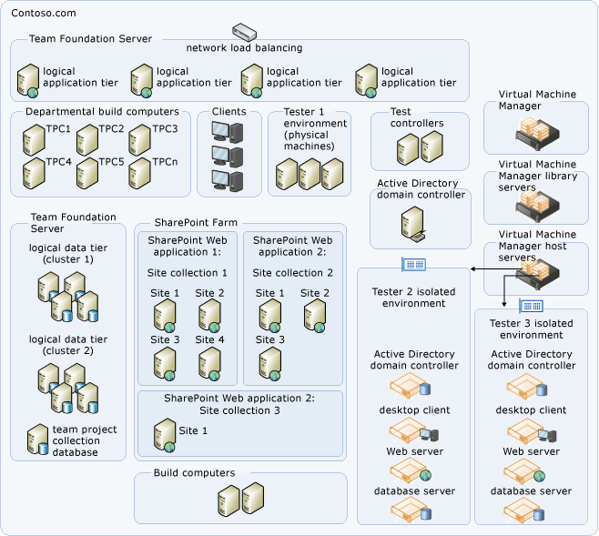
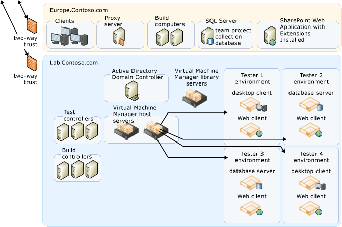

# Examples of complex topology for Azure DevOps Server

[!INCLUDE [temp](../_shared/version-tfs-all-versions.md)]

You can configure Azure DevOps Server in one of several
topology configurations. Generally speaking, the simpler the topology,
the more easily you can maintain an Azure DevOps Server
deployment. You should deploy the simplest topology that meets your
business needs.

This article describes two complex Azure DevOps Server topologies. A
complex topology has Azure DevOps Server components distributed
across many servers. It is accessed by clients in multiple domains in
geographically distant physical locations. Azure DevOps Proxy Server
is installed in addition to optional components such as SharePoint
Products and SQL Server Reporting Services. There are several different
code bases, and these code bases each have their own project
collection for the projects that use them. The databases for team
project collections are stored on several different servers that are
running SQL Server.

## Complex single-domain topology

A complex server topology uses multiple servers in clusters or other
failover configurations to host the logical Azure DevOps data and
application tier components. The following diagram demonstrates a
complex single-domain topology:

This example topology is similar to the [moderate topology](examples-moderate-topo.md).
Azure DevOps Server services are deployed on one server and the Azure
DevOps Server databases are installed on a separate server, with
Team Foundation Build and the team's test agents and test agent
controllers deployed on additional servers. Also, fail-over components
have been added. The Azure DevOps databases have been installed on
a SQL Server cluster.

The example diagram shows child domains in Seattle and Cleveland, each
with a two-way transitive trust to the parent domain. The service
account for Azure DevOps Server is trusted by both domains. Each
geographically distant child domain uses a limited-bandwidth connection.
Since getting an enlistment from the version code control component of
Azure DevOps Server can take a very long time under such limited
bandwidth conditions, an Azure DevOps Proxy Server is installed in
each child domain to act as a version control file proxy cache. All
client requests go directly to the application tier, with the exception
of version control code **get** requests. These requests are directed
through the Azure DevOps Proxy Server, which then caches all source
files that it downloads on the proxy server.

The topology in this example is also concerned with fault tolerance and
high performance. Data tier fault tolerance is provided by taking
advantage of the SQL Server clustering technologies. Multiple SharePoint
Web applications are configured for use by projects within
collections in a SharePoint Web farm. Project collection databases
are distributed across SQL Server instances for improved performance and
ease of individual management. SQL Server Reporting Services and SQL
Server Analysis Servers are running on separate servers for improved
performance.

This example is designed for a large product development team with up to
2,000 users.

## Complex multi-domain topology

A complex multi-domain server topology uses multiple servers in two or
more domains. As with the complex single-domain topology, the deployment
uses clusters or other failover configurations to host the components of
the data tier for Azure DevOps. The administrators for this
deployment have configured network load balancing and added multiple
application-tier servers to distribute the operational load. The
following illustration demonstrates a complex multi-domain topology:

As in the above example, this topology is configured for fault tolerance
and high performance. In addition, this topology is distributed across
multiple domains, some of which are fully trusted child domains of the
parent domains, but one of which (IsolatedLab.com) is a completely
separate domain. The service accounts used by Azure DevOps Server are
fully trusted members of all domains, and user accounts have been
configured in both the parent domain and the separate domain as
necessary for users who must work in both domains. Firewalls have been
configured to allow traffic across the ports required by Azure DevOps
Server.

## Related articles

- [Examples of simple topology](examples-simple-topo.md)
- [Examples of moderate topology](examples-moderate-topo.md)
- [Azure DevOps Server architecture](architecture.md)
