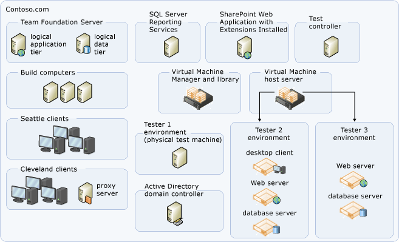

# Examples of moderate topology for Azure DevOps 

[!INCLUDE [temp](../_shared/version-tfs-all-versions.md)]

You can configure Azure DevOps Server in several
topology configurations. Generally speaking, the simpler the topology,
the more easily you can maintain a deployment of Azure DevOps Server.
You should deploy the simplest topology that meets your business needs.
This article describes a moderately complex topology, in which the logical
components of the data and application tiers of Azure DevOps are
installed on separate physical servers. Client computers within the
trusted domains can access Azure DevOps Server.

## Moderate topology

A moderate topology uses two or more servers to host the logical
components of the data and application tiers of Azure DevOps. The
following illustration demonstrates a moderately complex topology for
Azure DevOps Server, applicable for a product development team with fewer than 1,000 users:

In this example, the services for Azure DevOps Server are deployed on
one server, called an application-tier server, and the databases
for Azure DevOps Server are installed on a separate server, called a data-tier server. A separate server hosts the SharePoint Web
application that Azure DevOps Server uses, and another server hosts
the instance of SQL Server Reporting Services that Azure DevOps
Server uses. 

The portal for each project is hosted on the
SharePoint Web application. Therefore, the administrator must configure
permissions for the users of that project on that Web application. The
same consideration applies to configuring permission for users in SQL
Server Reporting Services.  Team Foundation Build and the team's test
controllers are deployed on additional servers. 

In this illustration,
the domain for the Cleveland clients is a child domain of the parent
domain in Seattle. The child domain has a two-way transitive trust
relationship with its parent domain. The service account for Azure DevOps Server is trusted by both domains. Users in the child domain
can access the server, and they are authenticated automatically
by Windows integrated authentication. In this configuration, Azure DevOps Proxy Server is required and installed in the
Cleveland office. 

## Related articles

- [Examples of simple topology](examples-simple-topo.md)
- [Examples of complex topology](examples-complex-topo.md)
- [Azure DevOps Server architecture](architecture.md)
