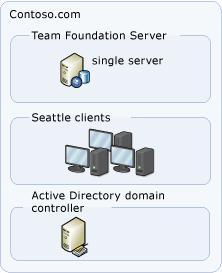
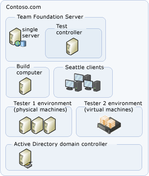

# Examples of simple topology for Azure DevOps Server

[!INCLUDE [temp](../_shared/version-tfs-all-versions.md)]

You can install and configure Azure DevOps Server in
several topology configurations. Generally speaking, the simpler the
topology, the more easily you can maintain a deployment of
Azure DevOps Server. You should deploy the simplest topology that
meets your business needs. This article describes two fairly simple
topologies, in which the server and clients are all contained within a
single workgroup or domain.

## Simplest topology

The simplest server topology uses the fewest number of physical
servers to host the components that compose the logical tiers of Team
Foundation. The following illustration shows the simplest topology:

In this example, all server components are deployed on a single physical
server. You can access them from client computers in the same domain or
workgroup. This example is designed for a small product development team
that has fewer than 50 users.

In this configuration, you can install the computer that is running Team
Foundation Build and the team's test components on either the single
server, which is running Azure DevOps Server, or on one or more
client computers. This configuration is best suited to small development
organizations or pilot projects within larger organizations.

## Simple topology

The simple server topology also uses the fewest number of physical
servers to host the components that compose the logical tiers of Azure DevOps. However, this topology also recognizes the additional load
that building and testing software places on processing power. The
following illustration shows a simple topology for Azure DevOps
Server:

In this example, the Web services and databases for Azure DevOps are
hosted on the same physical server, but the build services are installed
on a separate computer. You can access Azure DevOps Server from
client computers in the same domain or workgroup. This example is
designed for a small product development team that has fewer than 100
users.

In this configuration, you install the computer that is running Team
Foundation Build and the team's test components on a computer that is
dedicated to that purpose. This configuration is best suited to smaller
development projects where builds and testing demands are regular and
performance is a greater concern.

## Related articles

- [Examples of moderate topology](examples-moderate-topo.md)
- [Examples of complex topology](examples-complex-topo.md)
- [Azure DevOps Server architecture](architecture.md)
