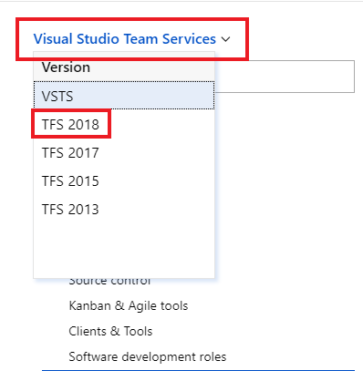

# Viewing different versions of the Azure DevOps Services, Azure DevOps Server, and Team Foundation Server (TFS) docs

On **September 5th, 2018**, Visual Studio Team Services, the cloud-hosted set of developer collaboration and DevOps services, became **Azure DevOps Services**. On **November 19, 2018**, the latest version of Team Foundation Server (the on-premises server software for developer collaboration and DevOps services) had a Release Candidate as **Azure DevOps Server 2019 RC 1**.

Many of the featured services in VSTS are now offered as standalone ones in both Azure DevOps Services and Azure DevOps Server RC 1:

|VSTS/TFS feature        |Azure DevOps service |
|------------------------|---------------------|
|Code (Git and TFVC))    | Azure Repos         |
|Work                    | Azure Boards        |
|Build and release       | Azure Pipelines     |
|Test                    | Azure Test Plans    |
|Packages (extension)    | Azure Artifacts     |

**As a result, we support two versions of the user interface in documentation**: The older, horizontal navigation used by TFS 2018 and earlier; and the new, vertical, service-oriented navigation used by Azure DevOps. The Azure DevOps documentation, which covers both Azure DevOps Services and TFS scenarios and reference, commonly uses the latest versions of the common UI in its guidance. 

Most TFS and Azure DevOps Server 2019 documentation is embedded in the Azure DevOps Services documentation. You can toggle to it by selecting the version selector dropdown in the upper-left of a documentation page.

For assistance in understanding these changes in navigation and UI, read [Navigation basics](/azure/devops/project/navigation/index).

