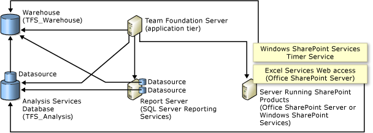

---
title: Troubleshoot server administration
titleSuffix: Azure DevOps Server & TFS  
description: Learn the answers to frequently asked questions (FAQs) about server administration
ms.topic: conceptual
ms.manager: jillfra
ms.author: aaronha
author: aaronhallberg
ms.prod: devops-server
ms.technology: tfs-admin
monikerRange: '>= tfs-2013'
ms.date: 03/06/2019
--- 

# Troubleshoot server administration

[!INCLUDE [temp](_shared/version-tfs-all-versions.md)]

Review the questions and answers provided here for information on managing Azure DevOps Server, previously named Team Foundation Server (TFS). 

> [!IMPORTANT]
> You should not manually modify any of the TFS databases unless you're
> either instructed to do so by Microsoft Support or when you're
> following the procedures described for [manually backing up the databases](admin/backup/manually-backup-tfs.md).  Any other modifications can invalidate your service agreement.

## Q: Can I rename a project or project collection?

**A:** You can rename both a project and project collection. 
- To rename a project, see [Rename a project](/azure/devops/organizations/projects/rename-project). 
- To rename a collection, you first detach the collection, edit its 
settings, and then attach the collection. See [Manage project collections](admin/manage-project-collections.md).

## Q: How are services managed?

**A:** Azure DevOps and the products it integrates with
include several services and service accounts which run on some or all
of the logical tiers and physical computers that compose a deployment.
You can use the same account for all of these service accounts, or you
can use different accounts. Your choice of account or accounts to use
depends on the configuration of your deployment, your security needs,
and what components you have installed. For clarity, each service
account is referred to separately by using placeholder names.

To learn more, see [Service accounts and dependencies](admin/service-accounts-dependencies.md).

## Q: How do I scale my deployment?

**A:** You can [move Azure DevOps Server to a new server](admin/move-clone-hardware.md)
or add [additional application-tier servers](admin/backup/restore-application-tier-server.md). You can 
also [Move Azure DevOps Server from one environment to another](admin/move-across-domains.md).

## Q: How do I monitor my deployment?

<!--- QUESTION: anything more to add here. Note GrantH blog no longer active --> 

**A:** You can monitor Azure DevOps on-premises activity using the following tools:
- From the administration console Logs page, you can open a log file generated when configuring or servicing Azure DevOps on-premises.  
- From the web administration page for the application-tier server, you can view activity logs and job monitoring charts.  

	`http://MyServer:8080/tfs/\_oi/`

<!--- Granth blog is no longer active
	To learn more, see this blog post: [New tools for TFS
    Administrators](http://blogs.msdn.com/b/granth/archive/2013/02/13/tfs2012-new-tools-for-tfs-administrators.aspx).  -->
- From the web portal Control Panel, you can export an audit log
    of all users and their access levels. See [Change access levels](/azure/devops/security/change-access-levels).

For additional monitoring tips, see this blog post: [What does a well
maintained TFS server look
like today?](https://www.danielstocker.net/what-does-a-well-maintained-tfs-server-look-like-today/).

## Q: What should I know about maintaining multiple servers?

**A:** Depending on how you initially installed
and configured Azure DevOps on-premises, you might
need to manage it across one or multiple servers to maintain and
operate your deployment. For example, the following illustration shows
the logical architecture of a deployment that integrates with
both SQL Server Reporting Services and SharePoint Products:

In this example, you have to:
- Manage the configuration of the components, the users, the groups, and permissions across several servers. 
- Configure firewalls or other devices to allow network traffic on the
ports that are required for communication between the servers. 
- Make sure that all services that the deployment requires are running
and configured to start automatically. 
- Make sure that the Azure DevOps service account is fully trusted by every computer in the deployment. 

See also this blog post: [What does a well
maintained TFS server look
like today?](https://www.danielstocker.net/what-does-a-well-maintained-tfs-server-look-like-today/).

## Q: Where can I learn more about requirements?

**A:** See one or more of the following articles:

- [Requirements for Azure DevOps on-premises](requirements.md)
	- [SQL Server requirements](requirements.md#sql-server)
	- [Active Directory requirements](requirements.md)
	- [SharePoint Products requirements](requirements.md#sharepoint)
	- [Language requirements](requirements.md#languages)	- 
- [Client and on-premises build compatibility](compatibility.md)
- [Service account requirements](account-requirements.md)
- [Port requirements](architecture/required-ports.md).
- [Default network ports and protocols](./architecture/architecture.md#default-network-settings)
- [Customizable network settings](./architecture/architecture.md#customizable-network-settings)
- [Azure Artifacts and version compatibility](/azure/devops/artifacts/overview?view=vsts#versions-and-compatibility)

You can also learn about requirements and infrastructure in these reference articles:
-   [Architecture overview](architecture/architecture.md)
-   [Naming restrictions](/azure/devops/collaborate/naming-restrictions)
-   [Service accounts and dependencies](admin/service-accounts-dependencies.md)

For licensing information, read the [licensing whitepaper](https://www.microsoft.com/download/details.aspx?id=13350).

## Q: Are there any maintenance restrictions?

**A:** Yes. As mentioned above, you should never manually modify Azure DevOps on-premises 
databases, because that can invalidate your service agreement, block
upgrades and patches, and result in data loss or corruption. There are
only two circumstances where you should ever consider modification:
-   You are instructed to do so by Microsoft Support.
-   Your deployment needs require you to manually back up your
    Azure DevOps databases. In that case, you should only modify the databases as
    described [here](./admin/backup/manually-backup-tfs.md).

## Q: What other resources are available?

**A:** The following resources and tools are available:

**Azure DevOps Server:**

- You can post questions or search for answers in our [Developer Community page](https://developercommunity.visualstudio.com/content/problem/post.html?space=21)
- [Azure DevOps Server support](https://aka.ms/AzureDevOpsServersupport)

**Azure DevOps Services:**

- You can post questions or search for answers in our [Developer Community page](https://developercommunity.visualstudio.com/content/problem/post.html?space=21)
- [Azure DevOps Blog](http://go.microsoft.com/fwlink/?LinkId=254496)
- [Azure DevOps Services support](https://azure.microsoft.com/en-us/support/devops/)

