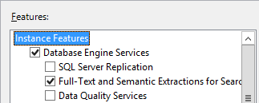

# How to set up a dual server configuration, Azure DevOps on-premises

[!INCLUDE [temp](../_shared/version-tfs-2015-earlier.md)]

You can enable your Azure DevOps Server deployment to handle more load than a single server configuration by deploying the application and data tiers on separate servers. Make sure to review our [hardware recommendations](../requirements.md#hardware-recommendations) to confirm that this configuration seems appropriate for your team. If not, consider a [single server](single-server.md) or [multiple server](multiple-server.md) configuration instead.

If you're upgrading from an earlier version, learn more about [compatibility](../compatibility.md), [release notes](../whats-new.md), and [getting started with your upgrade](../upgrade/get-started.md).

## Preparation

1. Prepare an application tier server that satisfies the [system requirements](../requirements.md) for Azure DevOps Server.

2. Prepare a data tier server that meets the [hardware recommendations](../requirements.md#hardware-recommendations) for your team.

	Set up a [supported version of SQL Server](../requirements.md#sql-server) on the data tier. When you set SQL Server up for Azure DevOps Server, install at least the database engine and the full text search services.

	

	Paid copies of Azure DevOps Server come with a license to SQL Server Standard for use with Azure DevOps Server. The 
	[Team Foundation Server pricing page](https://nam06.safelinks.protection.outlook.com/?url=https%3A%2F%2Fvisualstudio.microsoft.com%2Fwp-content%2Fuploads%2F2017%2F11%2FVisual-Studio-2017-Licensing-Whitepaper-November-2017.pdf&data=02%7C01%7CChrystal.Comley%40microsoft.com%7Cef8e9223d359472b3d8108d69c43d4e8%7C72f988bf86f141af91ab2d7cd011db47%7C1%7C0%7C636868212482594484&sdata=w6SSW6EovOGxuIpoX5Jc5RV%2BlwqakTJTNHSuLPFPTwQ%3D&reserved=0)) explains the details. If you use the license that's included with Azure DevOps Server, you can only use it for the Azure DevOps Server databases.

3. Configure the firewall on your data tier to [allow access to the SQL Server database engine](https://msdn.microsoft.com/library/ms175043.aspx)
   so that Azure DevOps Server can get through the firewall to connect to the SQL Server database engine from the application tier.

4. Ensure that the account you plan to use to configure Azure DevOps Server is a member of the 
   [SysAdmin server role in SQL Server](https://msdn.microsoft.com/library/ms188659.aspx). 

	> Installing Azure DevOps Server involves a complex set of operations that require a high degree of privilege - these include creating databases, 
	> provisioning logins for service accounts, and more. Technically, all that is required is membership in the ServerAdmin role; 
	> ALTER ANY LOGIN, CREATE ANY DATABASE, and VIEW ANY DEFINITION server scoped permissions; and CONTROL permission on the master 
	> database. Membership in the SysAdmin server role will confer all of these memberships and permissions,
	> and is therefore the easiest way to ensure that Azure DevOps Server configuration will succeed. If necessary, these memberships and permissions 
	> can be revoked after Azure DevOps Server is installed.  

5. If you're going to enable reporting, prepare the application and data tiers for that.

	::: moniker range=">= azure-devops-2019"
	> [!NOTE]   
	> Make sure to review [Reporting configuration choices](get-started.md#reporting-choices) to understand the choices available to you and the impact it has on your choice of work tracking customization process models.
	::: moniker-end 
	Install SQL Server Analysis Services and install and configure SQL Server Reporting Services. Configure your firewall to 
	[allow access to Reporting Services](https://msdn.microsoft.com/library/bb934283.aspx) and to 
	[allow access to Analysis Services](https://msdn.microsoft.com/library/ms174937.aspx).

   [!INCLUDE [install-sql-server-client-tools-connectivity](../_shared/install-sql-server-client-tools-connectivity.md)]

## Installation

1. [!INCLUDE [download-azure-devops-server](../_shared/download-azure-devops-server.md)]

2. Kick off the installation.

	<!--- Image needs update -->
	

	The installer copies files onto your machine, and then starts the Azure DevOps Server Configuration Center.

## Configure your installation

Configure Azure DevOps Server using from your supported configuration options as described in the [get started guide](get-started.md#basic-advanced). 

### New Deployment - Basic option
Even in a dual-server configuration,
the easiest way to set up Azure DevOps Server is to use the Server Configuration
Wizard with the **New Deployment - Basic** scenario. For details, see [Configure using the Basic option](single-server.md#configure-basic).  

  

This option is optimized for simplicity, using default settings for most inputs. 

When selecting a SQL Server instance in the wizard, be sure to point to the data tier you have already configured. With the **New Deployment - Basic** option, you will also need to choose:

- **Application Tier**: Which website settings to use, including whether to use HTTP or HTTPS bindings. See [website settings](../admin/websitesettings.md) for more information.
- **Search**: Whether to install and configure Code Search features. See [configuring Search](/azure/devops/project/search/administration#config-tfs) for more information.

### New Deployment - Advanced option
If you want full control over all inputs, use the [**New Deployment - Advanced** option](single-server.md#configure-advanced) instead. 

If you select the **New Deployment - Advanced** option, you will additionally need to choose:

- The service account your various Azure DevOps Server deployment processes will run as. The default value used in the Basic scenario is `NT AUTHORITY\NETWORK SERVICE` in domain joined scenarios, and `LOCAL SERVICE` in workgroup scenarios.
- Whether to enable SSH, along with the port it should listen on. The default value used in the Basic scenario is to configure SSH on port 22.
- The location of the file cache used for frequently accessed Azure DevOps Server resources. [!INCLUDE [file-cache-location](../_shared/file-cache-location.md)].
- Whether to configure Reporting features. The default behavior used in the Basic scenario doesn't support configureation of these features. Note that these options are not available on client  operating systems.
- Whether to create a project collection in which to store your projects, along with the name of that collection. The default behavior in the Basic scenario is to create a project collection named `DefaultCollection`.

In both cases, the wizard runs readiness checks to validate your environment and your setting selections. If all goes well, the wizard lets you configure your deployment. If there are errors, you need to fix each of them and re-run the readiness checks before you can continue.

## Related articles

- [Install and configure Azure DevOps on-premises](get-started.md)
- [Create a project](/azure/devops/organizations/projects/create-project)
