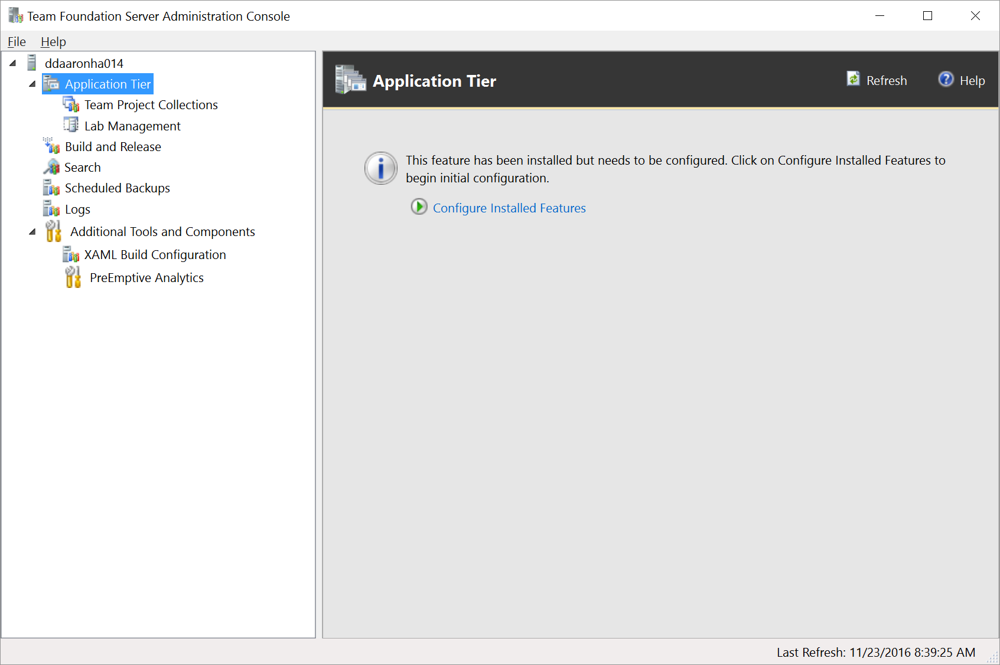

# Install and configure Azure DevOps on-premises

[!INCLUDE [temp](../_shared/version-tfs-2015-earlier.md)]

You have several choices in how to deploy Azure DevOps Server 2019, previously named Visual Studio Team Foundation Server (TFS). You can install everything on a single server. Or, you can use multiple application tiers and SQL instances. For information about how to determine the right type of deployment for your team, see [Hardware recommendations](../requirements.md#hardware-recommendations). 

## Deployment choices

- [Single server](single-server.md): 
	A single-server deployment is the easiest deployment because the application-tier and data-tier are on the same machine. Choose this deployment when support a single team or small set of teams.

- [Dual servers](dual-server.md): 
	A dual-server deployment, with separate application and data-tiers, can provide better performance for larger set of teams and to support teams which have above average usage.  

- [Multiple servers](multiple-server.md): 
	Chooose this type of deployment, which involves multiple application and data tiers, to provide better performance for very large teams and teams with very heavy usage. By using more than one server, you improve high availability and disaster recovery ability.

::: moniker range=">= azure-devops-2019"
<a id="reporting-choices" />
## Reporting configuration choices

Azure DevOps Server supports the Analytics Service which can be used in place of SQL Server Reporting Services or along side it. However, if you plan to use the Inheritance process model to customize work tracking, you can only use the Analytics Service for reporting, the project collection must not be configured to support reporting. 

To learn more about the Analytics Service, see [What is the Analytics Service?](/azure/devops/report/analytics/what-is-analytics). To learn more about the Inheritance process model, see [About process customization and inherited processes](/azure/devops/organizations/settings/work/inheritance-process-model). 

> [!NOTE]   
> Only new project collections can be configured to support the Inheritance process model. Upgraded project collections can only continue to support the On-premises XML process model. 

::: moniker-end

## Installations for evaluation or personal use

If you set up Azure DevOps on-premises for personal use or to evaluate it, use [Azure DevOps Express](https://www.visualstudio.com/downloads/). Azure DevOps Express is free, simple to set up, and installs on both client and server operating systems. It supports all of the same features as Azure DevOps Server 2019. TFS Express licensing limits use to five active users. 

> [!TIP]
> Consider using a free [Azure DevOps Services organization](/azure/devops/accounts/create-account-msa-or-work-student) for personal use. Because Azure DevOps Services are cloud-based, you don't need to install them on your own hardware or manage your own backups.

## The deployment process

No matter how you plan to deploy Azure DevOps Server, the process involves the following three steps: 

- **Preparation**: The installer prepares one or more servers for Azure DevOps Server or TFS by reviewing and following the [system requirements](../requirements.md). 

- **Installation**: The installer places executables on your server and runs an installer from VisualStudio.com or the Volume Licensing Service Center.
 
- **Configuration**: This step configures the installed features to get your installation up and running. When you run a configuration wizard, it runs a series of readiness checks. These checks make sure that your system meets the requirements and that your setting selections are likely to work. If there are any issues, one or more warnings or error messages display. After you resolve all errors, run the configuration to finish setting up your deployment. 

::: moniker range=">= azure-devops-2019"
<!--- **Azure DevOps Server** -->
When installation finishes, the installer starts the Azure DevOps Server Configuration Center. A unified wizard supports all Azure DevOps Server configurations, such as new installations, upgrades, and application-tier-only scenarios. 

 

If you need to close the Configuration Center, you can return to it. Start the Azure DevOps Server Administration Console, and select **Configure Installed Features** from the **Application Tier** node.

 

::: moniker-end

::: moniker range=">= tfs-2015 <= tfs-2018"
<!--- **TFS** -->
When installation finishes, the installer starts the Team Foundation Server Configuration Center. For TFS 2017 and later versions, a unified wizard supports all TFS configurations, such as new installations, upgrades, and application-tier-only scenarios. For TFS 2015 and earlier versions, select the appropriate wizard for your scenario. 

If you need to close the Configuration Center, you can return to it. Start the Team Foundation Server Administration Console, and select **Configure Installed Features** from the **Application Tier** node.

::: moniker-end

<a id="basic-advanced" /> 
::: moniker range=">= azure-devops-2019"
## Configuration options: Basic, Advanced and Azure 

The Server Configuration Wizard supports two main configuration options: **Basic**,  **Advanced**, and **Azure**.
::: moniker-end

::: moniker range=">= tfs-2015 <= tfs-2018"

## Configuration options: Basic and Advanced
The Server Configuration Wizard supports two main configuration options: **Basic** and **Advanced**.
::: moniker-end

### Basic
Choose **Basic** when you want to configure the application-tier server and install and configure the **Search** extension, or configure some other third party search feature. Installing and configuring Search supports Code, Work Item and Wiki search features. To learn more, see [Configure search](/azure/devops/project/search/administration#config-tfs).

### Advanced
::: moniker range=">= tfs-2018"
Choose **Advanced** when you want to configure your deployment to support SQL Server Analysis Services and SQL Server Reporting Services, in addition to the features configured with the **Basic** option. 
::: moniker-end

::: moniker range=">= tfs-2015 <= tfs-2017"
Choose **Advanced** when you want to configure your deployment to support these additional features, in addition to the features configured with the **Basic** option: 
- SQL Server Analysis Services
- SQL Server Reporting Services
- SharePoint integration 
::: moniker-end

::: moniker range=">= azure-devops-2019"
### Azure 
Choose **Azure** when you have installed Azure DevOps Server on an Azure Virtual Machine and want to configure it using Azure SQL Database. For details, see [Use Azure SQL Database with Azure DevOps Server](install-azure-sql.md). 

<!--- QUESTION: Any restrictions on reporting with this option? -->
::: moniker-end

## Related articles

- [System requirements](../requirements.md)
- [Install on a single server](single-server.md)
- [Install on a dual server](dual-server.md)
- [Install on multiple servers](multiple-server.md)