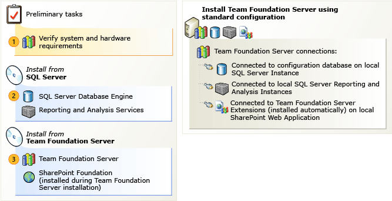

# Configure Team Foundation Server using the standard configuration

[!INCLUDE [temp](../../_shared/version-tfs-2013-only.md)]

You can configure Team Foundation Server to use the standard configuration. To complete this procedure, you must have a domain account. 

For more information about accounts, see [Service account requirements](../../account-requirements.md)

> [!TIP]
> You can access the Team Foundation Server Configuration tool by launching Team Foundation Server Administration Console, choosing **Application Tier**, and then choosing **Configure Installed Features**.

## Prerequisites

You must be a member of the **Administrators** security group on the server that is running the Azure DevOps application tier serer. 

### To configure using the standard configuration

1.  Choose **Standard Single Server**, and then choose **Start Wizard**.

    The **Team Foundation Server Standard Configuration **wizard appears.

2.  Read the Welcome screen, and then choose **Next**.

3.  In **User Account**, enter the name of the service account that you want to use for SharePoint Foundation.

    This account is also used as the report reader account to create reports.

4.  In **Password**, enter the password for this service account, and then choose **Next**.

5.  Choose **Install SharePoint Foundation 2013**.

> [!NOTE]
> If the SharePoint installation requires a reboot, you might need to reenter some of the information you previously entered in this wizard.

6. After Team Foundation Server installs SharePoint Foundation, choose **Next**.

7. Review the information, and then choose **Next**.

   The wizard validates your configuration.

   If you run into a problem, you can use the detailed results to identify the issue. If you can, fix the issue, and then choose the link to run the ready checks over again. If you resolved the problem, you’ll be able to configure TFS in the next step.

8. Choose **Configure**.

   The wizard applies configuration settings.

9. Choose **Next**, **Close**, **Close**.

   The Team Foundation Server Administration Console appears.

## Related articles

[Install Team Foundation Server](../get-started.md) 
