# How to set up a multiple server configuration, Azure DevOps on-premises

[!INCLUDE [temp](../_shared/version-tfs-2015-earlier.md)]

You can scale up an Azure DevOps Server, previously named Team Foundation Server (TFS), deployment for thousands or tens of thousands of users
by installing your application tier across many servers,
and you can ensure high availability by using SQL Server AlwaysOn Availability Groups.

> [!NOTE]  
> If you have an existing Azure DevOps installation and you want to upgrade it,
> [use the upgrade wizard](../upgrade/run-upgrade-wizard.md).

## Preparation and prerequisites

### Data tier

0. Set up your SQL Server deployment using a [supported version of SQL Server](../requirements.md#sql-server).
   Your deployment can be a single instance of SQL Server or an [AlwaysOn Availability Group](/sql/database-engine/availability-groups/windows/getting-started-with-always-on-availability-groups-sql-server).

	When you set up SQL Server, install the database engine and the full text search services.

	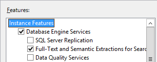

1. Configure the firewall on each of the servers
   to [allow access to the SQL Server database engine](/sql/database-engine/configure-windows/configure-a-windows-firewall-for-database-engine-access)
   so that the Azure DevOps application-tier servers can get through the firewall to connect to the SQL Server database engine.

### Reporting

If you're going to enable reporting, prepare the data tier servers for that.
::: moniker range=">= azure-devops-2019"
> [!NOTE]   
> Make sure to review [Reporting configuration choices](get-started.md#reporting-choices) to understand the choices available to you and the impact it has on your choice of work tracking customization process models.
::: moniker-end 

0. Install SQL Server Analysis Services.

	You can install Analysis Services on the server or AlwaysOn Availability Group where you installed the database engine,
	or you can install it on a separate SQL Server instance or a separate AlwaysOn Availability Group.

1. Configure the firewall on each of the Analysis Services servers
   to [allow access to Analysis Services](https://msdn.microsoft.com/library/ms174937.aspx).

2. Install and configure SQL Server Reporting Services.

	You can install Reporting Services on the server or AlwaysOn Availability Group where you installed the database engine or Analysis Services,
	or you can install it on a separate SQL Server instance or a separate AlwaysOn Availability Group.

3. Configure the firewall on each of the Reporting Services servers to [allow access to Reporting Services](/sql/reporting-services/report-server/configure-a-firewall-for-report-server-access).

## Install Azure DevOps on application tier servers

Install Azure DevOps Server on multiple application tier servers.

### First application tier server.

1. If you're going to enable reporting, install SQL Server Client Tools Connectivity on the application tier server.

	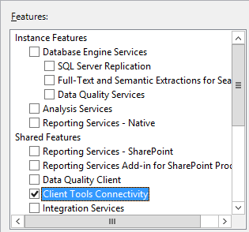

2. [!INCLUDE [download-azure-devops-server](../_shared/download-azure-devops-server.md)] 

3. Choose **Start Wizard** to run the application-tier only configuration wizard.

     

4. Choose the **New Deployment - Advanced** option. For details, see [Configure using the Advanced option](single-server.md#configure-advanced). 

5. On the database page, point to the SQL Server instance on the data tier and test the connection.  
	::: moniker range=">= azure-devops-2019"
	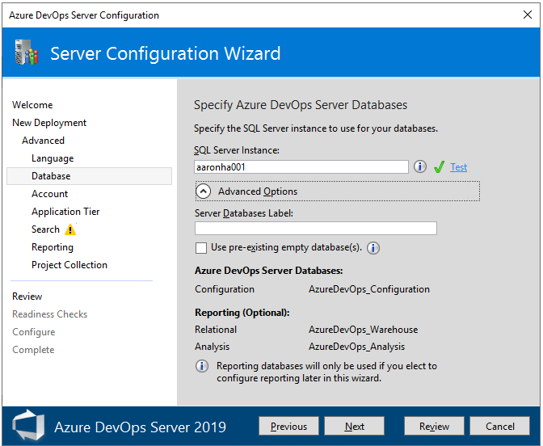 
	::: moniker-end 
	::: moniker range=">tfs-2015 <=tfs-2018"
	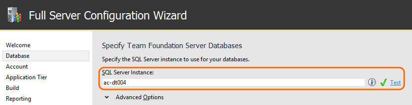
	::: moniker-end 

::: moniker range=">= azure-devops-2019"
0. On the Account page, specify the service account to use.   

	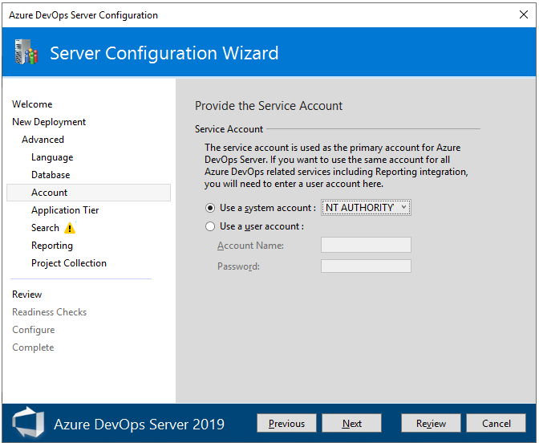 
   ::: moniker-end 
   ::: moniker range=">tfs-2015 <=tfs-2018"
1. On the Account page, specify the service account and authentication method.  

	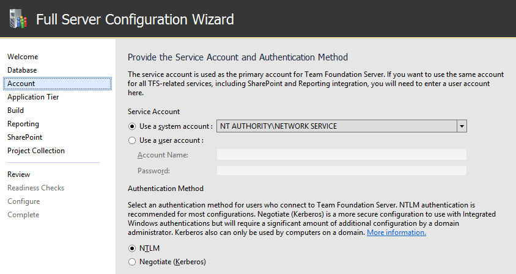
   ::: moniker-end 

	By default, Azure DevOps services will run as a network service in a domain
	or as local system in a workgroup.
	On a domain,
	you can use a domain account and grant it only the permissions that the Azure DevOps service account needs.

#### Reporting

0. If you want to enable reporting, turn it on here.

	::: moniker range=">= azure-devops-2019"
	Uncheck the **Configure Reporting** checkbox if you don't plan on using SQL Server Reporting Services or haven't yet installed SQL Server Analysis Services and SQL Server Reporting Services. Otherwise, keep the box checked.

	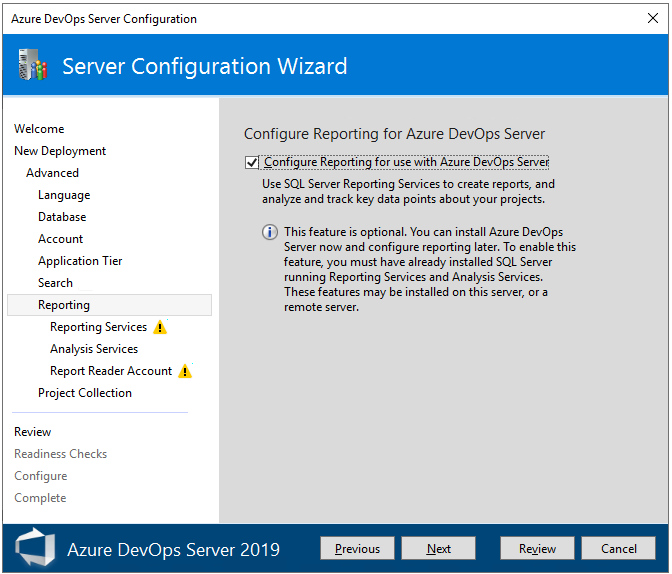  
	::: moniker-end 
	::: moniker range=">tfs-2015 <=tfs-2018"
	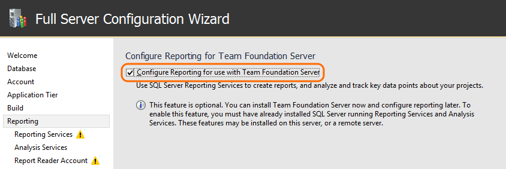  
	::: moniker-end 

1. Enter the name of the server where you installed SQL Server Reporting Services. Then, choose **Populate URLs**. 

	::: moniker range=">= azure-devops-2019"
	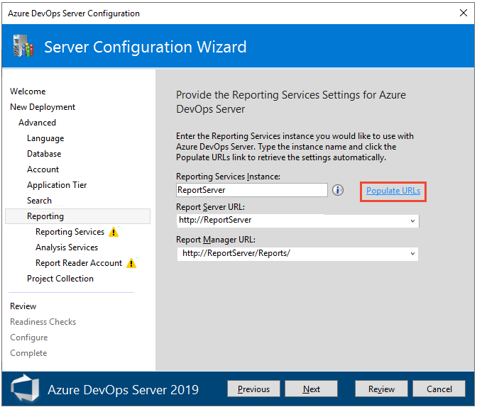 
	::: moniker-end 
	::: moniker range=">tfs-2015 <=tfs-2018"
	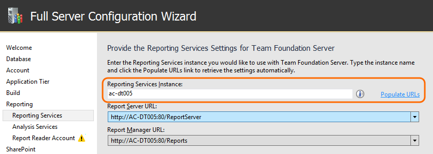
	::: moniker-end 	

2. Set the account that will be assigned the Reports Reader role in the Analysis Services instance
   and test that the account and password can be authenticated.
   Reports use this account when they access the Analysis Services database.  

	::: moniker range=">= azure-devops-2019"
	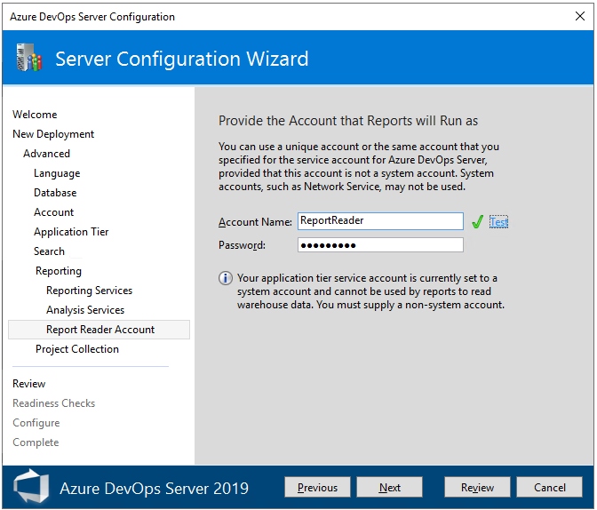  
	::: moniker-end 
	::: moniker range=">tfs-2015 <=tfs-2018"
	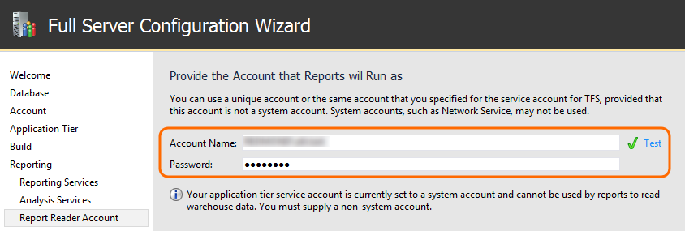
	::: moniker-end 
	
### Additional application tier servers

0. [!INCLUDE [install-sql-server-client-tools-connectivity](../_shared/install-sql-server-client-tools-connectivity.md)]

1. [!INCLUDE [download-azure-devops-server](../_shared/download-azure-devops-server.md)]

2. On the database page, point to the SQL Server instance that is the primary replica in the AlwaysOn Availability Group
   where you installed the database engine,
   and list the available databases.
	::: moniker range=">= azure-devops-2019"
	 
	::: moniker-end 
	::: moniker range=">tfs-2015 <=tfs-2018"
	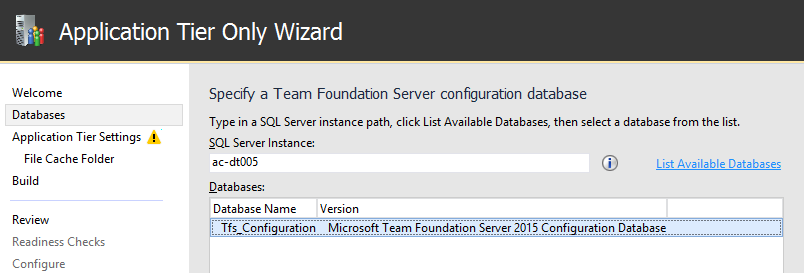
	::: moniker-end 

::: moniker range=">= azure-devops-2019"
0. On the **Account** page, specify the service account to use.   

	 
   ::: moniker-end 

::: moniker range=">tfs-2015 <=tfs-2018"
0. On the **Account** page, specify the service account and authentication method.  

	
   ::: moniker-end 

## AlwaysOn Availability Group

If you installed the database engine on a SQL Server AlwaysOn Availability Group,
add the following Azure DevOps databases to the availability group.
- TfsConfiguration
- TfsDefaultCollection

If you add a new project collection, add that database to the AlwaysOn Availability Group, too.

<!--- QUESTION: Database names haven't changed? --> 

## Related articles

- [Install and configure Azure DevOps on-premises](get-started.md)
- [Create a project](/azure/devops/organizations/projects/create-project)
- [Add or manage project collections](../admin/manage-project-collections.md)
