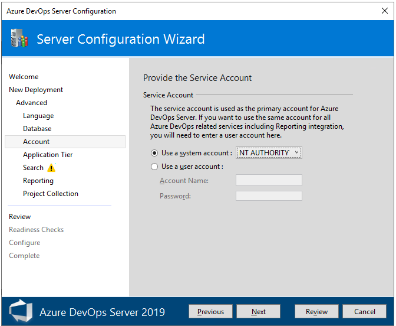
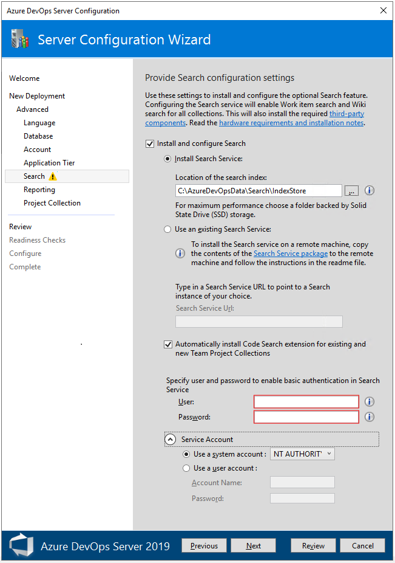
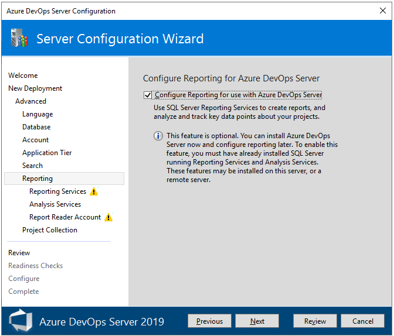
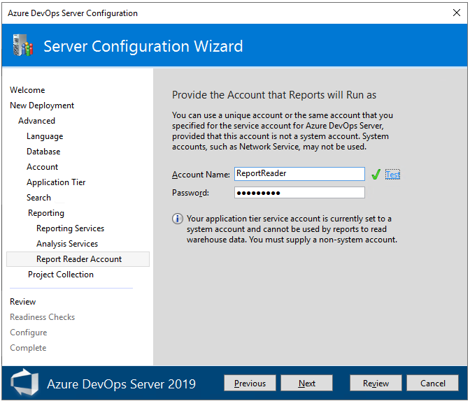
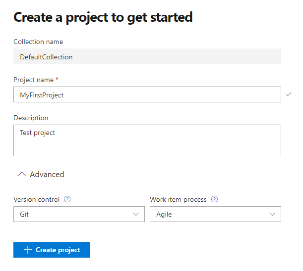

# Install on a single server

[!INCLUDE [temp](../_shared/version-tfs-2015-earlier.md)]

<!--- TODO: Update to address the different versions. provide hints to get them through web site settings and search configuration --> 

The simplest way to set up Azure DevOps Server is to put everything on a single server. To confirm that this configuration is appropriate for your team, see the [hardware recommendations](../requirements.md#hardware-recommendations). If not, consider a [dual-server](../install/dual-server.md) or [multiple-server](../install/multiple-server.md) configuration instead.

If you're upgrading from an earlier version, learn more about [compatibility](../compatibility.md), [release notes](../whats-new.md), and [getting started with your upgrade](../upgrade/get-started.md).

## Prerequisites

1. Prepare a single computer that satisfies the [system requirements](../requirements.md).

2. If you don't plan to use SQL Server Express, set up a [supported version of SQL Server](../requirements.md#sql-server). When you set up SQL Server for Azure DevOps on-premises, at a minimum install the Database Engine and Full-Text and Semantic Extractions for Search features.

	We recommend that you use SQL Server Express only for personal or evaluation deployments. Paid copies of Azure DevOps on-premises include a SQL Server Standard license. For more information, see [Azure DevOps Server pricing](https://azure.microsoft.com/pricing/details/devops/azure-devops-services/) and [Team Foundation Server pricing](https://www.visualstudio.com/team-services/tfs-pricing). If you use the included license, you can use it only for databases created with those products.

3. The account you use to configure the installation must be a member of the [sysadmin server role in SQL Server](/sql/relational-databases/security/authentication-access/server-level-roles).

   > [!NOTE]
   > Installing Azure DevOps on-premises involves a complex set of operations that require a high degree of privilege. These operations include creating databases, provisioning logins for service accounts, and more. Technically, all that's required is:
   > - Membership in the serveradmin role.
   > - ALTER ANY LOGIN, CREATE ANY DATABASE, and VIEW ANY DEFINITION server-scoped permissions.
   > - CONTROL permission on the master database. 
   > 
   >   Membership in the sysadmin server role confers all these memberships and permissions. It's the easiest way to ensure that configuration succeeds. If necessary, you can revoke these memberships and permissions after installation.

4. To support installation and configuration of the **Search** extension, you need to provide a user name and password. Installing and configuring **Search** supports Code, Work Item and Wiki search features. For more information, see [Configure search](/azure/devops/project/search/administration#config-tfs).  

	> [!NOTE]
	> Search also requires Oracle Server JRE 8 (Update 60 or higher). You can download and install or update to the latest version by accepting the Oracle Binary Code License Agreement for Server JRE and selecting **Configure**. Note that this will set the JAVA_HOME environment variable to point to the Java installation directory, and that Server JRE does not provide automatic updates.  

5. When configuring the application-tier you have a choice of web site settings. Review [Web site settings](../admin/websitesettings.md) to understand the choices and requirements. 

## Download and install

1. [!INCLUDE [download-azure-devops-server](../_shared/download-azure-devops-server.md)]

2. Start the installation.

     The installer copies files onto your machine, and then starts the Azure DevOps Server Configuration Center.

3.  You can configure your installation by choosing **Start Wizard**, or return at a later time and launch the Server Configuration Wizard wizard as described in the next section.

	 

<a id="configure-basic" /> 

## Configure using the Basic option

This section walks you through configuring your Azure DevOps Server using the Basic option. The Basic option is optimized for simplicity by using default options for most inputs. If you want full control over all inputs, choose the [**New Deployment - Advanced** option](#configure-advanced) instead. 

0. Open the Azure DevOps Administration Console and choose **Configure Installed Features** to open the Server Configuration Wizard. 

	 

1. Choose **Configure Azure DevOps Server** and then choose **Start Wizard**. 

	 

2. **Basic**. Choose the **New Deployment - Basic** option and then choose **Next**. 

	 

3. **Language**. Select the **Language** for your deployment and choose **Next**.

	 

4. **SQL Server Instance**. Select the SQL Server instance you want to use. For evaluation purposes, choose **Install SQL Server Express**. For production purposes, choose **Use an existing SQL Server Instance**. Then, choose **Next**.

	 

	If you chose **Use an existing SQL Server Instance**, enter the database information in the next page and choose **Test** to verify. Then choose **Next**.

	 

5. **Application Tier**. Choose the web site settings you want to use, which includes whether to use HTTP or HTTPS bindings, and then choose **Next**. For more information, see [Web site settings](../admin/websitesettings.md).

	 

6. **Search**. Select whether to install and configure **Search** features or use an existing search service. Installing and configuring **Search** supports Code, Work Item and Wiki search features. For more information, see [Configure search](/azure/devops/project/search/administration#config-tfs). Choose **Next**.

	 

	<!--- QUESTION: Need to provide hints on what to input re credentials --> 
7. **Review**. Review your selections and choose **Verify**, the wizard runs readiness checks to validate your environment and your setting selections. If it's successful, you can configure your deployment. Otherwise, fix any errors and rerun the readiness checks.

8. **Readiness Checks**. When all checks have passed, you're ready to complete the configuration. Choose **Configure**.

	 

	> [!TIP]
	> You can return to any previous page by choosing **Previous** or the page name in the left pane. If you change a configuration setting, then you need to verify the settings by choosing **Click here to rerun readiness Checks**. 

9. **Configure**. The wizard starts configuring each feature and displays the progress. When complete, choose **Next**.

      

10. **Complete**. Review your configuration results and choose **Copy Full Path** to copy the link to the configuration log file. Choose the Azure DevOps Server link to open the web portal. 

     In this example, the link is `/http:aaronha001/`. 

      

<!---

## Configure

Configure Azure DevOps Server by using your selected scenario. The easiest way to set it up on a single server is to use the Server Configuration Wizard with the **New Deployment - Basic** scenario.

> [!NOTE]
> For previous versions, use the Basic Configuration Wizard.

This scenario is optimized for simplicity by using default options for most inputs. If you want full control over all inputs, use the **New Deployment - Advanced** scenario instead. 

With the **New Deployment - Basic** scenario, select the following settings:

- **Language**: Select the language to use for configuring.
- **SQL Server Instance**: Select whether to install SQL Server Express or use an existing SQL Server instance.
- **Application Tier**: Select the website settings to use, which includes whether to use HTTP or HTTPS bindings. For more information, see [Web site settings](../admin/websitesettings.md).
- **Search**: Select whether to install and configure Code Search features or use an existing search service. For more information, see [Configure search](/azure/devops/project/search/administration#config-tfs).

If you use the **New Deployment - Advanced** scenario, select the following additional settings:

- **Account**: Select the service account that your processes run as. The default value used in the Basic scenario is `NT AUTHORITY\NETWORK SERVICE` in domain-joined scenarios and `LOCAL SERVICE` in workgroup scenarios.
- **Application Tier**: 
    - Under **SSH Settings**, select whether to enable SSH and the port it should listen on. The default value used in the Basic scenario is to configure SSH on port 22.
    - Under **File Cache Location**, select the location of the file cache used for frequently accessed resources. [!INCLUDE [file-cache-location](../_shared/file-cache-location.md)].
- **Project Collection**: Select whether to create a project collection in which to store your projects. Enter the name of that collection. The default behavior in the Basic scenario is to create a project collection named **DefaultCollection**.

After you review your selections and select **Verify**, the wizard runs readiness checks to validate your environment and your setting selections. If it's successful, you can configure your deployment. Otherwise, fix any errors and rerun the readiness checks.

-->

<a id="configure-advanced" /> 

## Configure using the Advanced option

This section walks you through configuring your Azure DevOps Server using the Advanced option. For a review of Basic and Advanced options, see [Install and configure Azure DevOps, Basic and Advanced configuration options](get-started.md#basic-advanced).

0. Start the Server Configuration Wizard to Configure Azure DevOps Server. 

	 

1. Choose **Configure Azure DevOps Server** and then choose **Start Wizard**. 

	 

2. **Advanced**. Choose the **New Deployment - Advanced** option and then choose **Next**. 

	 

3. **Language**. Select the **Language** for your deployment and choose **Next**.

	 

4. **Database**. Specify the SQL Server instance you have set up for use with Azure DevOps Server. Then, choose **Next**.

	 

5. **Account**. Specify the service account to use. 

	 

6. **Application Tier**. Choose the web site settings you want to use, which includes whether to use HTTP or HTTPS bindings, and then choose **Next**. For more information, see [Web site settings](../admin/websitesettings.md).

	 

7. **Search**. Select whether to install and configure **Search** features or use an existing search service. Installing and configuring **Search** supports Code, Work Item and Wiki search features. For more information, see [Configure search](/azure/devops/project/search/administration#config-tfs). Choose **Next**.

	 

	<!--- QUESTION: Need to provide hints on what to input re credentials --> 
   <a id="reporting" /> 
8. <strong>Reporting</strong>. Uncheck the <strong>Configure Reporting</strong> checkbox if you don&#39;t plan on using SQL Server Reporting Services or haven&#39;t yet installed SQL Server Analysis Services and SQL Server Reporting Services. Otherwise, keep the box checked and choose <strong>Next</strong>.

	 

9. **Reporting Services**. Enter the name of the server where you installed SQL Server Reporting Services. Then, choose **Populate URLs**. Choose **Next**.

      

10. **Analysis Services**. Enter the name of the server where you installed SQL Server Reporting Services, and then choose **Test**. Choose **Next**.

      

11. **Report Reader Account**. Enter the credentials for the service  account you've set up for reporting, and then choose **Test**. Choose **Next**. 

       

12. **Project Collection**. Leave the **Create a new team project collection** checkbox checked. You must have at least one project collection in which to define projects. Leave the project name as is, *DefaultCollection*, or give it a new name and optionally a description.  

       
     ::: moniker range=">= azure-devops-2019"
     > [!NOTE]   
     > This collection will support the On-premises XML process model for customizing work tracking. To create a collection that uses the Inheritance process model, you'll need to add a project collection which isn't configured with reporting services. See [Manage project collections](../admin/manage-project-collections.md). To learn more about the Inheritance process model, see [About process customization and inherited processes](/azure/devops/organizations/settings/work/inheritance-process-model).

     <!--- QUESTION: Is the option to configure the first Project Collection an artifact that we chose to configure reporting services? or is it not supported for the first project collection ? --> 
     ::: moniker-end

13. **Review**. Review the configuration settings you've made and choose **Verify**.  

       
14. **Readiness Checks**. The system performs a final pass to ensure the configuration settings are valid. When all checks have passed, you're ready to complete the configuration. Choose **Configure**.

      

     > [!TIP]
     > You can return to any previous page by choosing **Previous** or the page name in the left pane. If you change a configuration setting, then you need to verify the settings by choosing **Click here to rerun readiness Checks**. 

15. **Configure**. The wizard starts configuring each feature and displays the progress. When complete, choose **Next**.

      

16. **Complete**. Review your configuration results and choose **Copy Full Path** to copy the link to the configuration log file. Choose the Azure DevOps Server link to open the web portal. 

     In this example, the link is `/http:aaronha001/`. 

      

## Create a project

Your web portal will open to the Create project page. 

0. Provide a project name and optional description. The project name can't contain spaces or special characters (such as / : \ ~ & % ; @ ' " ? < > | # $ * } { , + = [ ]), can't begin with an underscore, can't begin or end with a period, and must be 64 characters or less. 

	The default settings configure a Git repository for version control and the Agile process for work tracking. To choose different options, expand **Advanced**. 

	> [!div class="mx-imgBorder"]  
	>    

	For a comparison of version control options, see [Choose the right version control for your project](/azure/devops/repos/tfvc/comparison-git-tfvc). For a review of work tracking processes, see [Choose a process](/azure/devops/boards/work-items/guidance/choose-process). 

1. When your project has been created, the project summary page appears. To learn more, see [Share your project mission, view project activity](/azure/devops/project/wiki/project-vision-status).

## Next steps

**For administrators:**
> [!div class="nextstepaction"]
> [Get started as an administrator](/azure/devops/user-guide/project-admin-tutorial) 

**For developers:**
> [!div class="nextstepaction"]
> [Start tracking work](/azure/devops/boards/get-started/plan-track-work) or [Code with Git](/azure/devops/repos/get-started/code-with-git)

## Related articles

- [Install and configure Azure DevOps on-premises](get-started.md)
- [Create a project](/azure/devops/organizations/projects/create-project)

<!---Express install log: C:\ProgramData\Microsoft\Azure DevOps\Server Configuration\Logs\TFS_Azure DevOps Server Configuration_0228_200329.log -->
