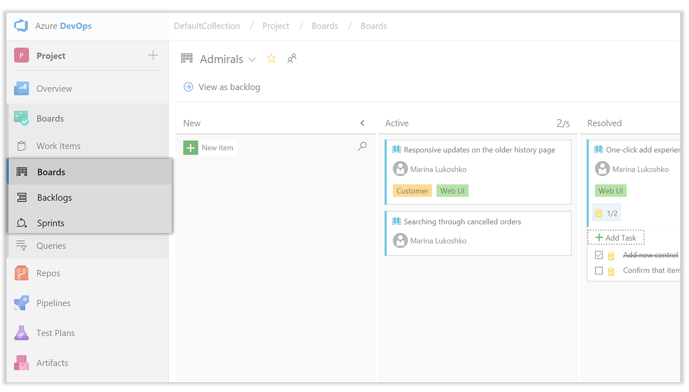
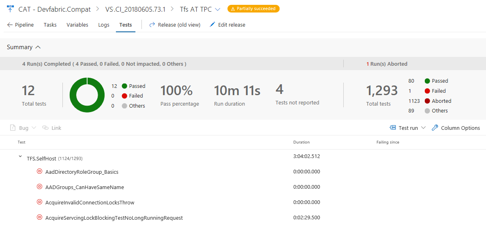
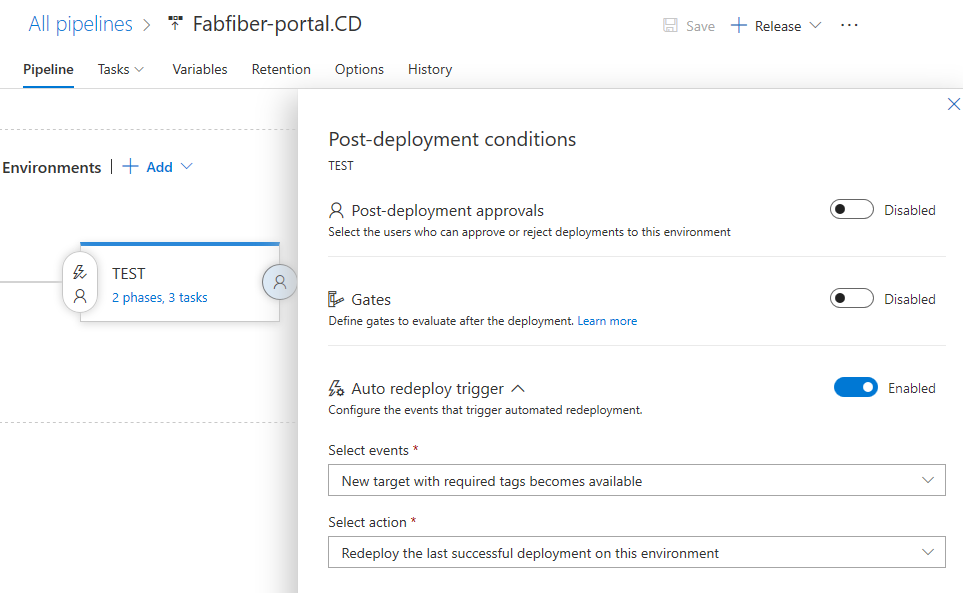
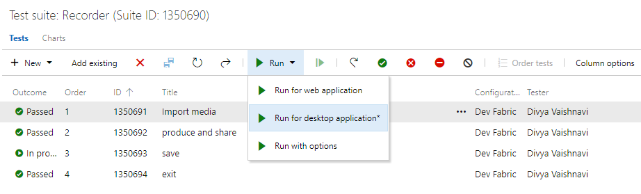
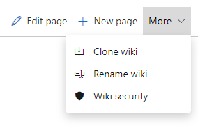
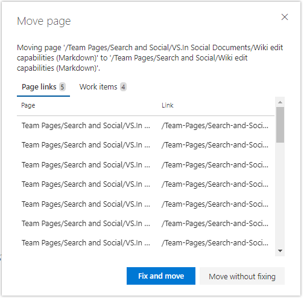

# <a id = "top"> </a> **Azure DevOps Server 2019 Release Notes**

****

| <a href="https://developercommunity.visualstudio.com/spaces/22/tfs.html?topics=tfs" target="blank">Developer Community</a> 
| <a href="https://docs.microsoft.com/tfs/server/requirements?view=vsts" target="blank">System Requirements and Compatibility</a> 
| <a href="https://visualstudio.microsoft.com/license-terms" target="blank">License Terms</a> 
| <a href="https://blogs.msdn.microsoft.com/devops/tag/tfs/" target="blank">DevOps Blog</a> 
| <a href="https://docs.microsoft.com/tfs/release-notes/azuredevops2019-sha" target="blank">SHA-1 Hashes</a> |

****

In this article, you will find information regarding the newest release for Azure DevOps Server 2019. Click the button to download our latest update, Azure DevOps Server 2019.0.1.

<a href="https://go.microsoft.com/fwlink/?LinkId=2089023" target="blank"></a>

To learn more about Azure DevOps Server 2019, see [Azure DevOps Server Requirements](https://go.microsoft.com/fwlink/?LinkId=809018 "Azure DevOps Server Requirements"). Visit the <a href="https://visualstudio.microsoft.com/downloads" target="blank">visualstudio.com/downloads</a> page to download Team Foundation Server products. 

Direct upgrade to Azure DevOps Server is supported from Team Foundation Server 2012 and newer. If your TFS deployment is on TFS 2010 or earlier, you need to perform some interim steps before upgrading to Azure DevOps Server 2019. Please see the <a href="https://docs.microsoft.com/tfs/server/install/get-started" target="blank">Install page</a> for more information. 

****

## **Azure DevOps Server 2019.0.1 Patch 1 Release Date: July 9, 2019**

We have released a [security patch](https://aka.ms/azdev2019.0.1patch) for Azure DevOps Server 2019.0.1 that fixes the following bugs. Please see the [blog post]https://devblogs.microsoft.com/devops/june-security-release-patches-available-for-azure-devops-server-and-team-foundation-server/) for more information.
* **[CVE-2019-1072](https://portal.msrc.microsoft.com/en-US/security-guidance/advisory/CVE-2019-1072)**: Remote code execution vulnerability in work item tracking
* **[CVE-2019-1076](https://portal.msrc.microsoft.com/en-US/security-guidance/advisory/CVE-2019-1076)**: Cross site scripting (XSS) vulnerability in pull requests

****

## **Azure DevOps Server 2019.0.1 Release Date: May 21, 2019**

[Azure DevOps Server 2019.0.1](https://go.microsoft.com/fwlink/?linkid=2089023) is a roll up of bug fixes. It includes all fixes in the Azure DevOps Server 2019 patches previously released. You can directly install Azure DevOps Server 2019.0.1 or upgrade from Azure DevOps Server 2019 or Team Foundation Server 2012 or newer.

> [!NOTE]
> The Data Migration Tool will be available for Azure DevOps Server 2019.0.1 about three weeks after this release. You can see our list of currently supported versions for import [here](https://docs.microsoft.com/en-us/azure/devops/migrate/migration-overview#supported-azure-devops-server-versions-for-import).

This release includes fixes for the following bugs:

### Azure Boards

* "The field criteria for this plan has an error." when configuring a Plan. Reported through [Developer Community](https://developercommunity.visualstudio.com/content/problem/438145/impossible-to-configure-a-plan-so-i-can-see-featur.html).
* apiwitcontroller.executequery throws an exception when a query has the same column multiple times.
* In the client object model using the vso.work_full oauth scope, WorkItemServer.DownloadFile() fails.
* Copying an embedded image from a work item field to another work item field in a different project may create a broken image.

### Azure Repos

* "TF401019: GitRepositoryNotFoundException".

### Azure Pipelines

* The **Test Analytics Tab** has a star (*) that indicates preview, even though this feature is not in preview.
* On the **Releases** tab, the action to manage security is now shown to all the users irrespective of whether they can change the permissions or not.
* On the Releases landing pages, the start draft release action was creating a new release, but now it starts the draft release.

### Azure Test Plans

* The 1 hour filter on the TestRuns and TestResults CompletedDate are too granular.
* In the **Test Case** work item type, the type, "Test Case", should not be localized.
* Test cases do not show up in MTM or a browser.
* "Validating stage: You do not have permission to trigger releases on the associated release pipeline" error when running automated tests from a Test Plan. Reported through [Developer Community](https://developercommunity.visualstudio.com/content/problem/476664/permissions-to-execute-automated-tests-from-test-p.html).
* Using the [delete test case API](https://docs.microsoft.com/en-us/rest/api/vsts/test/test%20cases/delete?view=vsts-rest-5.0), test cases can be deleted from other projects. Reported through [Developer Community](https://developercommunity.visualstudio.com/content/problem/352447/delete-test-case-through-api-removes-test-cases-fr.html).
* Clicking on a work item link in Test Runner opens the work item URL inside Test Runner instead of the default browser.
* Test case status is not getting updated for users that sign out of Test Runner.
* User name and email address do not show in the user dropdown in Test Runner.

### Azure Artifacts

* **Move Up** and **Move Down** are not localized in Upstreams.

### Analytics

* Analytics reports may show incomplete data because the model is marked as "ready" before it is actually complete.
* The velocity, burndown and burnup widgets display different planned work for users on different time zones.
* A hold may be placed on Analytics data ingestion while doing maintenance which can cause stale reports.

### General

* Left navigation items get squeezed on IE when there is not enough space.

### Administration

* Additional logging added to Collection upgrade to help debug issues.
* When TfsConfig offlineDetach fails, the error message is not actionable.
* TfsJobAgent service crashes.
* The Search extension does not get installed after configuration is complete.
* The Administration Console becomes unresponsive when the configuration DB is corrupted.
* Service Hooks may not correctly process notifications.
* Code Search indexing does not start after configuring Search.
* There are unlocalized strings on search pages results.

This release includes the following update:

### Support for Visual Studio 2019 (VS2019) in Visual Studio Test task

We've added support for Visual Studio 2019 to the Visual Studio Test task in pipelines. To run tests using the test platform for Visual Studio 2019, select the **Latest** or **Visual Studio 2019** options from the Test platform version dropdown.

> [!div class="mx-imgBorder"]
>  in Visual Studio Test task")

****

## **Azure DevOps Server 2019 Patch 2 Release Date: May 14, 2019**

We have released a [security patch](https://aka.ms/azdev2019patch) for Azure DevOps Server 2019 that fixes the following bugs. Please see the [blog post](https://devblogs.microsoft.com/devops/may-security-release-patches-available-for-azure-devops-server-2019-tfs-2018-3-2-tfs-2018-1-2-tfs-2017-3-1-and-tfs-2015-4-2/) for more information.
* **[CVE-2019-0872](https://portal.msrc.microsoft.com/en-US/security-guidance/advisory/CVE-2019-0872)**: Cross site scripting (XSS) vulnerability in the Test Plans
* **[CVE-2019-0971](https://portal.msrc.microsoft.com/en-US/security-guidance/advisory/CVE-2019-0971)**: Information disclosure vulnerability in the Repos API
* **[CVE-2019-0979](https://portal.msrc.microsoft.com/en-US/security-guidance/advisory/CVE-2019-0979)**: Cross site scripting (XSS) vulnerability in the User hub

****

## **Azure DevOps Server 2019 Patch 1 Release Date: April 9, 2019**

We have released a [security patch](https://aka.ms/azdev2019patch) for Azure DevOps Server 2019 that fixes the following bugs. Please see the [blog post](https://devblogs.microsoft.com/devops/april-security-release-patches-available-for-azure-devops-server-2019-tfs-2018-3-2-tfs-2018-1-2-tfs-2017-3-1-and-the-release-of-tfs-2015-4-2/) for more information.
* **[CVE-2019-0857](https://portal.msrc.microsoft.com/en-US/security-guidance/advisory/CVE-2019-0857)**: Spoofing vulnerability in the Wiki
* **[CVE-2019-0866](https://portal.msrc.microsoft.com/en-US/security-guidance/advisory/CVE-2019-0866)**: Remote code execution vulnerability in Pipelines
* **[CVE-2019-0867](https://portal.msrc.microsoft.com/en-US/security-guidance/advisory/CVE-2019-0867)**: Cross site scripting (XSS) vulnerability in Pipelines
* **[CVE-2019-0868](https://portal.msrc.microsoft.com/en-US/security-guidance/advisory/CVE-2019-0868)**: Cross site scripting (XSS) vulnerability in Pipelines
* **[CVE-2019-0869](https://portal.msrc.microsoft.com/en-US/security-guidance/advisory/CVE-2019-0869)**: HTML injection vulnerability in Pipelines
* **[CVE-2019-0870](https://portal.msrc.microsoft.com/en-US/security-guidance/advisory/CVE-2019-0870)**: Cross site scripting (XSS) vulnerability in Pipelines
* **[CVE-2019-0871](https://portal.msrc.microsoft.com/en-US/security-guidance/advisory/CVE-2019-0871)**: Cross site scripting (XSS) vulnerability in Pipelines
* **[CVE-2019-0874](https://portal.msrc.microsoft.com/en-US/security-guidance/advisory/CVE-2019-0874)**: Cross site scripting (XSS) vulnerability in Pipelines
* **[CVE-2019-0875](https://portal.msrc.microsoft.com/en-US/security-guidance/advisory/CVE-2019-0875)**: Elevation of privilege vulnerability in Boards

****

## **Azure DevOps Server 2019 Release Date: March 5, 2019**

> [!NOTE]
> The Data Migration Tool will be available for Azure DevOps Server 2019 about three weeks after this release. You can see our list of currently supported versions for import [here](https://docs.microsoft.com/en-us/azure/devops/articles/migration-overview?view=vsts#supported-tfs-versions-for-import).

****
## **RC2 Release Date: January 22, 2019**

### Summary of What's New in Azure DevOps Server 2019 RC2

We have added the following features to RC2:

* [Link GitHub Enterprise commits and pull requests to Azure Boards work items](#link-github-enterprise-commits-and-pull-requests-to-azure-boards-work-items)
* [Configure builds using YAML](#configure-builds-using-yaml)
* [Card annotations include bugs and custom work item types](#card-annotations-include-bugs-and-custom-work-item-types)
* [Improved branch picker](#improved-branch-picker)
* [Changes to Artifacts and Release Management Deployment Pipeline Licensing](#changes-to-artifacts-and-release-management-deployment-pipeline-licensing)

****
## **RC1 Release Date: November 19, 2018**

### Summary of What's New in Azure DevOps Server 2019 RC1

Azure DevOps Server 2019 introduces a new navigation experience and many new features. Some of the highlights include:

* [New navigation experience](#new-navigation-experience)
* [The Analytics marketplace extension for reporting is now available](#the-analytics-marketplace-extension-for-reporting-is-now-available)
* [Support for Azure SQL Database](#support-for-azure-sql-database)
* [Process inheritance on new collections](#process-inheritance-on-new-collections)
* [New Work Items hub](#new-work-items-hub)
* [New Boards, Backlogs, and Sprints hubs](#new-boards-backlogs-and-sprints-hubs)
* [New Queries hub](#new-queries-hub)
* [Standardize pull request descriptions using templates](#standardize-pull-request-descriptions-using-templates)
* [Change the target branch of a pull request](#change-the-target-branch-of-a-pull-request)
* [Manage build pipelines using the new Builds page](#manage-build-pipelines-using-the-new-builds-page)
* [Manage release pipelines using the new Releases page](#manage-release-pipelines-using-the-new-releases-page)
* [Visualize release progress](#visualize-release-progress)
* [Locally update your agent](#locally-update-your-agent)
* [Progressively expose and phase deployments using release gates](#progressively-expose-and-phase-deployments-using-release-gates)
* [Upstream sources](#upstream-sources)
* [Create table of contents for wiki pages](#create-table-of-contents-for-wiki-pages)

You can also jump to individual sections to see the new features:

* [General](#general)
* [Boards](#boards)
* [Repos](#repos)
* [Pipelines](#pipelines)
* [Test Plans](#test-plans)
* [Artifacts](#artifacts)
* [Wiki](#wiki)
* [Reporting](#reporting)

****

## General

### Announcing Azure DevOps Server

On September 10, we announced Azure DevOps as the evolution of Visual Studio Team Services and Team Foundation Server. Azure DevOps Server 2019 is our first on premises release with this new brand. You can find more information in our [blog post](https://azure.microsoft.com/en-us/blog/introducing-azure-devops/).

### New navigation experience

We are introducing a new navigation to modernize the user experience. This new navigation has rolled out to the Azure DevOps service and is now available in Azure DevOps Server 2019. See [our blog](https://blogs.msdn.microsoft.com/devops/2018/06/19/new-navigation/) for more information.

> [!div class="mx-imgBorder"]
> 

### Changes to Artifacts and Release Management Deployment Pipeline Licensing

Based on user feedback, we are making two key changes to our licenses with Azure DevOps Server 2019. First, customers will no longer need to purchase the Artifact extension to use Artifacts. An Artifacts license use will now be included in the Basic License. All users that have a Basic License assigned to them will now be able to use Artifacts. Second, customers will no longer be required to purchase Release Management Deployment Pipelines. Just like Build Pipelines, Release Management Deployment Pipelines are now included with Azure DevOps Server 2019.  

### Support for Azure SQL Database

In order to simplify the experience of running Azure DevOps 2019 in Azure, we've enabled support for Azure SQL Database (General Purpose S3 and above). This will allow you to leverage extensive [backup features](https://docs.microsoft.com/en-us/azure/sql-database/sql-database-automated-backups) and [scaling options](https://docs.microsoft.com/en-us/azure/sql-database/sql-database-service-tiers) to suit your needs while reducing the administrative overhead of running the service. Note that your Host VM must be located in the same Azure region as your database in order to keep latency low. See the [documentation](https://docs.microsoft.com/en-us/tfs/server/install/install-azure-sql) for more information.

### Work item & test client object model SOAP APIs in future versions

Azure DevOps Server 2019 continues to support the work item tracking SOAP API and the client object model. However, it will be marked as deprecated in future versions of Azure DevOps Server. You can find more information in [our documentation](https://aka.ms/witclientom).

### Process inheritance on new collections

Process inheritance is now available on new collections. Users will need to make a conscience decision on the process model when creating a new collection. See [our documentation](https://docs.microsoft.com/en-us/azure/devops/organizations/settings/work/inheritance-process-model?toc=/azure/devops/reference/toc.json&bc=/azure/devops/reference/breadcrumb/toc.json&view=vsts) on what the inheritance model is and how it is different from XML.

> [!div class="mx-imgBorder"]
> 

### Expanded search box

We understand the importance of search and are bringing back the expanded search box on the product header. In addition, you can now invoke the search box by just clicking "/" on any service page in Azure DevOps. This feature was prioritized based on the following [user voice](https://visualstudio.uservoice.com/forums/330519/suggestions/34756084).

Here is the default search box:

> [!div class="mx-imgBorder"]
> 

Once you type a "/", you'll see the expanded search box:

> [!div class="mx-imgBorder"]
> 

### My work flyout

A new feature we're very excited to introduce is the **my work** flyout. We heard feedback that when you are in one part of the product and want some information from another part, you don't want to lose your context. With this new feature, you can access this flyout from anywhere in the product, and it will give you a quick glance at crucial information including your work items, pull requests, and all favorites. With this new flyout, if you're in **Repos** heads down in your code, but then want to quickly check which work item you should work on next, you can simply click on the flyout and see the work items assigned to you and pick up the next item.

Below, you can see the **my work** flyout showing the work items assigned to me:

> [!div class="mx-imgBorder"]
> 

Here, you can see the second pivot which shows the PRs assigned to me. In the flyout, you also have one click access to view more pull requests:

> [!div class="mx-imgBorder"]
> 

Here you can see the last pivot, which is everything you've favorited. This includes your favorite teams, dashboards, boards, backlogs, queries, and repositories:

> [!div class="mx-imgBorder"]
> 

## Boards

### Link GitHub Enterprise commits and pull requests to Azure Boards work items

Teams that use GitHub Enterprise for code and want rich project management capabilities can now integrate their repositories with Azure Boards. By [connecting GitHub and Azure Boards](https://aka.ms/azureboardsgithub), you can get all of the features like backlogs, boards, sprint planning tools, multiple work item types and still have a workflow that integrates with developer workflows in GitHub.

Linking commits and pull requests to work items is easy. Mention the work item using the following syntax:​

```
AB#{work item ID}
```

Mention a work item in a commit message, pull request title, or pull request description, and Azure Boards will create a link to that artifact. For example, consider a commit message like this:​

```
Adds support for deleting connections. Fixes AB#20.
```

This will create a link from the work item #20 to the commit in GitHub, which will appear in the work item's Development section.  ​
 
> [!div class="mx-imgBorder"]
> 

If the words "fix", "fixes", or "fixed" precede the work item mention (as shown above), the work item will be moved to the completed state when the commit is merged to the default branch.

Teams that are using Azure Pipelines to build code in GitHub will also see the work items linked to their GitHub commits in the build summary.

### New Work Items hub

The Work Items Hub is our new hub that will serve as the home of your work items! Here, you have many different list views of your work items that are scoped down for you. You can view **Assigned to me** to quickly get a glance at all the work that is assigned to you or **Recently updated** which shows you all of the work items in your project that have been most recently updated. All of your list options can be seen below:

> [!div class="mx-imgBorder"]
> 

If you want to scope down your lists even further, you are able to filter on type, assigned to, state, area, tags, and keyword. Once you have your desired list view, you can then sort the work items by simply clicking the column's header. If one column is too narrow for you to view the full content of the column, you can easily resize the column in the header area. These experiences can be seen below:

> [!div class="mx-imgBorder"]
> 

### New Boards, Backlogs, and Sprints hubs

The **Backlogs** hub was split into three distinct hubs to improve the user experience. Though powerful, the old Backlogs hub was home to too many features. This often made it difficult to find the feature or capability users were looking for. To address this problem, we’ve split the Backlogs hub into:

* The **Backlogs** hub is now home to just the backlogs for a project. A backlog is a prioritized list of work for the team. Backlogs provide planning tools such as work item hierarchy, forecasting, and new sprint planning experience.
* The new **Boards** hub is home to all Kanban Boards for a project. Boards are used to communicate status and flow. Cards (work items) move from left to right across the board through columns defined by the team. 
* The new **Sprints** hub is home to features used to plan and execute an increment of work. Each sprint contains a sprint backlog, a taskboard, and a view to manage and set capacity for the team.

> [!div class="mx-imgBorder"]
> 

### New Queries hub

The new queries hub streamlines many of the existing queries features from the old hub with a more modern look and feel as well as provides new capabilities to make it easier to get to the queries that are important to you. Some highlights of the new experience include:

- Directory pages with last modified by information and the ability to search for queries
- Breadcrumb with unique URLs for folders to bookmark important groups of queries
- Quick access to your favorite queries from the results page

Read more about these exciting updates on our [DevOps blog](https://blogs.msdn.microsoft.com/devops/2018/06/18/queries-hub-updates-generally-available).

### Move work items to another project and change a work item type

You can now [change the work item type](https://docs.microsoft.com/en-us/azure/devops/boards/backlogs/remove-delete-work-items?view=vsts&tabs=new-nav#change-the-work-item-type) or [move work items](https://docs.microsoft.com/en-us/azure/devops/boards/backlogs/remove-delete-work-items?view=vsts&tabs=new-nav#move-a-work-item-to-another-project) to another project within a project collection. These features require that the data warehouse is disabled. With the data warehouse disabled, you can use the [Analytics Service](/azure/devops/report/analytics/index) to support your reporting needs. To learn more about disabling the data warehouse, see [Disable the data warehouse and cube](https://docs.microsoft.com/en-us/azure/devops//report/admin/disable-data-warehouse).

### Sprint planning features

The new sprint planning features help to expedite and improve sprint planning experience.

* Create your next sprint or subscribe to an existing sprint schedule directly from the **Sprints** hub.
* Use the new **Planning** pane in your backlog to drag and drop work items into future sprints. The **Planning** pane includes sprint dates, work item counts, and planned effort.
* Add requirements to the top of the **Taskboard** or use quick create to add to the top, bottom, or row of choice on your sprint backlog.
* Use filters for Assignee, Work Item Type, State and Tags to tailor the views to your needs.

> [!div class="mx-imgBorder"]
> 

### New Directory pages

All new hubs, including **Backlogs**, **Boards**, and **Sprints**, now have new directory pages organized with the following sections:

* **Continue where you left off** This new section provides you a quick link directly to the last (Board | Backlog | Sprint) you were on.
* **Favorites** All your favorited boards, sprints, and backlogs across all teams.
* **My** All of the boards, backlogs, and sprints for teams you belong to.
* **All** A full list of all your boards, backlogs, and sprints.

> [!div class="mx-imgBorder"]
> 

### New View Options menu

The new hubs, including **Backlogs**, **Boards**, and **Sprints**, have a new **View Options** menu. This is a new home for all actions to customize layout and page content. Use **View Options** to enable additional views, such as showing hierarchy in backlogs or changing the **Group By** option on a taskboard, to turn on the side panel for mapping and planning sprints, or to explore work details charts.

> [!div class="mx-imgBorder"]
> 

Read more about these exciting updates, new Team profile pane, and Favorites on our [DevOps blog](https://blogs.msdn.microsoft.com/devops/2018/06/22/new-work-hubs/).

### Card annotations include bugs and custom work item types

Card annotations are loved for their intuitive check list view and interaction. Previously, card annotations were limited to default backlog level types and did not support Bugs or custom types. With new release, we have removed the restriction on work item types and added ability to show Bugs and any custom work item type as a card annotation.

Board settings for card annotations were expanded to include all work item types available for that backlog level.

> [!div class="mx-imgBorder"]
> 

When annotations for work item is enabled, counts for that work item type is included on the card as a separate check list.

> [!div class="mx-imgBorder"]
> 

Quick creation of enabled work item types is also available via card context menu.

> [!div class="mx-imgBorder"]
> 

### Move work using suggested Areas and Iterations

It can be common to work in the same area or iteration and repeatedly browse through the hierarchies when moving work items around. The **Area** and **Iteration** path controls now include a list of recently used values as **Suggestions**, giving you quick access to set and move on.

> [!div class="mx-imgBorder"]
> 

In addition, **Iteration** dates are included to the right of the name so that you can quickly judge when a work item should be delivered.

> [!div class="mx-imgBorder"]
> 

### Query work across the iteration schedule with +/- @CurrentIteration

The @CurrentIteration macro that helps your team track work based on your iteration schedule now supports integer offset. Easily keep tabs on the work that didn’t get closed with @CurrentIteration - 1, or look ahead at the work planned for future iterations with @CurrentIteration + 1. See the [@CurrentIteration post](https://blogs.msdn.microsoft.com/devops/2018/03/01/currentiteration-team-parameter-offset) on the Microsoft DevOps Blog for more information. This feature was prioritized based on what is currently the #12 highest voted [suggestion](https://visualstudio.uservoice.com/forums/330519-visual-studio-team-services/suggestions/13314216-vso-support-currentiteration-1-for-next-or-past) with 456 votes.

### Clarify query iteration schedules with the @CurrentIteration Team parameter

If you have been using the @CurrentIteration macro in queries in the past you may have noticed that results may vary if the Team context changes across Teams with different iteration schedules. Now, when you create or modify a query with the @CurrentIteration macro, you will be required to also select the Team with the iteration schedule that is relevant to the query. With the Team parameter, you can use the @CurrentIteration macro in the same query but across teams. One example may be a query for work items in two different team projects using different iteration names and even schedules. This means no more having to update queries as sprints change! See the [@CurrentIteration post](https://blogs.msdn.microsoft.com/devops/2018/03/01/currentiteration-team-parameter-offset) on the Microsoft DevOps Blog for more information. This feature was prioritized based on a [suggestion](https://visualstudio.uservoice.com/forums/330519-visual-studio-team-services/suggestions/4675453-allow-multiple-current-iterations-for-multiple-i).

> [!div class="mx-imgBorder"]
> 

### Query work in the Area Paths of a Team with the new @TeamAreas macro

In the settings for a Team, you can associate one or more Area Paths, which helps you focus **Backlogs**, **Boards**, **Plans**, even **Dashboards** to just the work for that Team. If you wanted to write a query for a Team though, you had to list out the specific Area Paths for that team in the query clauses. Now, a new <strong>@TeamAreas</strong> macro is available for you to easily reference the Area Paths owned for the specified Team. 

> [!div class="mx-imgBorder"]
> 

### Query for empty rich text fields

Find work items that have an empty rich text field, such as Description, using the new **IsEmpty** query operator. 

### Easily find existing work items in linking and mention experiences

When you want to link two existing work items together, you can now easily find the item that is important to you using our new work item search control. The query selector has been replaced with inline suggestions based on your recently accessed work items, as well as an entry point to search for a specific work item by ID or title.

> [!div class="mx-imgBorder"]
> 

### Open work items from search

Previously, a work item couldn't be opened from the search results page if the work item preview pane was turned off. This would make it difficult to dig into your search results. Now you can click on the work item title to open the work items in a modal window. This feature was prioritized from [UserVoice](https://visualstudio.uservoice.com/forums/330519-azure-devops-formerly-visual-studio-team-services/suggestions/33988486-open-item-from-search).

## Repos

### Improved branch picker

Most of the experiences in **Azure Repos** require you to select a repo and then a branch in that repo. To improve this experience for organizations with large number of branches, we are rolling out a new branch picker. The picker now allows you to select your favorite branches or quickly search for a branch.

> [!div class="mx-imgBorder"]
> 

### Receive notifications when pull request policies are bypassed

For teams that use pull requests (PRs) and [branch policies](/azure/devops/git/branch-policies), there may be occasions when people need to override and bypass those policies - for example, when deploying a hotfix to a production issue in the middle of the night. It makes sense to trust developers to do the right thing and to use the override capability sparingly. At the same time, teams need a way to verify that those policy overrides are being used in the right situations. To support this, we’ve added a new notification filter to allow users and teams to receive email alerts any time a policy is bypassed. Begin with the **A pull request is created or updated** template and select **Policy Bypass** from the list of filters. Select **Policies were bypassed** as the value and you’ll be notified any time a PR is completed, and policies are bypassed.

> [!div class="mx-imgBorder"]
> 

### Allow bypassing branch policies without giving up push protection

There are many scenarios where you have the occasional need to bypass a branch policy - reverting a change that caused a build break, applying a hotfix in the middle of the night, etc. Previously, we offered a permission ("Exempt from policy enforcement") to help teams manage which users were granted the ability to bypass branch policies when completing a pull request. However, that permission also granted the ability to push directly to the branch, bypassing the PR process entirely.​
 
To improve this experience, we've split the old permission to offer more control to teams that are granting bypass permissions. There are two new permissions to replace the old one:​
 
1. **Bypass policies when completing pull requests.** Users with this permission will be able to use the "Override" experience for pull requests.
1. **Bypass policies when pushing.** Users with this permission will be able to push directly to branches that have required policies configured.​

By granting the first permission and denying the second, a user will be able to use the bypass option when necessary, but will still have the protection from accidentally pushing to a branch with policies.
 
> [!NOTE]
> This change does not introduce any behavior changes. Users that were formerly granted **Allow** for "Exempt from policy enforcement" will be granted **Allow** for both new permissions, so they will be able to both override completion on PRs and push directly to branches with policies.

See the [Set branch permissions](/azure/devops/git/branch-permissions?view=vsts) documentation for more information.

### Quickly describe pull requests using commit messages

Writing descriptive commit messages adds value to the history of any Git repository. To encourage quality commit messages, new pull requests (PR) that have multiple commits will require contributors to enter a title manually.

Pull request descriptions will continue to be empty by default, but a new feature will make it easier to incorporate the commit messages from the PR commits into the PR description. To add the commit messages, simply click **Add commit messages** to append the commit messages to the end of the PR description text.

### Create pull requests without a default team as reviewer

When we first launched the pull request (PR) experience, we thought it would make sense to assign all PRs to the team context that you had selected when creating the PR. This behavior has been a frustration point, since many people did not notice the connection between the team context and the PR assignment. In fact, this has been one of our top [UserVoice suggestions](https://visualstudio.uservoice.com/forums/330519-visual-studio-team-services/suggestions/18780553-dont-add-the-default-team-as-reviewer-when-doing-a).
 
As part of the new navigation changes, we took the opportunity to change this default association with teams. You'll notice two changes:​
 
1. When creating a PR, no reviewers are added by default. The reviewers list does have a feature to make it easier to add individuals and groups that were added to PRs recently. The [required reviewers policy](/azure/devops/git/branch-policies?view=vsts#automatically-include-code-reviewers) can also help teams that want to ensure that specific reviewers are added to review their code.​
1. The **Pull Requests** hub has a new customizable section. By default, this section shows PRs "Assigned to my teams", providing equivalent functionality as the old section. However, if you belong to multiple teams, this section will show PRs assigned to any of your teams. The section is also customizable - just click on the "Customize this view" action near the section header.

### Standardize pull request descriptions using templates

Writing good pull request descriptions is a great way to help reviewers know what to expect when reviewing code. They're also a great way to help track things that should be done for every change, such as testing, adding unit tests, and updating documentation. Many of you have been [requesting](https://visualstudio.uservoice.com/forums/330519-visual-studio-team-services/suggestions/18132127-support-pull-request-template-in-vs-online-for-pr) that we add pull request templates to make it easier for teams to write great descriptions, and we've now added that feature.

In addition to supporting a default PR description template, teams can add multiple templates, which are presented to you in a menu on the create PR page. Simply click the **Add a template** button to choose from any template in the repository to append it to the PR description.

> [!div class="mx-imgBorder"]
> 

Branch-specific templates are also supported if you want to apply a different template for a PR into a specific branch, or branch folder. For example, if you want to have a template specific to all branches that begin with "hotfix/" you can add a template that will be used for all PRs into those branches.

See the [pull request templates](/azure/devops/repos/git/pull-request-templates) documentation to learn more about how to create and use templates.

### Change the target branch of a pull request

For most teams, nearly all pull requests target the same branch, such as `master` or `develop`. However, in the case where you do need to target a different branch, it's easy to forget to change the target branch from the default. With the new feature to change the target branch of an active pull request, this is now a simple action. Just click on the pencil icon near the target branch name in the pull request header.

> [!div class="mx-imgBorder"]
> 

Beyond just correcting mistakes, the feature to change target branches also makes it easy to "retarget" a pull request when the target branch has been merged or deleted. Consider a scenario where you have a PR targeting a feature branch which contains some feature your changes are dependent upon. You want to review your dependent changes in isolation from other changes in the feature branch, so you initially target `features/new-feature`. Reviewers can then see just your changes and leave the appropriate comments. 

Now, consider what would happen if the feature branch also had a PR active, and was merged into `master` before your changes? Previously, you'd have to abandon your changes and create a new PR into `master`, or merge your PR into `features/new-feature`, and then create another PR from `features/new-feature` to `master`. With this new action to update the target branch, you can simply change the target branch of the PR from `features/new-feature` into `master`, preserving all of the context and comments. Changing the target branch even creates a new update to the PR which makes it easy to look back at prior diffs before the target branch change.

> [!div class="mx-imgBorder"]
> 

### Extension authors can query context about the current repo

One of the challenges for an author of a version control extension is to get the context of the repository being displayed to the user, such as the name, ID and URL. To help with this, we added the VersionControlRepositoryService as an extension-accessible service. Using this, an extension author can query for information about the current Git repository context within the Web UI. It currently has one method, getCurrentGitRepository().
* If a Git repository is selected, a GitRepository object is returned with basic data about the repository (name, ID, and URL)
* If a TFVC repository is selected or the service is accessed outside the Azure Repos pages, null will be returned.

Here is a [sample extension](https://github.com/eldarerathis/vsts-extension-samples/commit/e9935324046846c23973fca284661d2b767985a3) that uses this service.

## Pipelines

### Manage build pipelines using the new Builds page

We are making several improvements and rolling out a new version of the **Builds** page. This new version combines the directory of all your build pipelines and the list of current builds so that you can quickly navigate across your project's builds to see their status. It also includes a preview of test analytics for the selected pipeline.

> [!div class="mx-imgBorder"]
> 

### Manage build and deployment completion emails better using improved formatting

Build and deployment completion emails have been updated to be more filterable by email rules. Now the subject line includes more relevant information at a glance, the body contains more details, and their styling has been refreshed with the latest brand.

Elements of the new format are:

- `[Build result] [pipeline name] - [repository:branch] - [project name] - [commit]`
- `[Deployment result] [pipeline name] > [release name] : [stage name]`

Here are a few examples:

- `[Build succeeded] IdentityService.CI - MyRepo:master - MyProject - d3b90b80`
- `[Deployment succeeded] New release pipeline > NotificationSpecialRelease-1 : Stage 1`

### Follow the new unified Azure Pipelines terminology

Throughout builds and releases, different terms have been used historically for similar concepts. In other cases, meanings of terms were vague. For example, telling the difference between an **agent pool** and an **agent queue**.

Terminology has been unified in Azure Pipelines to clarify its concepts. You'll now see the following unified terms:

Previous term | Unified term | Meaning
--------------- | -------------- | ----------
Hosted agent | Microsoft-hosted agent | A build/release agent that runs on cloud-hosted infrastructure managed by Microsoft.
Private agent | Self-hosted agent | A build/release agent that runs on a machine provided and managed by you.
Agent pool | Agent pool | An organization-level set of agent machines that can run builds or releases.
Agent queue | Agent pool | A project-level set of agent machines that can run builds or releases. It is linked to an organization-level agent pool.
Build definition | Build pipeline | An end-to-end set of build steps for an application.
Build | Build | An instance of a build pipeline that is running or has run.
Phase | Job | A series of tasks that run sequentially or in parallel on an agent. A build or release pipeline can contain one job or a graph of multiple jobs.
Release definition | Release pipeline | An end-to-end set of release steps for an application to be deployed across various stages.
Release | Release | An instance of a release pipeline that is running or has run.
Environment | Stage | A logical and independent entity that represents where you want to deploy a release generated from a release pipeline.
Concurrent job/pipeline | Parallel job |  A parallel job gives you the ability to run a single build or release job at a time in your organization. With more parallel jobs available, you can run more build and release jobs at the same time.
Service endpoint | Service connection | A group of settings, such as credentials, used to connect to external services to execute tasks in a build or release.

See the [Concepts](/azure/devops/pipelines/?view=vsts#concepts) documentation for more information.

### Manage release pipelines using the new Releases page

A new and fully redesigned user experience is available for the release landing page. See a list of the release pipelines you release often on the left. You can also search your pipelines and favorite them. 

> [!div class="mx-imgBorder"]
> 

Change to the folders view to create folders for organization and security. Security can be set at a folder level. 

> [!div class="mx-imgBorder"]
> 

### Visualize release progress

The new release progress view gives you with live updates of deployment progress and one-click access to further details. The new view visualizes the release pipeline, making it easier to understand what’s happening and surfaces appropriate details and actions at different stages of the release. 

> [!div class="mx-imgBorder"]
> 

#### Pipeline, release details, and environments

The **Pipeline** view shows the artifacts of the release and the environments where they will be deployed. The **Release** area provides release details such as the release trigger, artifact versions, and tags.

Environments are modeled in a way to help understand their status, along with detailed progress. At any point, you can get to the logs by clicking on the status link within the environment.

> [!div class="mx-imgBorder"]
> 

#### Pre-deployment and post-deployment

If pre-deployment or post-deployment conditions have been set for an environment, it is indicated on the environment with the presence of the approvals and gates. The progress of approvals and gates show up in the status of the environment as well. You can take action or view further details by clicking on the environment’s condition icon hanging off the right or left side of the environment.
 
> [!div class="mx-imgBorder"]
> 

#### Commits and work items

With each new release, you can see the list of associated commits and work items for each environment separately by clicking on the environment. If the list is long, use filters to find a commit or work item you’re interested in.

> [!div class="mx-imgBorder"]
> 

#### Deployment progress and logs

The environments show live updates for in-progress deployments, including how many phases and tasks are complete and the running time. Clicking the environment status opens a view containing the logs, with focus on the what’s currently active. 

You can click into the logs to enter a focused view.

> [!div class="mx-imgBorder"]
> 

#### Impact of upgrading to Azure DevOps Server 2019 on tasks: Windows Machine File Copy and PoweShell on Target Machine
Machine groups under Test Hub was [deprecated](https://devblogs.microsoft.com/devops/release-management-planning-update-2016-h2/) in TFS 2017 RTM. With Azure DevOps Server 2019,
the Machine groups service is no longer available. This will impact the users of 'Windows Machine File Copy' task version 1.* and 'PowerShell on Target Machines' task version 1.*. For your pipelines to continue working,
- You have to switch to 'Windows Machine File Copy' task version 2.* and provide the full fqdn for the target machine instead of just the machine name.
- And switch to  'Powershell on Target Machine' task version 2.* or later and provide the full fqdn of the machine or machine name followed by the Windows Remote Management ports (http/https). For example, targetMachine:5985 or targetMachine:5986
 

#### Test results and extensibility

Results from test execution are also surfaced for each environment. Clicking on the test results opens a view containing test details including results from other extensions that contribute to the process.

> [!div class="mx-imgBorder"]
> 

Existing extensions work in this new view, plus there are new extensibility points to allow extensions develops to surface even more information for an environment. See the [contributions and extensions](https://docs.microsoft.com/en-us/azure/devops/pipelines/preview/new-release-summary?view=vsts#contribution-points-and-extensions) documentation for more information.

### Configure builds using YAML

YAML-based build pipelines are available in your Azure DevOps Server. Automate your continuous integration pipeline using a YAML file checked into your repository. A complete reference for the YAML schema can be found [here](https://docs.microsoft.com/en-us/azure/devops/pipelines/yaml-schema?view=vsts&tabs=schema).

To support YAML-based build pipelines more seamlessly, we changed the default behavior for all new resources that you create (e.g., service connections, variable groups, agent pools, and secure files) to be usable in all pipeline of that project. If you want tighter control on your resources, you can disable the default authorization model (see figure below). When you do so, someone with permissions to use the resource must explicitly save the pipeline in the web editor after a resource reference is added to the YAML file.

> [!div class="mx-imgBorder"]
> 

### Chain related builds together using build completion triggers

Large products have several components that are dependent on each other. These components are often independently built. When an upstream component (a library, for example) changes, the downstream dependencies have to be rebuilt and revalidated. Teams typically manage these dependencies manually.

Now you can trigger a build upon the successful completion of another build. Artifacts produced by an upstream build can be downloaded and used in the later build, and you can also get data from these variables: Build.TriggeredBy.BuildId, Build.TriggeredBy.DefinitionId, Build.TriggeredBy.BuildDefinitionName. See the [build triggers](/azure/devops/pipelines/build/triggers#BuildCompletion) documentation for more information.

> [!div class="mx-imgBorder"]
> 

Keep in mind that in some cases, a single [multi-phase build](/azure/devops/pipelines/process/phases) could meet your needs. However, a build completion trigger is useful if your requirements include different configuration settings, options, or a different team to own the dependent process.

### Locally update your agent

Tasks you install from the Gallery sometimes require a newer version of the pipelines agent. If your Azure DevOps Server can connect to the internet, newer versions are downloaded automatically. If not, then you have to manually upgrade each agent. Beginning with this release, you can configure your Azure DevOps Server to look for the agent package files on its local disk rather than from the internet. This gives you both flexibility and control over what agent versions you make available, without having to expose your Azure DevOps Server to the internet.

### New build status badge URL

Build badges embedded into the homepage of a repository are a common way to show the health of the repository. Although we had build badges until now, there were a few issues:
* The URL was not intuitive
* The badge was not specific to a branch
* There was no way for a user to click on the badge to take the user to the latest build of that definition

We are now rolling out a new API for build badges that solves these problems. The new API allows users to publish a per-branch status and can take users to the latest build of the selected branch. You can get the Markdown for the new status badge URL by selecting the **Status badge** menu action in the [new **Builds** page](#manage-build-pipelines-using-the-new-builds-page).

For backward compatibility, we will continue to honor the older build badge URLs as well.

### Add custom build counters to your builds

Build counters provide a way to uniquely number and label builds. Previously, you could use the $(rev:r) special variable to accomplish this. Now you can define your own counter variables in your build definition that are auto-incremented every time you run a build. You do this on the variables tab of a definition. This new feature gives you more power in the following ways:

* You can define a custom counter and set its seed value. For instance you can start your counter at 100. $(rev:r) always starts at 0.
* You can use your own custom logic to reset a counter. $(rev:r) is tied to build number generation, and it is auto-reset whenever there is a new prefix in the build number.
* You can define multiple counters per definition.
* You can query for the value of a counter outside of a build. For instance, you can count the number of builds that have run since last reset using a counter.

See the documentation on [User-defined variables](https://docs.microsoft.com/en-us/azure/devops/pipelines/process/variables?view=vsts&tabs=yaml%2Cbatch#user-defined-variables) for more information about build counters.

### Azure Policy compliance and security validations in Pipelines

We want ensure stability and security of software early in the development process while bringing development, security, and operations together. ​​ To do so, we have added support for [Azure Policy](https://azure.microsoft.com/en-in/services/azure-policy/). 
 
Azure Policy helps you manage and prevent IT issues with policy definitions that enforce rules and effects for your resources. When you use Azure Policy, resources stay compliant with your corporate standards and service level agreements.​
 
To comply with compliance and security guidelines as part of release process, we have enhanced our Azure resource group deployment experience. Now, we are failing the Azure Resource Group deployment task with relevant policy related errors in case of any violations while deploying ARM templates. 

> [!div class="mx-imgBorder"]
> 

Additionally, we have added Azure Policy Release definition template. This will allow users to create Azure policies and assign these policies to resources, subscriptions, or management groups from the release definition itself. 

> [!div class="mx-imgBorder"]
> 

### Build on Linux/ARM and Windows 32-bit platforms

The Azure Pipelines [open source, cross-platform agent](https://github.com/Microsoft/azure-pipelines-agent) has always been supported on 64-bit (x64) Windows, macOS, and Linux. With this release, we’re introducing two new supported platforms: [Linux/ARM and Windows/32-bit](https://github.com/Microsoft/azure-pipelines-agent/releases/tag/v2.141.0). These new platforms give you the ability to build on less-common, but no less important, platforms such as the Raspberry Pi, a Linux/ARM machine.

### Improved experiences for Tests in Pipelines

**Tests tab** now has a modern experience that gives you rich, in-context test information for **Pipelines**. The new experience provides an in-progress test view, full page debugging experience, in context test history, reporting aborted test execution, and run level summary.

> [!div class="mx-imgBorder"]
> 

#### View execution of in-progress tests

Tests, such as integration and functional tests, can run for a long time so it’s important to see test execution at any given time. With the In-Progress Test View, you no longer have to wait for test execution to complete to know the test outcome. Results are available in near real-time as they are run, helping you to take actions faster. You can debug a failure or abort, file a bug or abort the pipeline. The feature is currently available for both build and release pipeline using **VS Test Task** in Multi Agent phase, using **Publish Test Results Task** or publishing test results using API(s). In the future we plan to extend this experience for test execution using Single Agent.

The view below shows the In-Progress Test summary in the new release progress view, reporting total test count and number of test failures at a given point in time.

> [!div class="mx-imgBorder"]
> 

By clicking the In-Progress Test summary above, you can view the detailed test summary along with failed or aborted test information in **Test Plans**. The test summary refreshes at a periodic interval with the ability to refresh the detail view on demand, based on the availability of new results.

> [!div class="mx-imgBorder"]
> 

#### View test run debugging details in full page

Error messages and stack traces are lengthy in nature and need enough real estate to view the details during debugging. To have an immersive debugging experience, you can now expand the test or test run view to full page view, while still being able to perform the required in context operations like bug creation or requirement association for the current test result.

> [!div class="mx-imgBorder"]
> 

#### View test history in-context

Historically, teams would have to go to **Runs** hub to view the history of a test result. With the new experience, we bring the test history right in context within **Test Plans** tab for build and release. The test history information is provided in a progressive manner starting with the current build definition or environment for the selected test, followed by other branches and environments for the build and release respectively.

> [!div class="mx-imgBorder"]
> 

#### View aborted tests

Test execution can abort due to multiple reasons such as bad test code, source under test, and environmental issues. Irrespective of the reason for the abort, it is important for you to diagnose the behavior and identify the root cause. You can now view the aborted tests and test runs, alongside the completed runs in **Test Plans**. The feature is currently available for both build and release pipeline using **VS Test Task** in Multi Agent phase or publishing test results using API(s). In the future we plan to extend this experience for test execution using Single Agent.

> [!div class="mx-imgBorder"]
> 

#### Test traceability and release environments support in Test History

We are adding support for viewing the history of an automated test grouped by various release environments in which the test is run. If you are modelling release environments as release pipelines or test environments, and running tests across such environments, you can find out if a test is passing in the dev environment, but failing in the Integration environment. You could find out if it is passing in the English locale, but failing in an environment that has Turkish locale. For each environment, you will find the status of the latest test result, and if the test has failed on that environment, you will also find the release since which the test has been failing.

#### Review summarized test results

During test execution, a test might spawn multiple instances of tests that contribute to the overall outcome. A few examples include: tests that [rerun due to failures](/azure/devops/release-notes/2017/dec-11-vsts#identify-flaky-tests), tests composed of an ordered combination of other tests (e.g. ordered test), or tests having different instances based on provided input parameter (data-driven tests). Since these tests are related they need to be reported together with the overall outcome derived based on the individual test outcomes. With this update, we introduce an improved version of test results presented as a hierarchy in the **Tests** tab on a release. Let's look at an example.

Earlier, we introduced the ability to [rerun failed tests](/azure/devops/release-notes/2017/dec-11-vsts#identify-flaky-tests) in the **VS Test** task. However, we only reported on the last attempt of a test, which somewhat limited the usefulness of this feature. We have now extended this feature to report each instance of the test execution as an attempt. Additionally, the Test Management API now supports the ability to publish and query hierarchical test results. See the [Test results API](/rest/api/vsts/test/results?view=vsts-rest-5.0) documentation for more information.

> [!div class="mx-imgBorder"]
> 
> 
> [!NOTE]
> Metrics in the test summary section (e.g. Total tests, Passed, etc.), are computed using the root level of the hierarchy rather than each individual iteration of the tests.

#### View test analytics in Pipelines

Tracking test quality over time and improving test collateral is key to maintaining a healthy pipeline. The test analytics feature provides near real-time visibility into your test data for builds and release pipelines. It helps improve the efficiency of your pipeline by identifying repetitive, high impact quality issues. 

You can group test results by various elements, identify key tests for your branch or test files, or drill down to a specific test to view trends and understand quality issues such as flakiness. 

View test analytics for [builds](https://docs.microsoft.com/en-us/azure/devops/pipelines/test/test-analytics?view=vsts#view-test-analytics-for-builds) and [release](https://docs.microsoft.com/en-us/azure/devops/pipelines/test/test-analytics?view=vsts#view-test-analytics-for-releases), preview below:

> [!div class="mx-imgBorder"]
> 

For more information, see our [documentation](https://docs.microsoft.com/en-us/azure/devops/pipelines/test/test-analytics?view=vsts).

### Simplify definitions with multiple agentless tasks

Tasks in an agentless phase are orchestrated by and executed on the server. Agentless phases do not require an agent or any target computers. Unlike agent phases, only one task could be added to each agentless phase in the definitions. This meant multiple phases had to be added when there were more than one agentless task in the process, making the definition bulky. We have relaxed this restriction, which allows you to maintain multiple tasks in an agentless phases. The tasks in the same phase would execute sequentially, just as they do for agent phases. See the [server phases](/azure/devops/pipelines/process/server-phases?view=vsts&tabs=yaml) documentation for more information.

### Progressively expose and phase deployments using release gates

Using release gates, you can specify application health criteria that must be met before a release is promoted to the next environment. All the specified gates are periodically evaluated prior to or after any deployment, until they are all successful. Four types of gates are available out of the box and you can add more gates from the [Marketplace](https://marketplace.visualstudio.com/search?term=tag%3AReleaseGates&target=VSTS&category=All%20categories&sortBy=Relevance). You will be able to audit that all the necessary criteria for a deployment were met. See the [documentation for release gates](/azure/devops/pipelines/release/approvals/gates) for more information.

> [!div class="mx-imgBorder"]
> 

### Hold deployments until gates succeed consistently

Release gates enable automatic evaluation of health criteria before a release is promoted to the next environment. By default, the release progresses after one successful sample for all gates has been received. Even if a gate is erratic and the successful sample received is noise, the release progresses. To avoid these types of issues, you can now configure the release to verify consistency of the health for a minimum duration before progressing. At run time, the release would ensure consecutive evaluations of the gates are successful before allowing the promotion. The total time for evaluation depends on "time between reevaluation" and would typically be more than the configured minimum duration. See the [Release deployment control using gates](/azure/devops/pipelines/release/approvals/gates?view=vsts) documentation for more information.

> [!div class="mx-imgBorder"]
> 

### Automatically deploy to new targets in a deployment group

Previously, when new targets were added to a deployment group, a manual deployment was required to ensure all targets have the same release. You can now configure the environment to automatically deploy the last successful release to the new targets. See the [Deployment Groups](/azure/devops/pipelines/release/deployment-groups/) documentation for more information.

> [!div class="mx-imgBorder"]
> 

### Continuously deploy builds tagged by post-build processing

Continuous deployment triggers create a release on build completion. However, sometimes builds are post-processed and the build should only be released after that processing completes. Now you can leverage build tags, which would be assigned during post-processing, in the trigger filters of the release.

> [!div class="mx-imgBorder"]
> 

### Set a variable at release time

In a release definition, you can now choose the variables you would like to set when you create the release.

> [!div class="mx-imgBorder"]
> 

The value provided for the variable when the release is created is only used for that release. This feature will help you avoid multiple steps for Create-in-Draft, update the variables in draft, and trigger the release with the variable.

> [!div class="mx-imgBorder"]
> 

### Pass environment variables to tasks

CI/CD task authors can set a new property, [**showEnvironmentVariables**](https://github.com/Microsoft/vsts-tasks/blob/master/Tasks/CmdLineV2/task.json#L23), in the task.json to pass environment variables to tasks. When you do so, an extra control is rendered on the task in the build editor. This is available for the **Powershell**, **Cmd**, and **Bash** tasks.

> [!div class="mx-imgBorder"]
> 

This enables two scenarios:

- A task requires an environment variable with case-preserved in the variable name. For instance, in the above example, the environment variable passed along to the task would be “foo” and not “FOO”.
- It allows secrets values to be passed in a safe manner to the scripts. This is preferred to passing the secrets as arguments to the scripts since the operating system on the agent may log invocation of processes including their arguments.

### Clone variable groups

We have added support for cloning variable groups. Whenever you want to replicate a variable group and just update few of the variables, you don't need to go through the tedious process of adding variables one by one. You can now quickly make a copy of your variable group, update the values appropriately, and save it as a new variable group. 

> [!div class="mx-imgBorder"]
> 
> 
> [!NOTE]
> The secret variable values are not copied over when you clone a variable group. You need to update the encrypted variables and then save the cloned variable group.

### Ignore a release gate for a deployment

Release gates enable automatic evaluation of health criteria before a release is promoted to the next environment. By default, the release pipeline progresses only when all gates are healthy at the same time. In certain situations, such as when expediting a release or after manually checking health, an approver may want to ignore a gate and allow the release to progress even if that gate has yet to evaluate as healthy. The [release gates](/azure/devops/pipelines/release/approvals/gates) documentation for more information.

> [!div class="mx-imgBorder"]
> 

### Perform additional testing using a pull request release trigger

You've been able to trigger a build based on a pull request (PR) and get that quick feedback before a merge for a while. Now you can configure a PR trigger for a release as well. The status of the release will be posted back to the code repository and can be directly seen in the PR page. This is helpful if you want to perform additional functional or manual testing as part of your PR workflow.

> [!div class="mx-imgBorder"]
> 

### Create Azure service connection with service principal that authenticates with a certificate

You can now define an Azure service connection with a service principal and certificate for authentication. With the Azure service connection now supporting service principal that authenticates with a certificate, you can now deploy to [Azure Stack](https://docs.microsoft.com/en-us/azure/devops/pipelines/targets/azure-stack?view=vsts) configured with [AD FS](https://docs.microsoft.com/en-us/azure/azure-stack/azure-stack-identity-overview). To create a service principal with certificate authentication, refer to the article on [how to create a service principal that authenticates with a certificate](https://docs.microsoft.com/en-us/azure/azure-resource-manager/resource-group-authenticate-service-principal#create-service-principal-with-self-signed-certificate). 

> [!div class="mx-imgBorder"]
> 

### Run from Package supported in Azure App Service deployments

The Azure App Service Deploy task (4.*) version now supports [RunFromPackage](https://docs.microsoft.com/en-us/azure/azure-functions/run-functions-from-deployment-package) (previously called [RunFromZip](https://github.com/Azure/app-service-announcements/issues/110).

App Service supports a number of different techniques to deploy your files such as msdeploy (aka WebDeploy), git, ARM and more. But all these techniques have a limitation. Your files are deployed under your wwwroot folder (specifically d:\home\site\wwwroot) and the runtime then runs the files from there. 

With Run From Package, there is no longer a deployment step which copies the individual files to wwwroot. Instead, you just point it to a zip file, and the zip gets mounted on wwwroot as a read-only file system. This has several benefits:
* Reduces the risk of file copy locking issues.
* Can be deployed to a production app (with restart).
* You can be certain of the files that are running in your app.
* Improves the performance of Azure App Service deployments.
* May reduce cold-start times, particularly for JavaScript functions with large npm package trees.

### Deploy Linux containers with the App Server Deploy task

The 4.* version of the Azure App Service Deploy task now supports deploying your own custom container to [Azure Functions on Linux](https://blogs.msdn.microsoft.com/appserviceteam/2017/11/15/functions-on-linux-preview/). 

The Linux hosting model for Azure Functions is based on Docker containers which bring greater flexibility in terms of packaging and leveraging app specific dependencies. Functions on Linux can be hosted in 2 different modes:

1. **Built-in container image:** You bring the Function App code and Azure provides and manages the container (built-in image mode), so no specific Docker related knowledge is required. This is supported in the existing version of App Service Deploy task.
2. **Custom container image:** We have enhanced the App Service Deploy task to support deploying custom container images to Azure Functions on Linux. When your functions need a specific language version or require a specific dependency or configuration that isn't provided within the built-in image, you can build and deploy a custom image to Azure Function on Linux by using Azure Pipelines.

### The Xcode task supports newly released Xcode 10

Coinciding with Apple's release of Xcode 10, you can now set your projects to build or be tested specifically with Xcode 10. Your pipeline can also run jobs in parallel with a [matrix](https://docs.microsoft.com/en-us/azure/devops/pipelines/yaml-schema?view=vsts#matrix-1) of Xcode versions. You can use the Microsoft-hosted macOS agent pool to run these builds. See the [guidance](https://docs.microsoft.com/en-us/azure/devops/pipelines/languages/xcode?view=vsts) for using Xcode in Azure Pipelines.

> [!div class="mx-imgBorder"]
> 

### Streamline deployment to Kubernetes using Helm

[Helm](https://github.com/kubernetes/helm/) is a tool that streamlines installing and managing Kubernetes applications. It has also gained a lot of popularity and community support in the last year. A Helm task in **Release** is now available for packaging and deploying Helm charts to [Azure Container Service (AKS)](https://azure.microsoft.com/services/container-service/) or any other Kubernetes cluster.

 With the addition of this Helm task, now you can set up a Helm based CI/CD pipeline for delivering containers into a Kubernetes cluster. See the [Deploy using Kubernetes to Azure Container Service](/azure/devops/pipelines/apps/cd/azure/deploy-container-kubernetes?view=vsts) documentation for more information.

> [!div class="mx-imgBorder"]
> 

### Control Helm version used in Release

The **Helm Tool Installer** task acquires a specific version of Helm from the internet or the tools cache and adds it to the PATH of the agent (hosted or private). Use this task to change the version of Helm used in subsequent tasks such as the **.NET Core cli** task. Adding this task before the **Helm Deploy** task in a build or release definition ensures you are packaging and deploying your app with the right Helm version. This task also helps in optionally installing **kubectl** tool, which is a prerequisite for Helm to work.

### Continuously deploy to Azure Database for MySQL

You can now continuously deploy to [Azure Database for MySQL](https://azure.microsoft.com/services/mysql/) - Azure’s MySQL database as a service. Manage your MySQL script files in version control and continuously deploy as part of a release pipeline using a native task rather than PowerShell scripts.

### Use improved Windows remote PowerShell based tasks

New and improved Windows remote PowerShell based tasks are available. These improvements include several performance fixes and support live logs and console output commands, such as Write-Host and Write-Output.

**PowerShell on Target task (version: 3.*)**: You can add inline script, modify PSSession options, control "ErrorActionPreference", and fail on standard error.

**Azure File Copy task (version: 2.*)**: Ships with the latest AzCopy (v7.1.0) that addresses a [GitHub issue](https://github.com/Microsoft/vsts-tasks/issues/5590).

### Filter branches for GitHub Enterprise or external Git artifacts

When releasing from GitHub Enterprise or external Git repos, now you can configure the specific branches that will be released. For example, you may want to deploy only builds coming from a specific branch to production.

> [!div class="mx-imgBorder"]
> 

### Build applications written in Go

Use the **Go Tool Installer** task to install one or more versions of Go Tool on the fly. This task acquires a specific version of Go Tool needed by your project and adds it to the PATH of the build agent. If the targeted Go Tool version is already installed on the agent, this task will skip the process of downloading and installing it again.

The **Go** task helps you download dependencies, build, or test your application. You can also use this task to run a custom Go command of your choice.

### Run inline or file-based Python scripts in your pipeline

A new [Python Script](/azure/devops/pipelines/tasks#utility) task simplifies running Python scripts in your pipeline. The task will run a script from a Python file (.py) in your repository, or you can manually enter a script in the task’s settings, to save as part of your pipeline. The task will use the version of Python in the path, or you can specify an absolute path to a Python interpreter to use.

### Leverage improved Xcode build and test output from xcpretty

[xcpretty](https://github.com/supermarin/xcpretty) enhances the readability of xcodebuild output and generates test results in JUnit format. The Xcode build task now automatically uses xcpretty when it is available on the agent machine, as it is on hosted macOS agents. Though xcpretty output can be different and less verbose than xcodebuild output, we make the full xcodebuild logs available with each build.

## Test Plans

### Test Runner (Azure Test Plans) client to runs manual tests for desktop applications

You can now use the Test Runner (Azure Test Plans) client to run manual tests for desktop applications. This will help you move from Microsoft Test Manager to Azure Test Plans. Please refer to our guidance [here](https://docs.microsoft.com/en-us/azure/devops/test/mtm/guidance-mtm-usage?view=vsts). Using the Test Runner client, you can run your manual tests and record the test results for each test step. You also have data collection capabilities such as screenshot, image action log, and audio video recording. If you find an issue when testing, use Test Runner to create a bug with test steps, screenshots, and comments automatically included in the bug.

Test Runner (Azure Test Plans) requires a one-time download and install of the runner. Select **Run for desktop application** as shown below. 

> [!div class="mx-imgBorder"]
> 
> 
> [!div class="mx-imgBorder"]
> 

## Artifacts

### Upstream sources

Azure DevOps Server 2019 brings substantial updates to the upstream sources available on your Azure Artifacts feeds:

* You can add [nuget.org](http://nuget.org/) upstream sources to existing feeds created in previous TFS releases. Look for the banner above your feed's packages for more information, including behavior changes you should be aware of before upgrading.
* You can add other Azure DevOps Server feeds as upstream sources to your feed, which means you can use NuGet and npm packages from those feeds through your feed.

We've also introduced a new role in Azure Artifacts: "Collaborator". A Collaborator can save packages from an upstream source, but cannot publish packages packages directly into the feed (e.g. by using nuget publish). This enables you to restrict package publish to a trusted user or the build system while allowing your engineers to use new packages from your upstream sources.

### Follow packages

We’ve made it even easier to set up notifications with a new **Follow** button directly on every package. The **Follow** button is also compatible with release views. If you follow a package while looking at it through a view, you’ll only get updates for new versions that are promoted to that view.

### Change feed settings without having to manually save

A few of the interactions on the feed settings page have been improved. Now, changes you make, such as adding an upstream or a permission, are saved immediately. This means you don’t have to worry about losing changes when you switch between settings pivots.

### Simplify authentication using the new cross-platform Credential Provider for NuGet

Interacting with authenticated NuGet feeds just got a lot better. The new .NET Core-based [Azure Artifacts Credential Provider](https://github.com/microsoft/artifacts-credprovider) works with msbuild, dotnet, and nuget(.exe) on Windows, macOS, and Linux. Any time you want to use packages from an Azure Artifacts feed, the Credential Provider will automatically acquire and store a token on behalf of the NuGet client you're using. You no longer need to manually store and manage a token in a configuration file.

To get the new provider, head to [GitHub](https://github.com/microsoft/artifacts-credprovider) and follow the instructions for your client and platform.

### Compress symbols when publishing to a file share

We have updated the [Index & Publish Symbols task](/azure/devops/pipelines/tasks/build/index-sources-publish-symbols) to support compressing symbols when they are published to a file share.

> [!div class="mx-imgBorder"]
> 

## Wiki

### Publish markdown files from a Git repository as a Wiki

Developers create documentation for “APIs”, “SDKs”, and “help docs explaining code” in code repositories. Readers then need to sift through code to find the right documentation. Now you can simply publish markdown files from code repositories and host them in Wiki.

> [!div class="mx-imgBorder"]
> 

From within Wiki, start by clicking **Publish code as wiki**. Next, you can specify a folder in a Git repository that should be promoted.

> [!div class="mx-imgBorder"]
> 

Once you click on **Publish**, all the markdown files under the selected folder will be published as a wiki. This will also map the head of the branch to the wiki so that any changes you make to the Git repo will be reflected immediately.

See the [product documentation blog post](https://go.microsoft.com/fwlink/?linkid=866310) for more information.

### Link to headings within a page

Now you can click the link icon next to any section heading in a wiki page to generate a URL directly to that section. You can then copy that URL and share it with team members to link them directly to that section. This feature was prioritized based on a [suggestion](https://visualstudio.uservoice.com/forums/330519-visual-studio-team-services/suggestions/33012745-wiki-link-to-headings).

> [!div class="mx-imgBorder"]
> 

### Attach files and images in folders

While editing wiki pages offline it can be easier to add file attachments and images in the same directory as the wiki page. Now, you can add an attachment or an image in any folder in the wiki and link it to your page. This feature was prioritized based on a [suggestion](https://visualstudio.uservoice.com/forums/330519-visual-studio-team-services/suggestions/33308998-allow-attachments-in-folders-of-wiki).

> [!div class="mx-imgBorder"]
> 

### Embed a video in wiki

Now you can embed videos in a wiki page from online services such as Microsoft Stream and YouTube. You can add the embedded video URL using the following syntax:

```markdown
::: video
<iframe width="560" height="315" src="https://www.youtube.com/embed/7DbslbKsQSk" frameborder="0" allow="autoplay; encrypted-media" allowfullscreen></iframe>
:::
```

> [!div class="mx-imgBorder"]
> 

### Rename a wiki

Now you can rename your wiki in the wiki user interface and using REST APIs. From the **More** menu, click **Rename wiki** to give your wiki a memorable name. 

> [!div class="mx-imgBorder"]
> 

### Open page in new tab

Now you can right click on a wiki page and open it in new tab or simply press CTRL + left click on a wiki page to open it in a new tab.

> [!div class="mx-imgBorder"]
> 

### Retain special characters in Wiki page titles

You can now create wiki pages with special characters such as `: < > * ? | -`. Now pages with titles like “FAQ?” or “Set-up guide” can be created in Wiki. The following characters are translated to their UTF-8 encoded strings:

|Character|Encoded String|
|-------------|--------------------|
|         :        |      %3A            |
|         <       |       %3C           |
|         >       |         %3E          |
|        *        |          %2A         |
|        ?         |          %3F        |
|        \|         |        %7C          |
|        -           |        %2D        |

### View broken links

All links in a wiki that are not linked properly will appear in a distinct red color and broken link icon, giving you a visual clue of all broken links in a wiki page. 

> [!div class="mx-imgBorder"]
> 

### Fix broken links when moving pages

Broken page links are one of the leading causes of poor page quality in any documentation solution. Previously in **Wiki**, when you moved a page within the tree structure or renamed a page, it could potentially break links to the page from other pages and work items. Now, you can check for and fix links before they get broken.

> [!IMPORTANT]
> Remember to use the `[]()` markdown syntax for links in pages and the **Wiki page** link type in work items to allow **Wiki** to find and fix these potentially broken links. Plain text URLs and hyperlinks in work items won’t get picked up by this feature.

When you rename or move a page, you’ll be prompted to check for affected absolute or relative links.

> [!div class="mx-imgBorder"]
> 

You’ll then be shown a list of the **Page links** and **Work items** affected before you take action.

> [!div class="mx-imgBorder"]
> 

### Create table of contents for wiki pages

Sometimes wiki pages can get long, with content organized into several headings. Now you can add a table of contents to any page that has at least one heading using the `[[_TOC_]]` syntax. 

> [!div class="mx-imgBorder"]
> 

You can also insert table of contents by clicking the appropriate button in the format pane when editing page.

> [!div class="mx-imgBorder"]
> 

See the [markdown guidance](/azure/devops/project/wiki/markdown-guidance) documentation for more information about using markdown in Azure DevOps.

### Surface metadata for wiki pages and code preview using YAML tags

Adding metadata to documentation can help readers and search indexes pick up and surface meaningful content. In this update, any file that contains a YAML block in the beginning of the file will be transformed into a metadata table of one head and one row. The YAML block must take the form of valid YAML set between triple-dashed lines. It supports all basic data types, list, object as value. The syntax is supported in **Wiki** and code file preview.

YAML Tags example:

```json
---
tag: post
title: Hello world
---
```

> [!div class="mx-imgBorder"]
> 

YAML Tags example with list:

```json
---
tags:
- post
- code
- web
title: Hello world
---
```

> [!div class="mx-imgBorder"]
> 

### Publish code as wiki with Contribute permissions

Earlier, only users having **Create Repository** permission on a git repository were able to publish code as wiki. This made the repository administrators or creators a bottleneck for any requests to publish markdown files hosted in git repos as wikis. Now, you can **Publish code as wiki** if you just have **Contribute permission** on the code repository.

## Reporting

### The Analytics marketplace extension for reporting is now available

The [Analytics Marketplace extension](https://docs.microsoft.com/en-us/azure/devops/report/analytics/data-available-in-analytics) is now available for Azure DevOps Server. Analytics is the future of reporting for Azure DevOps and Azure DevOps Server. Installing the Analytics extension provides [advanced widgets](https://docs.microsoft.com/en-us/azure/devops/report/analytics/analytics-widgets), [Power BI integration](https://docs.microsoft.com/en-us/azure/devops/report/powerbi/index), and [OData access](https://docs.microsoft.com/en-us/azure/devops/report/extend-analytics). 

For more information, check out [What is Analytics](https://docs.microsoft.com/en-us/azure/devops/report/analytics/what-is-analytics) and the [Reporting Roadmap](https://docs.microsoft.com/en-us/azure/devops/report/analytics/reporting-roadmap). 
Analytics is in Public Preview. It currently contains data for Boards and Automated Test results via Pipelines. See [Data available in Analytics Service](https://docs.microsoft.com/en-us/azure/devops/report/analytics/data-available-in-analytics). 


### Investigate build history through a new build dashboard widget

We have a new and improved build history widget that you can add to your dashboards. With this widget you can now view a history of builds from a specific branch on your dashboard and configure it on a public project for anonymous visitors.

> [!IMPORTANT]
> If you are looking for insights on your XAML builds, continue to use the older widget and read about [migrating from XAML builds to new builds](/azure/devops/pipelines/build/migrate-from-xaml-builds?view=vsts). Otherwise, we recommend that you move to the newer widget.

****

## Feedback

We would love to hear from you! You can report a problem or provide an idea and track it through [Developer Community](https://developercommunity.visualstudio.com/spaces/22/index.html) and get advice on [Stack Overflow](https://stackoverflow.com/questions/tagged/tfs). 

****

<center><a href="#top" data-raw-source="[Top of Page](#top)">Top of Page</a></center>
<a id="bottom"> </a> 