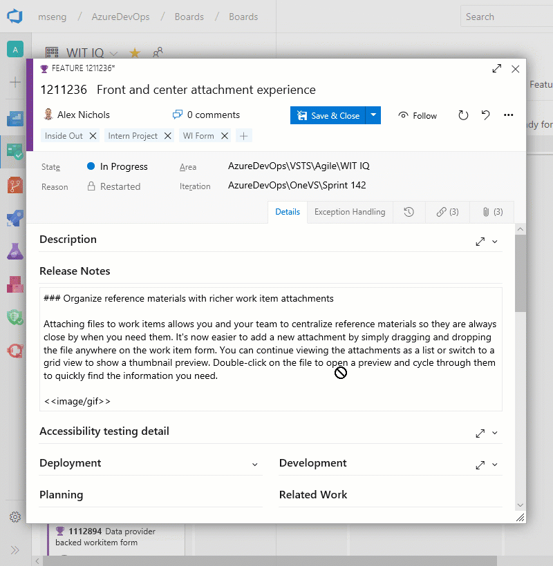
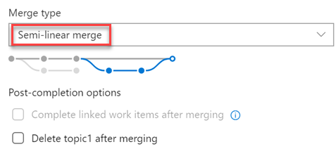
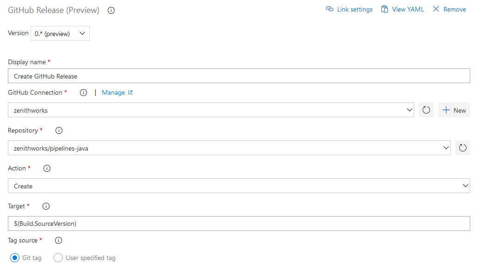
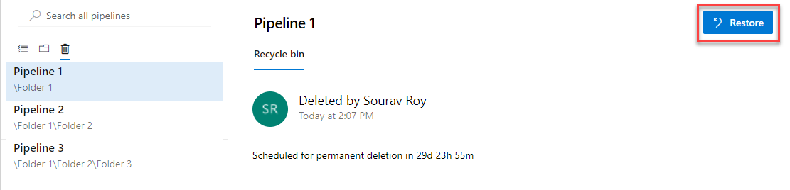
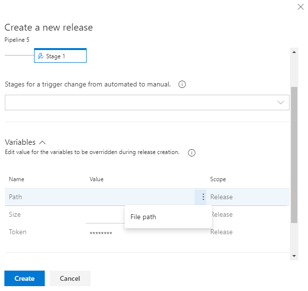
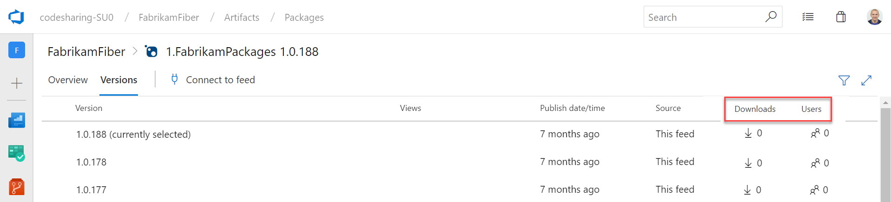
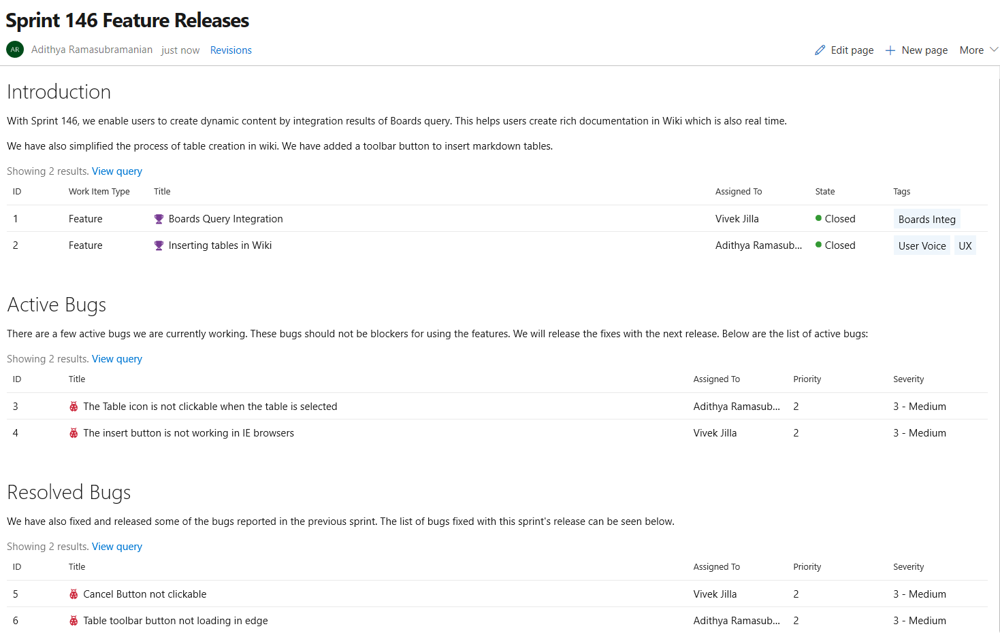
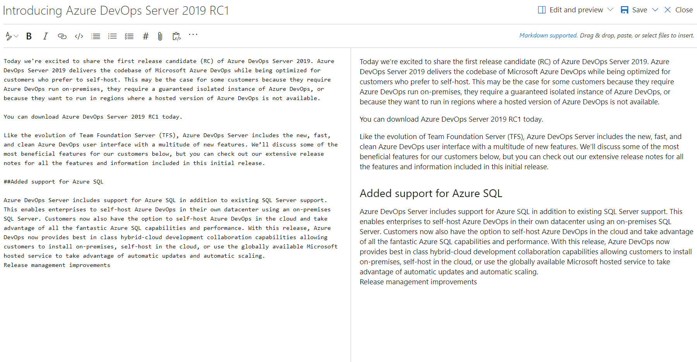

# <a id = "top"> </a> **Azure DevOps Server 2019 Update 1 Release Notes**

****

| <a href="https://developercommunity.visualstudio.com/spaces/22/tfs.html?topics=tfs" target="blank">Developer Community</a> 
| <a href="https://docs.microsoft.com/tfs/server/requirements?view=vsts" target="blank">System Requirements and Compatibility</a> 
| <a href="https://visualstudio.microsoft.com/license-terms" target="blank">License Terms</a> 
| <a href="https://blogs.msdn.microsoft.com/devops/tag/tfs/" target="blank">DevOps Blog</a> 
| <a href="https://docs.microsoft.com/tfs/release-notes/azuredevops2019-sha" target="blank">SHA-1 Hashes</a> |

****

In this article, you will find information regarding the newest release for Azure DevOps Server 2019 Update 1. Click the button to download Azure DevOps Server 2019 Update 1.

<a href="https://go.microsoft.com/fwlink/?LinkId=2097609" target="blank"></a>

To learn more, see [Azure DevOps Server Requirements](https://go.microsoft.com/fwlink/?LinkId=809018 "Azure DevOps Server Requirements"). Visit the <a href="https://visualstudio.microsoft.com/downloads" target="blank">visualstudio.com/downloads</a> page to download Team Foundation Server products. 

Direct upgrade to Azure DevOps Server 2019 Update 1 is supported from Azure DevOps Server 2019 or Team Foundation Server 2012 and newer. If your TFS deployment is on TFS 2010 or earlier, you need to perform some interim steps before upgrading to Azure DevOps Server 2019 Update 1. Please see the <a href="https://docs.microsoft.com/tfs/server/install/get-started" target="blank">Install page</a> for more information. 

****
## **RC2 Release Date: July 23, 2019**

RC2 includes several bug fixes since RC1 and is the final planned prerelease.

****

## **RC1 Release Date: July 2, 2019**

### Summary of What's New in Azure DevOps Server 2019 Update 1 RC1

Azure DevOps Server 2019 introduces many new features. Some of the highlights include:

* [New Basic process](#new-basic-process)
* [Query for work relative to the start of the day, week, month, or year](#query-for-work-relative-to-the-start-of-the-day-week-month-or-year)
* [Accept and execute on issues in GitHub while planning in Azure Boards](#accept-and-execute-on-issues-in-github-while-planning-in-azure-boards)
* [Rerun expired build for auto-complete pull requests](#rerun-expired-build-for-auto-complete-pull-requests)
* [New merge types for completing pull requests](#new-merge-types-for-completing-pull-requests)
* [Trigger YAML pipelines with tags](#trigger-yaml-pipelines-with-tags)
* [Task assistant for editing YAML files](#task-assistant-for-editing-yaml-files)
* [Web editor with IntelliSense for YAML pipelines](#web-editor-with-intellisense-for-yaml-pipelines)
* [Manage GitHub releases using pipelines](#manage-github-releases-using-pipelines)
* [Test result trend (Advanced) widget](#test-result-trend-advanced-widget)
* [Provenance information on packages](#provenance-information-on-packages)
* [Support for Python Packages](#support-for-python-packages)
* [Upstream sources for Maven](#upstream-sources-for-maven)
* [Embed Azure Boards query results in Wiki](#embed-azure-boards-query-results-in-wiki)
* [Permalinks for Wiki pages](#permalinks-for-wiki-pages)
* [Notifications on wiki pages](#notifications-on-wiki-pages)
* [Analytics extension no longer needed to use Analytics](#analytics-extension-no-longer-needed-to-use-analytics)

You can also jump to individual sections to see the new features:

* [General](#general)
* [Boards](#boards)
* [Repos](#repos)
* [Pipelines](#pipelines)
* [Test Plans](#test-plans)
* [Artifacts](#artifacts)
* [Wiki](#wiki)
* [Reporting](#reporting)

****

## General

### Dark Theme

The dark theme has been a popular feature on Azure DevOps Services and it is now available in Azure DevOps Server. You can turn on dark theme by selecting **Theme** from the menu underneath your avatar in the top right of every page.

> [!div class="mx-imgBorder"]
> 

## Boards

### New Basic process

Historically, Agile has been the default process for new projects, offering a robust and flexible set of work item types and states to suit a variety of project delivery methods. For some teams, who are more familiar with other tools or who are growing and want to adopt a more powerful tool set, want to get started quickly using terminology they are more familiar with.

The new Basic process provides three work item types (Epics, Issues, and Tasks) to plan and track your work. We recommend that you use Issues to track things like user stories, bugs, and features while using Epics to group Issues together into larger units of work. As you make progress on your work, move items along a simple state workflow of To Do, Doing, and Done.

> [!div class="mx-imgBorder"]
> 

See the [track issues and tasks](https://docs.microsoft.com/en-us/azure/devops/boards/get-started/track-issues-tasks?) documentation to help you get started with your new project.

### State value order on work item form

Previously, the state value on the work item form was ordered alphabetically. With this update we changed how the state values are ordered to match the workflow order in the process settings. You can also change the order of the states in each category in the state customization settings.

> [!div class="mx-imgBorder"]
> 

### Feature Enablement is no longer available

Customers will need to manually update the XML for each project in order to enable new features after upgrading their collection.

> [!div class="mx-imgBorder"]
> 

Refer to the [documentation](https://docs.microsoft.com/en-us/azure/devops/reference/add-features-manually?view=azure-devops-2019) to learn how to enable specific features.

### Organize reference materials with richer work item attachments

Attaching files to work items allows you and your team to centralize reference materials so they are always close by when you need them. It's now easier to add a new attachment by simply dragging and dropping the file anywhere on the work item form. You can continue viewing the attachments as a list or switch to a grid view to show a thumbnail preview. Double-click on the file to open a preview and cycle through them to quickly find the information you need.

> [!div class="mx-imgBorder"]
> 

### Share your team’s board using a badge

The repository’s README is often the home that your project team turns to for information about how to contribute to and use your solution. Now, like you can with a build or deployment status in Azure Pipelines, you can add to your README a badge for your team’s board in Azure Boards. You can configure the badge to show only the **In Progress** columns or all columns, and even make the badge visible publicly if your project is open source.

> [!div class="mx-imgBorder"]
> 

If your README is based on Markdown you can simply copy the sample Markdown from the status badge settings page and paste it into your file.

> [!div class="mx-imgBorder"]
> 

### Query for work relative to the start of the day, week, month, or year

While teams often focus on work within the context of what’s coming up next or based on sprint iterations, it’s often interesting to look back at work through the lens of the calendar to report on all the work that happened last month or in the first quarter of the year. Now you can use the following new set of <strong>@StartOf</strong> macros along with any date-based field to query based on the start of the day, week, month or year:

* @StartOfYear
* @StartOfMonth
* @StartOfWeek
* @StartOfDay

Each of these macros also accepts a new modifier string that lets you shift the data by different date units. For example, you can write a query to find all work items completed in the first quarter of this year by querying on State Change Date >= @StartOfYear and State Change Date <= @StartOfYear(“+3M”). See the [query macros](https://docs.microsoft.com/azure/devops/boards/queries/query-operators-variables?view=azure-devops#query-macros-or-variables) documentation for more information.

> [!div class="mx-imgBorder"]
> 

### Edit and delete discussion comments

We’re excited to announce the availability of a highly voted [Developer Community](https://developercommunity.visualstudio.com/content/idea/365434/edit-comments-on-tickets-discussion.html) feature, edit and delete of comments in your work item’s discussion in Azure Boards. To edit your comment, simply hover over any comment that you own, and you wil­­l see two new buttons. If you click the pencil icon, you will enter in to edit mode and can simply make your edits and press the "Update" button to save your edits. 

> [!div class="mx-imgBorder"]
> 

When you click the overflow menu, you will see the option to delete your comment. Once you click this, you will be prompt again to confirm that you want to delete this comment, and the comment will be deleted.

> [!div class="mx-imgBorder"]
> 

You will have a full trace of all the edited and deleted comments in the History tab on the work item form. You will also see that we’ve updated the UI of our discussion experience to make it feel more modern and interactive. We’ve added bubbles around comments to make it clearer where individuals comments start and end.

### Export query results to a CSV file

You can now export query results directly to a CSV format file from the web.

> [!div class="mx-imgBorder"]
> 

### Navigate to Azure Boards work items directly from mentions in any GitHub comment

Now when you mention a work item within the comment of an issue, pull request, or commit in GitHub using the `AB#{work item ID}` syntax, those mentions will become hyperlinks that you can click on to navigate directly to the mentioned work item.

This doesn't create a formal link that clutters up the work item in Azure Boards for every related conversation, but instead gives your team a way to provide a little more information about work items while discussing code or a customer-reported issue. See the [Azure Boards GitHub integration](https://aka.ms/azureboardsgithub) documentation for more information.

> [!div class="mx-imgBorder"]
> 

### Accept and execute on issues in GitHub while planning in Azure Boards

Now you can link work items in Azure Boards with related issues in GitHub. With this new type of linking, several other scenarios are now possible. If your team wants to continue accepting bug reports from users, for example, as issues within GitHub but relate and organize the team's work overall in Azure Boards, now you can.

> [!div class="mx-imgBorder"]
> 

The same mention syntax your team uses for commits and pull requests still applies and of course you can link manually in Azure Boards with the issue URL. See the [GitHub & Azure Boards](https://docs.microsoft.com/azure/devops/boards/github) documentation for more information.

> [!div class="mx-imgBorder"]
> 

### Quickly view linked GitHub activity from the Kanban board

When reviewing the Kanban board yourself or as a team, you often have questions such as "has this item started development yet?" or "is this item in review yet?" With the new GitHub annotations on the Kanban board, now you can get a quick sense of where an item is and directly navigate to the GitHub commit, pull request, or issue for more detail. See the [Customize cards](/azure/devops/boards/boards/customize-cards?view=azure-devops#enable-annotations-kanban-boards) documentation for more information about this and the other annotations for Tasks and Tests.

> [!div class="mx-imgBorder"]
> 

## Repos

### Draft pull requests

In order to prevent pull requests from being completed before they're ready and to make it easy to create work in progress that may not involve everyone, we now support draft pull requests.

Draft pull requests can be created by selecting **Create as draft** from the **Create** button drop down when creating a pull request.

> [!div class="mx-imgBorder"]
> 

Once you have created a draft pull request, you will see a badge indicating its status next to the title. 

> [!div class="mx-imgBorder"]
> 

Draft pull requests do not include reviewers or run builds by default but allow you to manually add reviewers and run builds. To promote the pull request to a normal pull request, simply click the **Publish** button from the pull request detail page.

### Rerun expired build for auto-complete pull requests

Azure Repos will now automatically queue expired builds that have been triggered by a pull request policy. This applies to pull requests that have passed all other policies and are set to auto-complete.

Previously, when pull requests had policies like required reviewers, the approval process could take too long and an associated build could expire before a reviewer approved the pull request. If the pull request was set to auto-complete it would remain blocked until a user manually queued the expired build. With this change the build will be queued automatically so that the pull request can auto-complete after a successful build.

> [!NOTE]
> This automation will only queue up to five expired builds per pull request and will only attempt to re-queue each build once.

### View just the left or right file in a pull request

Today, when viewing file changes in a pull request, you can use either a **Side-by-side diff** or **Inline diff** mode. We have received feedback that many of you just want to see the original file or the changed file, without comparing them, so we added a new option that will allow you to view either the left file or the right file individually.

> [!div class="mx-imgBorder"]
> 

### New merge types for completing pull requests

You now have more options when merging the changes from a pull request to the target branch. We have added support for two of our most requested features on the Developer Community: [Fast-Forward merging](https://developercommunity.visualstudio.com/idea/365639/enable-fastforward-merge-from-pullrequest.html) and [Semi-Linear merging](https://developercommunity.visualstudio.com/idea/365761/add-rebase-and-merge-to-pull-requests.html) (also called "Rebase and Merge").

You will now see these new options available in the **Complete Pull Request** dialog:

> [!div class="mx-imgBorder"]
> 

The updated policy administration page allows administrators to control which merge strategies are allowed on a branch or folder of branches.

> [!div class="mx-imgBorder"]
> 
> 
> [!NOTE]
> Existing policies are still enforced. For example, if your branch currently has a "squash merge only" policy in place, you will have to edit that policy in order to use the new merge strategies.

There are a few situations when rebasing during pull request completion is not possible:
* If a policy on the target branch prohibits using rebase strategies, you will need “Override branch policies” permission.
* If the source branch of the pull request has policies, you won’t be able to rebase it. Rebasing will modify the source branch without going through the policy approval process.
* If you’ve used the [Merge Conflict Extension](https://nam06.safelinks.protection.outlook.com/?url=https://marketplace.visualstudio.com/items?itemName%3Dms-devlabs.conflicts-tab&data=02%7c01%7cJoe.Bourne%40microsoft.com%7cb19b5f47678043aadffc08d6b126cda9%7c72f988bf86f141af91ab2d7cd011db47%7c1%7c0%7c636891177544782502&sdata=FaoKHy%2BZ5W/YI4rmT7E%2Bn22Kato/wrE18%2B3lWXPq778%3D&reserved=0) to resolve merge conflicts. Conflict resolutions applied to a three-way merge are seldom successful (or even valid) when rebasing all the commits in a pull request one at a time.

In all these cases, you still have the option of rebasing your branch locally and pushing to the server, or squash-merging your changes when completing the pull request.

### Filter by target branch in pull requests (PRs)

Pull requests let your team review code and give feedback on changes before merging them into the master branch. They have become an important part of many teams’ workflows since you can step through proposed changes, leave comments, and vote to approve or reject code changes.

To make it easier for you to find your pull requests, we added a filtering option to let you search for PRs using the target branch. 

> [!div class="mx-imgBorder"]
> 

You can also use the target branch filtering to customize the pull requests view in the **Mine** tab.

> [!div class="mx-imgBorder"]
> 

### Allow extensions to add syntax highlighting and autocomplete

Currently, we publish syntax highlighting for a subset of languages supported by the [Monaco editor](https://github.com/Microsoft/monaco-languages). However, many of you want to create your own syntax highlighting for languages that we don’t support.

With this update, we added an extensibility point that allows extensions to add syntax highlighting and autocomplete to the file explorer and pull requests views.

You can find an example of an extension demonstrating this feature [here](https://github.com/Microsoft/azure-devops-extension-sample/tree/master/src/Samples/CodeEditorContribution).

In addition, we added support for [Kusto language](https://docs.microsoft.com/en-us/azure/kusto/query/) syntax highlighting.

### Repository creation extension point

We've added an extension point to allow you to add new items to the repository picker. This extension point will let you add custom actions (redirects, popups, etc) to the repository picker menu, enabling flows like alternate repository creation scenarios.

> [!div class="mx-imgBorder"]
> 

### Improved encoding support

Previously, editing and saving files on the web would only save as UTF-8 encoding and we did not prompt you when the file encoding changed. Now, we will give you a warning when you try to save a file that is not UTF encoded via the web (which only supports UTF encoding). In addition, we added support for UTF-16 and UTF-32 encoding via the web pushes endpoint. This means that we will preserve the encoding type so you don't have to rewrite them as UTF-8.

The following screenshot shows and example of the dialog that you will see when you introduce encoding changes by a web push.

> [!div class="mx-imgBorder"]
> 

### Go get command support in Azure Repos 

Go is an open source programming language, also referred to as Golang. In Go, you can use the **get command** to download and install packages and dependencies. With this update, we've added support for `go get` within an Azure DevOps repository. With `go get`, you will be able to download packages with their dependencies named by the import paths. You can use the `import` key word to specify the import path. 

## Pipelines

### Web editor with IntelliSense for YAML pipelines

If you use YAML to define your pipelines, you can now take advantage of the new editor features introduced with this release. Whether you are creating a new YAML pipeline or editing an existing YAML pipeline, you will be able to edit the YAML file within the pipeline web editor. Use Ctrl+Space for IntelliSense support as you edit the YAML file. You will see the syntax errors highlighted and also get help on correcting those errors.

> [!div class="mx-imgBorder"]
> 

### Task assistant for editing YAML files

We continue to receive a lot of feedback asking to make it easier to edit YAML files for pipelines, so we are adding a task assistant to the YAML editor. With this, you will have the same familiar experience for adding a new task to a YAML file as in the classic editor. This new assistant supports most of the common task input types such as pick lists and service connections. To use the new task assistant, select **Edit** on a YAML-based pipeline, and then select the **Task assistant**.

> [!div class="mx-imgBorder"]
> 

### Trigger YAML pipelines with tags

YAML pipelines can be triggered when tags are added to a commit. This is valuable for teams whose workflows include tags. For instance, you can kick off a process when a commit is tagged as the "last known good".

You can specify which tags to include and exclude. For example:

```yaml
trigger:
  tags:
    include:
    - releases/*
    exclude:
    - releases/old*
```

### Declare container resources inline

Previously, we required you to declare your container resources in YAML pipelines, then reference them by name. We now offer an inline syntax for cases where you aren't going to refer to the container multiple times.

```yaml
jobs:
- job: my-container-job
  container:
    image: microsoft/dotnet:latest
```

### Setting to auto cancel an existing pipeline when a pull requests is updated

By default, pipelines triggered by pull requests (PRs) will be canceled if a new commit is pushed to the same PR. This is desirable in most cases since usually you don't want to continue running a pipeline on out-of-date code. If you don't want this behavior, you can add **autoCancel: false** to your PR trigger.

```yaml
pr:
  branches:
    include:
    - master
    - releases/*
  autoCancel: false
```
### Choose the directory of checked out code in YAML pipelines

Previously, we checked out repos to the `s` directory under $(Agent.BuildDirectory). Now you can choose the directory where your Git repo will be checked out for use with YAML pipelines.

Use the `path` keyword on `checkout` and you will be in control of the folder structure. Below is an example of the YAML code that you can use to specify a directory.

```yaml
steps:
- checkout: self
  path: my-great-repo
```

In this example, your code will be checked out to the `my-great-repo` directory in the agent’s workspace. If you don’t specify a path, your repo will continue to be checked out to a directory called `s`.

### New Azure App Service tasks optimized for YAML

We now support four new tasks which provide an easy yet powerful way to deploy Azure App Services with modern developers in mind. These tasks have an optimized YAML syntax making it simple and intuitive to author deployments to Azure AppServices, including WebApps, FunctionApps, WebApps for Containers and FunctionApp for Containers on both Windows and Linux platforms.

We also support a new utility task for file transformation and variable substitution for XML and JSON formats.

### Changes to default permissions for new projects

Up until now, project contributors could not create pipelines unless they are explicitly given "Create build definition" permission. For new projects, your team members can readily create and update pipelines. This change will reduce the friction for new customers that are onboarding to Azure Pipelines. You can always update the default permissions on the Contributors group and restrict their access.

### Manage GitHub releases using pipelines

GitHub releases are a great way to package and provide software to users. We are happy to announce that you can now automate it using GitHub Release task in Azure Pipelines. Using the task you can create a new release, modify existing draft/published releases or discard older ones. It supports features like uploading multiple assets, marking a release as pre-release, saving a release as draft and many more. This task also helps you create release notes. It also can automatically compute the changes(commits and associated issues) that were made in this release and add them to the release notes in a user friendly format.

Here is the simple YAML for the task:

```yaml
task: GithubRelease@0 
displayName: 'Create GitHub Release'      
inputs:
  githubConnection: zenithworks
  repositoryName: zenithworks/pipelines-java
  assets: $(build.artifactstagingdirectory)/*.jar
```

> [!div class="mx-imgBorder"]
> 

A sample GitHub release created using this task:

> [!div class="mx-imgBorder"]
> 

### Links to specific lines in a build log

You can now share a link to specific lines in the build log. This will help you when collaborating with other team members in diagnosing build failures. Simply select the lines of a log from the results view to get a link icon.

> [!div class="mx-imgBorder"]
> 

### Resource authorization improvements

We needed to provide security for protected resources (e.g., service connections, variable groups, agent pools, secure files) when referenced in a YAML file. At the same time, we wanted to make it easier for you to set up and use pipelines that use these types of resources for non-production scenarios. Previously, we added a setting to mark a resource as 'authorized for use in all pipelines'.

With this update, we are making it easier for you to fix a resource authorization problem even if you have not marked a resource as such. In the new experience, when a build fails because of a resource authorization error, you will see an option to explicitly authorize the use of those resources in the pipeline, and then proceed. Team members with permissions to authorize resources will be able to complete this action right from a failed build.

> [!div class="mx-imgBorder"]
> 

### New extension contribution points in the Pipelines Test tab

We've continued to make the extension framework more powerful by adding two new contribution points in the Test Results tab in Pipelines. This will enable [Marketplace extensions](https://marketplace.visualstudio.com/azuredevops) to provide more tailored reporting experiences and add further interactivity.

The two contribution points are:

1. **Custom Action button in the toolbar**

    Sometimes you may want to perform an action like updating an API's data or running custom tools using metadata from your test results. With this contribution point, you can create extensions which use the immediate context of the selected test result to add a custom action to the <em>*Custom Action</em>- button.

    > [!div class="mx-imgBorder"]
    > 

2. **Custom Details Tab in the details pane**

    You may have a wide variety of test report consumption workflows and may want to see different data points against failed tests for debugging and analysis. By using this contribution point, your team can add a new tab to the details pane that will come up when you select the any test result row in the data grid. This new tab can show a view with static content or dynamic data fetched using internal or external APIs.

### Run once agent

If you're using infrastructure such as Azure Container Instances to run elastic private agents, often, you want each agent to accept only one job before going away. Until now, this wasn't easy since you had to terminate the agent (possibly causing a failure to be reported) or accept the risk that an agent might receive another job before you could shut it down. With this update, we added the **--once** flag to the agent configuration. When you configure the agent this way, it'll accept only one job and then shut itself down.

### Agent pool user interface update

The agent pools management page in project settings has been updated with a new user interface. Now you can easily see all the jobs that are running in a pool. In addition you can learn why a job is not running.

> [!div class="mx-imgBorder"]
>  update")

### Deploy to failed targets in a Deployment Group

By default, **Azure Pipelines** used to re-run all jobs when you redeploy a previously failed run. Now, you can override this behavior by configuring the **Deployment Option** when deploying. By selecting the **All jobs and limit to failed targets in a deployment group** option, the re-run will run all the jobs and skip the deployments to the targets that are already up to date.  

> [!div class="mx-imgBorder"]
> 

### Automatically redeploy on failure

When a deployment to a stage fails, **Azure Pipelines** can now automatically redeploy the last successful deployment. You can configure the stage to automatically deploy the last successful release by configuring the **Auto-redeploy trigger** in the **Post-deployment conditions**. We plan to add additional triggered events and actions to the auto redeploy configuration in a future sprint. See the [Deployment groups](https://docs.microsoft.com/azure/devops/pipelines/release/deployment-groups/) documentation for more information.

> [!div class="mx-imgBorder"]
> 

### Grafana annotations service hook

We now support a new service hook that lets you add Grafana annotations for **Deployment Completed** events to a Grafana dashboard. This allows you to correlate deployments with the changes in application or infrastructure metrics that are being visualized in a Grafana dashboard.

> [!div class="mx-imgBorder"]
> 

### Query Azure Monitor alerts tasks

The previous version of the **Query Azure Monitors task** supported querying alerts only on the classic monitoring experience. With this new version of the task, you can query alerts on the unified monitoring experience recently introduced by Azure Monitor.

> [!div class="mx-imgBorder"]
> 

### Inline input of spec file in Deploy to Kubernetes task

Previously, the Kubernetes deployment task required you to provide a file path for the configuration. Now you can add the configuration inline as well.

> [!div class="mx-imgBorder"]
> 

### Docker CLI Installer task

This task allows installation of any version of Docker CLI on the agents as specified by the user.

> [!div class="mx-imgBorder"]
> 

### Restore deleted release pipelines

Deleting unused release pipelines helps to keep the release pipeline list clean but sometimes you delete something by mistake. With this update, it's now possible to restore a release pipeline that was deleted within the last 30 days. We added a new tab to the left panel of the Releases page that will display a list of deleted release pipelines. From this view you can restore a deleted release pipeline by selecting the pipeline from the list and clicking the **Restore** button.

> [!div class="mx-imgBorder"]
> 

### Notifications on failure of a release creation request

You can set notifications to receive emails as changes occur to your builds, code base, and other operations. For example, you can set an alert to get notified when a work item is assigned to you.

With this update, we added a new notification subscription to the **Release** category. This notification will send you an email when a request for a release creation fails. An example scenario where this may be useful is when a request to create a release fails because an artifact version is not available.
To learn how to manage your notifications see the documentation [here](https://docs.microsoft.com/azure/devops/notifications/howto-manage-personal-notifications).

> [!div class="mx-imgBorder"]
> 

### Schedule releases on source or pipeline change

Previously, when you had a scheduled release trigger, a release would get triggered even when there wasn't any change detected in the upstream artifact or in the release definition. An option has been added to the **Schedule release trigger** panel to schedule releases only if the artifact version or the release definition changed.

> [!div class="mx-imgBorder"]
> 

### Contribution point for variables in the create release dialog

Previously, the variables values needed during release creation had to be entered by the user without any assistance or suggestions. We've added contribution points to the **Create a new release** dialog to support extensions that will help populate the value of a variable during the release creation.

> [!div class="mx-imgBorder"]
> 

### Publish to Azure Service Bus session queues

We've extended the **Agentless job** build task to include the ability to publish messages to session queues. This option has been added to the **Publish to Azure Service Bus** task.

> [!div class="mx-imgBorder"]
> 

### New Azure subscription option in Kubernetes service connection

Service connections for builds and releases allow you to connect to external and remote services to execute tasks for a build or deployment. You can [define and manage a service connection](https://docs.microsoft.com/azure/devops/pipelines/library/service-endpoints#create-a-service-connection) from the Admin settings of your project.

With this update, we added an authentication option to the Kubernetes service connection form. Now you can select **Azure Subscription** to authenticate your connection. This makes it easy to deploy to specific namespaces by setting up Kubernetes connections with your Azure subscription and cluster name.

For a role-based access control (RBAC) enabled cluster, [ServiceAccount](https://kubernetes.io/docs/tasks/configure-pod-container/configure-service-account/) and [RoleBinding](https://kubernetes.io/docs/reference/access-authn-authz/rbac/#rolebinding-and-clusterrolebinding) objects are created in the chosen namespace. The RoleBinding object limits the operations of the created service account only to the chosen namespace. For an RBAC disabled cluster, the service account created has cluster-wide permissions across namespaces.

> [!div class="mx-imgBorder"]
> 

### Azure container registry in Docker registry service connection

Now you can create a Docker registry service connection from your project's settings page. To create the connection, choose an Azure container registry in one of the subscriptions associated with your Azure Active Directory (AAD) identity. All tasks requiring service connections to container registries such as **Docker@2** and **KubernetesManifest@0** will support a single way of specifying a connection.

> [!div class="mx-imgBorder"]
> 

### Search by folder name in release definitions

You can organize your release definitions by storing them in folders. Previously, you didn't have the option to do a search by folder. It was challenging to find a specific release definition if you had created a lot of folders. Now you can search by folder name in the release definition making it easier to find the definitions you are looking for.

> [!div class="mx-imgBorder"]
> 

### Duffle tool installer task in build and release pipeline

Duffle is a command line tool that allows you to install and manage Cloud Native Application Bundles (CNAB). With CNABs, you can bundle, install and manage container-native apps and their services.

In this update, we added a new task for build and release pipelines that allows you to install a specific version of Duffle binary.

> [!div class="mx-imgBorder"]
> 

### Kubernetes manifest task

We added a new task to our release pipelines to simplify the process of deploying to Kubernetes clusters using manifest files. This task will provide the following benefits in comparison to the usage of kubectl binary in scripts:

* Artifact substitution - The deploy action takes as input a list of container images which can be specified along with their tags or digests. This is substituted into the non-template version of the manifest files before applying it to the cluster to ensure that the right version of the image is pulled by the cluster's nodes.

* Manifest stability - Rollout status is checked for the Kubernetes objects deployed to incorporate stability checks while computing the task status as success/failure.

* Traceability annotations - Annotations are added to the deployed Kubernetes objects to superimpose traceability information about originating organization, project, pipeline, and run.

* Bake manifest - The bake action of the task allows for baking Helm charts into Kubernetes manifest files so that they can be applied to the cluster.

* Deployment strategy - Choosing canary strategy with deploy action leads to creation of desired percentage of workloads suffixed with **-baseline** and **-canary** so that they can be compared during a `ManualIntervention` task before utilizing the promote/reject action of the task to finalize the version to be retained.

```yaml
steps:
- task: KubernetesManifest@0
  name: bake
  displayName: Bake K8s manifests from Helm chart
  inputs:
    action: bake
    helmChart: charts/sample
    overrides: 'image.repository:nginx'

- task: KubernetesManifest@0
  displayName: Deploy K8s manifests
  inputs:
    kubernetesServiceConnection: k8sSC1
    manifests: $(bake.manifestsBundle)
    containers: |
      nginx: 1.7.9
```

### Upgrades to Docker task

We upgraded the Docker task to simplify the pipeline authoring experience. The **buildAndPush** command can now be used to build multiple tags for a specific container repository and push it to multiple container registries in a single step. The task can use Docker registry service connections for logging into container registries. Traceability metadata about source repository, commit and build provenance are added as labels to the images built using this task.

```yaml
steps:
- task: Docker@2
  displayName: Container registry login - ACR1 service connection
  inputs:
    command: login
    containerRegistry: acr1
- task: Docker@2
  displayName: Container registry login - ACR2 service connection
  inputs:
    command: login
    containerRegistry: acr2
- task: Docker@2
  displayName: Build and push images
  inputs:
    repository: test
    tags: |
      d1
      d2
```

### Kubectl tool installer

We added a new task that allows you to install a specific version of the Kubectl binary on the agents. The **latest** and **semver** version strings such as 'v1.14.0' are accepted as valid values for the Kubectl Version Spec input.

> [!div class="mx-imgBorder"]
> 

### Improvements to ServiceNow integration

A key capability for cross-team collaboration is to enable each team to use a service of their choice and have effective end-to-end delivery.
With this update, we enhanced the ServiceNow integration to support all types of changes (normal, standard and emergency). In addition, you can now specify the gate used to create a new change request using an existing template, as per the ITSM process followed in your organization. Finally, you can also gate releases based on existing change requests. This enables you to adopt CD, without needing to change the process recommended by your IT teams.

> [!div class="mx-imgBorder"]
> 

### Support for Red Hat Enterprise Linux 6

With this update, we added agent support for Red Hat Enterprise Linux 6. You can now configure agents targeting the Red Hat Enterprise Linux 6 platform for build and release jobs execution.

### Support for Azure PowerShell Az module

Azure PowerShell provides a set of cmdlets that you can use to manage Azure resources from the command line. Last December, the Azure PowerShell Az module became available and is now the intended module for managing your Azure resources. 

Previously, we didn’t provide support for the Azure PowerShell Az module in our hosted agents. With the new Azure PowerShell task version 4.* in build and release pipelines, we have added support for the new Az module for all platforms. Azure PowerShell task version 3.* will continue to support the AzureRM module. However, to keep up with the latest Azure services and features, we recommend that you switch to the Azure PowerShell task version 4.* as soon as possible.

The Az module has a compatibility mode to help you use existing scripts while you update them to use the new syntax. To enable compatibility for the Az module, use the `Enable-AzureRmAlias` command. Aliases let you use the old cmdlet names with Az module. You can get more details on migrating from the Azure RM module to the Azure PowerShell Az module [here](https://docs.microsoft.com/powershell/azure/new-azureps-module-az?view=azps-1.5.0#migrate-existing-scripts-to-az).

> [!NOTE]
> You need to install the Az module on your agent machine if you are using private agents.

For more information on the Azure PowerShell Az module, see the documentation [here](https://docs.microsoft.com/powershell/azure/new-azureps-module-az?view=azps-1.4.0&viewFallbackFrom=azps-1.3.0#the-future-of-support-for-azurerm).

### Azure Active Directory (AD) authentication support for Azure SQL task

The Azure SQL task has been enhanced to support connecting to a database using Azure AD (Integrated & Password) and a connection string in addition to the existing support for SQL server authentication.

> [!div class="mx-imgBorder"]
> 

### Publish build artifacts with long file paths

Until now, there was a limitation that prevented uploading build artifacts with paths longer than 233 characters. This could prevent you from uploading code coverage results from Linux and macOS builds with file paths longer than the limit. The limit has been updated to support long paths.

### Skip continuous integration (CI) for a commit

You can now tell Azure Pipelines to ignore a commit and skip running a pipeline that the commit would normally trigger. Just include `[skip ci]` in the commit message of the HEAD commit and Azure Pipelines will skip CI. You can also use any of the variations listed below. This is supported for commits to Azure Repos Git and GitHub Enterprise Server.

- `[skip ci]` or `[ci skip]`
- `skip-checks: true` or `skip-checks:true`
- `[skip azurepipelines]` or `[azurepipelines skip]`
- `[skip azpipelines]` or `[azpipelines skip]`
- `[skip azp]` or `[azp skip]`
- `***NO_CI***`

## Test Plans

### Test result trend (Advanced) widget

The **Test result trend (Advanced) widget** provides near real-time visibility into your test data for multiple builds and releases. The **Test result trend (Advanced) widget** displays a trend of your test results for your pipelines or across pipelines. You can use it to track the daily count of test, pass rate, and test duration. Tracking test quality over time and improving test collateral is key to maintaining a healthy DevOps pipeline.

> [!div class="mx-imgBorder"]
> 

The **Test result trend (Advanced) widget** helps you find outliers in your test results and answer questions like: are tests taking longer to run than usual? What test file or pipeline is affecting my overall pass rate? What are my long running tests?

To help you answer these questions, the widget provides these features:
* Displays a trend of pass rate, and count of test results or test duration
* Presents test results based on multiple build pipelines or release pipelines
* Uses combined charting options to display two metrics over the same trend
* Filters the test count over time by test outcome
* Filters all your test results by branch or test
* Stacks your metrics by test attributes such as **Priority** or **Environment**
* Group you data on Test files, owner or pipelines

The widget is highly configurable allowing you to use it for a wide variety of scenarios.

### Share test run results via URL 

You can configure automated tests to run as part of a build or release. The published test results can be viewed in the **Tests** tab in build or release summary. With this update, we added a **Copy results URL** feature so you can share a single test run results with others in your team. 

The sharing levels include:
   * Run level
   * Result level
   * Individual tab selected within test run 
   * Sharing is also compatible with any extension tabs configured

When you share the URL, viewers will see the test run results in the full screen view.

## Artifacts

### NuGet packages with SemVer 2.0.0 version numbers

Previously, Azure Artifacts did not support NuGet packages with SemVer 2.0.0 version numbers (generally, version numbers that contain the build metadata portion of the version, which is signified by a `+`). Now you can save packages from nuget.org that contain build metadata and push your own packages with build metadata. Per the [SemVer spec](https://semver.org/) and [NuGet.org policy](https://github.com/NuGet/Home/wiki/SemVer-2.0.0-support), build metadata cannot be used to order packages. So, you cannot publish both `1.0.0+build1` and `1.0.0+build2` to Azure Artifacts (or nuget.org) as those versions will be considered equivalent and thus subject to the [immutability constraints](https://docs.microsoft.com/en-us/azure/devops/artifacts/feeds/immutability).

### Provenance information on packages

With this update, we've made it a bit easier to understand the provenance of your packages: who or what published them and what source code commit they came from. This information is populated automatically for all packages published using the [NuGet](https://docs.microsoft.com/en-us/azure/devops/pipelines/targets/nuget?toc=/azure/devops/artifacts/toc.json&view=vsts&tabs=yaml), [npm](https://docs.microsoft.com/en-us/azure/devops/pipelines/targets/npm?toc=/azure/devops/artifacts/toc.json&view=vsts&tabs=yaml), [Maven](https://docs.microsoft.com/en-us/azure/devops/pipelines/packages/maven?toc=/azure/devops/artifacts/toc.json&view=vsts), and [Twine Authenticate](https://docs.microsoft.com/azure/devops/pipelines/artifacts/pypi?toc=/azure/devops/artifacts/toc.json&view=azure-devops&tabs=yaml) (for Python) tasks in Azure Pipelines.

### Package usage stats

Until now, Azure Artifacts didn’t provide a way to gauge the usage or popularity of packages. With this update, we added a count of **Downloads** and **Users** to both the package list and package details pages. You can see the stats on the right side of either page.

> [!div class="mx-imgBorder"]
> 

### Support for Python Packages

Azure Artifacts can now host Python packages: both packages you produce yourself and upstream packages saved from the public PyPI. For more details, see the announcement blog post and the [docs](https://docs.microsoft.com/en-us/azure/devops/artifacts/quickstarts/python-packages?view=vsts&tabs=new-nav). 

Now, you can now host all of your NuGet, npm, Maven, and Python packages in the same feed.

> [!div class="mx-imgBorder"]
> 

### Upstream sources for Maven

Upstream sources are now available for Maven feeds. This includes the primary Maven Central repository and Azure Artifacts feeds. To add Maven upstreams to an existing feed, visit **Feed settings**, select the **Upstream sources pivot**, then select **Add upstream source**.

> [!div class="mx-imgBorder"]
> 

### Proxy support for Artifacts-related tasks

Until now, many Artifacts-related build tasks didn't provide full support for Azure Pipelines' proxy infrastructure, which led to challenges using the tasks from on-premises agents. With this update, we've added support for proxies to the following tasks:

* Npm@1 ('npm' in the designer)
* NuGetCommand@2 ('NuGet' in the designer): restore and push commands only
* DotNetCoreCLI@2 ('.NET Core' in the designer): restore and nuget push commands only
* NpmAuthenticate@0, PipAuthenticate@0, and TwineAuthenticate@0 ('[type] Authenticate' in the designer): These tasks support proxies during the acquisition of auth tokens, but it is still necessary to configure any subsequent tasks/scripts/tools to also use the proxy. Put another way, these tasks do not configure the proxy for the underlying tool (npm, pip, twine).
* NuGetToolInstaller@0, NodeTool@0, DotNetCoreInstaller@0 ('[type] Installer' in the designer)

### All Artifacts package types supported in releases

Until now, only NuGet packages have been supported in the [Azure Artifacts artifact type](https://docs.microsoft.com/azure/devops/pipelines/release/artifacts?view=azure-devops#nuget) in Pipelines releases. With this update, all Azure Artifacts package types - Maven, npm, and Python - are supported.

### Artifacts views supported in releases

Previously, the Azure Artifacts artifact type could only trigger when new package versions were published to the feed. Now, we've also added support for views, so you can trigger releases when packages already in the feed are promoted to a view.

### Retention policies can skip packages downloaded recently

Until now, Azure Artifacts feeds have offered basic retention policies that would start deleting old package versions when a "maximum number of versions per package" was reached. With this update, we've added the ability to skip recently-downloaded packages when doing this clean-up. To enable, edit your feed and check the **Skip packages downloaded recently** checkbox.

### Delegate who can manage feeds

In Azure Artifacts, [Project Collection Administrators](https://docs.microsoft.com/en-us/azure/devops/organizations/security/set-project-collection-level-permissions?view=azdevops&tabs=new-nav) (PCAs) have always been able to administer all feeds in an Azure DevOps server. With this update, PCAs can also give this ability to other users and groups, thus delegating the ability to manage any feed.

## Wiki

### Markdown templates for formulas and videos

There is no longer a need to remember markdown syntax for adding [formulas](https://docs.microsoft.com/azure/devops/project/wiki/markdown-guidance?view=azure-devops#mathematical-notation-and-characters), [videos](https://docs.microsoft.com/azure/devops/project/wiki/markdown-guidance?view=azure-devops#embed-videos-in-a-wiki-page) and [YAML tags](https://docs.microsoft.com/azure/devops/release-notes/2018/aug-03-vsts#wiki) when editing a Wiki. You can now click on the context menu in the toolbar and select the option of your choice.

> [!div class="mx-imgBorder"]
> 

### Embed Azure Boards query results in Wiki

You can now embed Azure Boards query results in a wiki page in the form of a table.
The image below shows a sample of a wiki page with a list of all features released and all the active bugs in the current sprint embedded in the wiki. The content displayed in the page is using an existing work item query. With this new feature you can create dynamic content and not need to worry about manually updating the wiki page.

> [!div class="mx-imgBorder"]
> 

The query results can be added in two steps:

1. Click on the "Query Results" button from the edit toolbar.

> [!div class="mx-imgBorder"]
> 

2. Select the required query and click on "Insert" button.

The results of the query can now be viewed in the form of a table after you save the page.

> [!div class="mx-imgBorder"]
> 

### Monospaced font for Wiki Markdown editor

With the introduction of monospaced fonts for wiki Markdown editor, readability is no longer a challenge. The Markdown source looks clean and easy to read. This feature has been prioritized based on [this suggestion ticket](https://developercommunity.visualstudio.com/content/idea/365936/tfs-wiki-editor-monospaced-font.html).

> [!div class="mx-imgBorder"]
> 

### Permalinks for Wiki pages

Until now, shared Wiki page links broke if the linked page was renamed or moved. We've now introduced permanent links by adding a page IDs to the URL. This ensures that links you share remain intact as the wiki changes over time.

This feature was prioritized based on [this](https://developercommunity.visualstudio.com/content/idea/365921/add-permalinks-in-wiki.html) suggestion ticket.

### Show work item status in Wiki pages

In this update, we've enhanced work item mentions in Wiki pages by adding the status of the work item to the page, along with its ID and title.

> [!div class="mx-imgBorder"]
> 

Work item references in Pull Request comments and Boards discussions will also show the status.

This feature was prioritized based on [this](https://visualstudio.uservoice.com/forums/330519-azure-devops-formerly-visual-studio-team-services/suggestions/33715744-improve-work-item-display-in-wiki-page) suggestion.

### @mention users and groups

You can now @mention users and groups in a wiki page. This makes documents like a team's contact page, guidance documents and knowledge documents richer. The image below is an example showing a sprint retrospective with tasks and the person responsible.

> [!div class="mx-imgBorder"]
> 

In addition, you can also select a user or a group from the autosuggestion by typing "@" in the wiki edit page. The person mentioned will also get notified by mail.

> [!div class="mx-imgBorder"]
> 

Finally, you can also click on the @mentioned user to view the profile information card.
This feature has been prioritized based on [this](https://developercommunity.visualstudio.com/content/idea/365698/wiki-mention.html) feature suggestion.

### Notifications on wiki pages

Until now, you didn't have a way of knowing when the content on a  wiki page was changed. Now you can follow wiki pages to get notified via email when the page is edited, deleted or renamed. To track changes made to a wiki, select the **Follow** button from the wiki page.

> [!div class="mx-imgBorder"]
> 

This feature has been prioritized based on [this](https://developercommunity.visualstudio.com/content/idea/379604/wiki-notifications.html) suggestion ticket. To learn more, see our documentation [here](https://docs.microsoft.com/azure/devops/project/wiki/follow-notifications-wiki-pages?view=azure-devops).

### Support for HTML tags

Now, you can create richer content in wiki using HTML tags. Check out what you can do with HTML tags below.  

1. You can now create collapsible sections inside your wiki pages by using the **details** and **summary** tags. You can add the **open** attribute  to keep the details expanded by default.

    > [!div class="mx-imgBorder"]
    > 

    For more information on the **details** tag, take a look at the documentation [here](https://www.w3schools.com/tags/tag_details.asp). 

    This was prioritized based on [this suggestion ticket](https://developercommunity.visualstudio.com/content/idea/365782/wiki-collapsible-sections.html).

   > [!NOTE]
   > This tag is not supported in Edge and Internet Explorer browsers.

### Improved table creation and editing

Until now, creating and editing tables in a wiki was difficult. We've made changes to make it easier for you to add and manage tables in your wiki. 

1. Create a table from grid

    You no longer have to remember the markdown table syntax. Now you can create a markdown table easily by selecting from a 15 X 15 grid. Just select the required number of columns and rows to insert a table with a single click.

   > [!div class="mx-imgBorder"]
   > 

    This feature has been prioritized based on the following suggestion tickets:

   * [Table view for wiki](https://developercommunity.visualstudio.com/content/idea/365781/table-view-for-wiki.html)
   * [Make it simple to insert tables in wiki](https://developercommunity.visualstudio.com/content/idea/366218/make-it-simple-to-insert-tables-in-wiki-it-is-ridi-1.html)

2. Better table readability

    You can now toggle **word wrap** for your editor to have better readability of your tables. Disabling word wrap adds a scroll bar which lets you see the content of large tables easier.

   > [!div class="mx-imgBorder"]
   > 

3. Autoformating markdown tables

    You no longer have to add spaces to align your markdown columns. With the **Format tables** button, your markdown tables are automatically formatted by adding spaces to the cells to align the columns. If you have large tables, use it with **disable word wrap** to make the tables easier to read.​

   > [!div class="mx-imgBorder"]
   > 

    You can also use the **Ctrl + Shift + F** shortcut to format your tables.

## Reporting

### Analytics extension no longer needed to use Analytics

Analytics is increasingly becoming an integral part of the Azure DevOps experience. It is an important capability for customers to help them make data driven decisions. 
 
For Update 1, we're excited to announce that customers no longer need the Analytics extension to use Analytics. Customers can now enable Analytics underneath Project Collection Settings. It's a simple process that's right within the product.
 
Here is how customers can enable Analytics:
 
1. Navigate to Project Collection Settings:

> [!div class="mx-imgBorder"]
> 

2. Click **Enable Analytics**

> [!div class="mx-imgBorder"]
> 

And that's it! Analytics powered experiences will be turned on for the collection. 

New collections created in Update 1 and Azure DevOps Server 2019 collections with the Analytics extension installed that were upgraded will have Analytics enabled by default.

To learn more about Analytics and the experiences it enables:
* Read more about [enabling Analytics](https://go.microsoft.com/fwlink/?linkid=2093061&clcid=0x409).
* Read the [Analytics Overview documentation](https://docs.microsoft.com/en-us/azure/devops/report/powerbi/what-is-analytics?view=azure-devops-2019).
* Read up on the key features: [Analytics Widgets](https://docs.microsoft.com/en-us/azure/devops/report/dashboards/analytics-widgets?view=azure-devops-2019), [Top Failing Test Report](https://docs.microsoft.com/en-us/azure/devops/pipelines/test/test-analytics?toc=/azure/devops/report/analytics/toc.json&bc=/azure/devops/report/analytics/breadcrumb/toc.json&view=azure-devops-2019#view-test-analytics-for-builds), [Power BI Integration](https://docs.microsoft.com/en-us/azure/devops/report/powerbi/index?view=azure-devops-2019), and the [OData Endpoint](https://docs.microsoft.com/en-us/azure/devops/report/extend-analytics/index?view=azure-devops-2019).
* Watch [this Channel 9 Video on Azure DevOps Analytics](https://channel9.msdn.com/Events/connect/2017/T251).

****

## Feedback

We would love to hear from you! You can report a problem or provide an idea and track it through [Developer Community](https://developercommunity.visualstudio.com/spaces/22/index.html) and get advice on [Stack Overflow](https://stackoverflow.com/questions/tagged/tfs). 

****

<center><a href="#top" data-raw-source="[Top of Page](#top)">Top of Page</a></center>
<a id="bottom"> </a> 