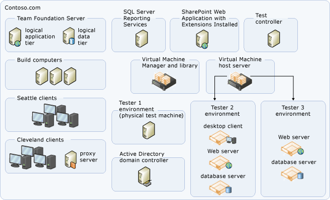

# Examples of Moderate Topology for Team Foundation Server

**TFS 2017** | **TFS 2015** | **TFS 2013**

You can configure Visual Studio Team Foundation Server in several
topology configurations. Generally speaking, the simpler the topology,
the more easily you can maintain a deployment of Team Foundation Server.
You should deploy the simplest topology that meets your business needs.
This topic describes a moderately complex topology, in which the logical
components of the data and application tiers of Team Foundation are
installed on separate physical servers. Client computers within the
trusted domains can access Team Foundation Server.

## A Moderate Server Topology

A moderate topology will use two or more servers to host the logical
components of the data and application tiers of Team Foundation. The
following illustration demonstrates a moderately complex topology for
Team Foundation Server:

In this example, the services for Team Foundation Server are deployed on
one server, referred to as an application-tier server, and the databases
for Team Foundation Server are installed on a separate server, referred
to as a data-tier server. A separate server hosts the SharePoint Web
application that Team Foundation Server uses, and another server hosts
the instance of SQL Server Reporting Services that Team Foundation
Server uses. The portal for each project is hosted on the
SharePoint Web application. Therefore, the administrator must configure
permissions for the users of that project on that Web application. The
same consideration applies to configuring permission for users in SQL
Server Reporting Services.  Team Foundation Build and the team's test
controllers are deployed on additional servers. In this illustration,
the domain for the Cleveland clients is a child domain of the parent
domain in Seattle. The child domain has a two-way transitive trust
relationship with its parent domain. The service account for Team
Foundation Server is trusted by both domains. Users in the child domain
can access the server, and they are authenticated automatically
by Windows integrated authentication. In this configuration, Team
Foundation Server Proxy is required and installed in the
Cleveland office. This example is designed for a moderately sized
product development team that has fewer than 1,000 users.

## See also

[Examples of simple topology](examples-simple-topo.md)

[Examples of complex topology](examples-complex-topo.md)

[TFS architecture](architecture.md)
