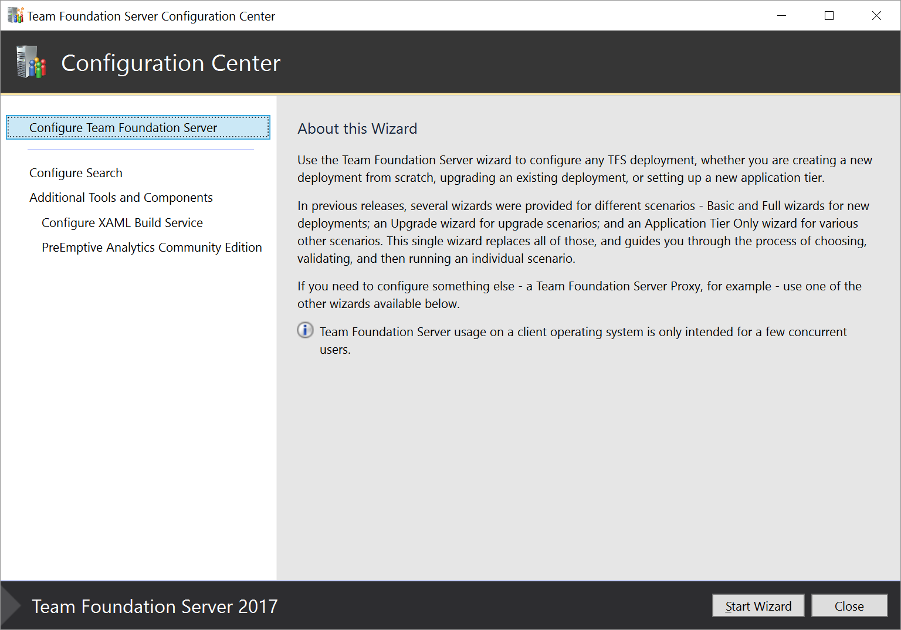

# Install and configure Azure DevOps Server or TFS

**Azure DevOps Server 2019 RC1** | **TFS 2018** |**TFS 2017** | **TFS 2015**

You have several choices in how to deploy Azure DevOps Server 2019 RC1 or Team Foundation Server (TFS). You can install everything on a single server. Or, you can use multiple application tiers and SQL instances. For information about determining the right type of deployment for your team, see [Hardware recommendations](../requirements.md#hardware-recommendations). 

- [Single server](single-server.md)    
	A single-server deployment is the easiest deployment, because the application tier and data tier are on the same machine.

- [Dual servers](dual-server.md)  
	A dual-server deployment, with separate application and data tiers can provide better performance for larger teams and teams with heavier usage.

- [Multiple servers](multiple-server.md)  
	This type of deployment, which involves multiple application and data tiers, often provides better performance for larger teams and teams with heavier usage. By using more than one server, you improve high availability and disaster recovery ability.

## Installations for evaluation or personal use

If you're setting up TFS for personal use or to evaluate it, use [TFS Express](https://www.visualstudio.com/downloads/). TFS Express is free, simple to set up, and installs on both client and server operating systems. TFS 2015 Update 2 and later supports all of the same features as TFS. TFS Express licensing limits it to five active users. 

Consider using a free [Azure DevOps Services organization](/azure/devops/accounts/create-account-msa-or-work-student) for personal use. Because Azure DevOps Services are cloud-based, you don't need to install them on your own hardware or manage your own backups.

## The deployment process

No matter how you plan to deploy Azure DevOps Server or TFS, deployment involves three steps: preparation, installation, and configuration: 

- Preparation: The installer prepares one or more servers for Azure DevOps Server or TFS by reviewing and following your system requirements. 

- Installation: The installer places executables on your server and runs an installer from VisualStudio.com or the Volume Licensing Service Center.
 
- Configuration: In this step, you use the appropriate configuration wizard to get your installation up and running. When you run a configuration wizard, it runs a series of readiness checks. These checks make sure that your system meets the requirements and that your setting selections are likely to work. If there are issues, you'll be presented with one or more warnings or errors. When all the errors have been resolved, you then run the configuration to finish setting up your deployment. 

    The configuration step varies by product:

    - Azure DevOps Server: When installation completes, the installer launches the Azure DevOps Server Configuration Center. A unified wizard supports all Azure DevOps Server configurations, such as new installations, upgrades, and application-tier-only scenarios. 

        

        If you need to close the configuration center, you can return to it by launching the Azure DevOps Server Administration Console and selecting **Configure Installed Features** from the **Application Tier** node.

        

    - TFS: When installation completes, the installer launches the Team Foundation Server Configuration Center. For TFS 2017 and later, a unified wizard supports all TFS configurations, such as new installations, upgrades, and application-tier only scenarios. For TFS versions earlier than TFS 2017, you pick the appropriate wizard for your scenario. 

        

        If you need to close the configuration center, you can return to it by launching the Team Foundation Server Administration Console and selecting **Configure Installed Features** from the **Application Tier** node.

        

    

    