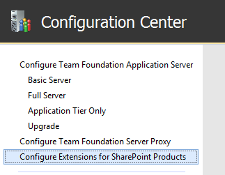
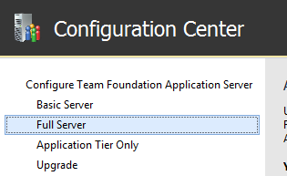
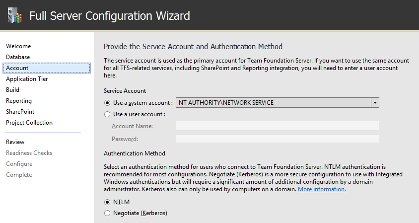
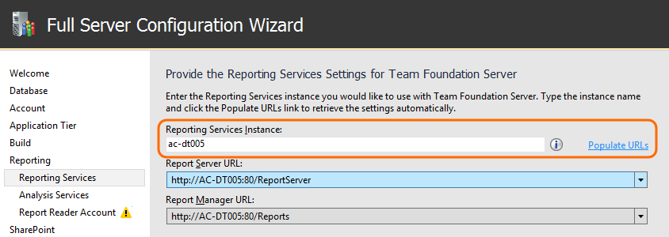
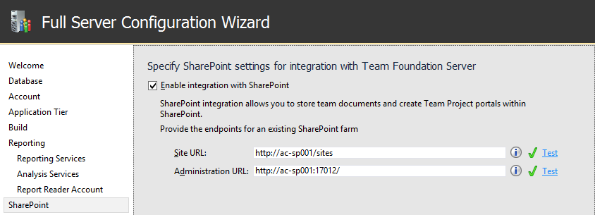
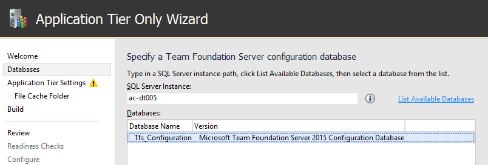
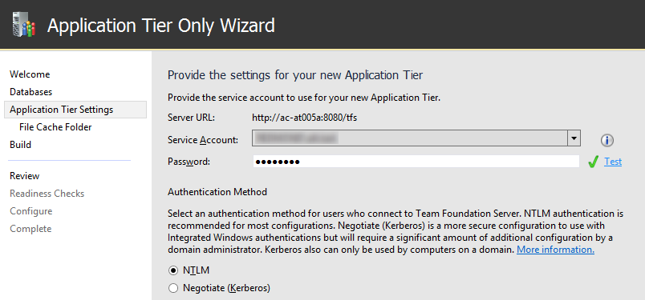

# How to set up TFS in a multiple server configuration

**TFS 2017** | **TFS 2015**

You can scale TFS up for thousands or tens of thousands of users
by deploying your application tier across many servers,
and you can ensure high availability by using SQL Server AlwaysOn Availability Groups.

> If you have an existing installation of TFS and you want to upgrade it,
> [use the upgrade wizard](../upgrade/run-upgrade-wizard.md).

## Data tier

0. Set up your SQL Server deployment using an [appropriate version of SQL Server](../requirements.md#sql-server).
Your deployment can be a single instance of SQL Server or an [AlwaysOn Availability Group](https://msdn.microsoft.com/library/gg509118.aspx).
When you set up SQL Server up for TFS, install the database engine and the full text search services.

	

0. Configure the firewall on each of the servers
to [allow access to the SQL Server database engine](https://msdn.microsoft.com/library/ms175043.aspx)
so that TFS can get through the firewall to connect to the SQL Server database engine
from the application tier server.

### Reporting

If you're going to enable reporting, prepare the data tier servers for that.

0. Install SQL Server Analysis Services.

	You can install Analysis Services on the server or AlwaysOn Availability Group where you installed the database engine,
	or you can install it on a separate SQL Server instance or a separate AlwaysOn Availability Group.

0. Configure the firewall on each of the Analysis Services servers
to [allow access to Analysis Services](https://msdn.microsoft.com/library/ms174937.aspx).

0. Install and configure SQL Server Reporting Services.

	You can install Reporting Services on the server or AlwaysOn Availability Group where you installed the database engine or Analysis Services,
	or you can install it on a separate SQL Server instance or a separate AlwaysOn Availability Group.

0. Configure the firewall on each of the Reporting Services servers 
to [allow access to Reporting Services](https://msdn.microsoft.com/library/bb934283.aspx).

### SharePoint

If you're going to enable SharePoint integration, prepare the data tier servers for that.

0. Install [an appropriate version of SharePoint](../requirements.md#sharepoint).

	You can install SharePoint Products on the server or AlwaysOn Availability Group where you installed the database engine,
	Analyisis Services, or Reporting Services,
	or you can install it on a separate SQL Server instance or a separate AlwaysOn Availability Group.

	If you already have SharePoint deployed, you can use that deployment instead of installing a new one.

0. Using the TFS Configuration Center, install the Team Foundation Server Extensions for SharePoint Products on your SharePoint server.

	

0. Add the identity of each of the application tier servers  that you'll set up - *{domain}\\{app-tier-server}$* -
to the Farm Administrators group in SharePoint.

## Application tier

You can scale up the application tier by installing TFS on multiple application tier servers.

### First application tier server.

0. If you're going to enable reporting, install SQL Server Client Tools Connectivity on the application tier server.

	

0. [Download](https://www.visualstudio.com/downloads/visual-studio-2015-downloads-vs.aspx) and install TFS and run the full configuration wizard.

	

0. On the database page, point to the SQL Server instance on the data tier and test the connection.

	

0. Set the service account and authentication method.

	

	By default, TFS services will run as a network service in a domain
	or as local system in a workgroup.
	On a domain,
	you can use a domain account
	and grant it only the permissions that the TFS service account needs.

#### Reporting

0. If you want to enable reporting, turn it on here.

	

0. Set the reporting service instance to your data tier and populate the reporting URLs.

	

0. Set the account that will be assigned the Reports Reader role in the Analysis Services instance
and test that the account and password can be authenticated.
Reports use this account when they access the Analysis Services database.

	

#### SharePoint

0. Point to your SharePoint instance and TFS will configure the site in SharePoint and hook it up to TFS.

	

	If you don't know the administration URL, go to the start menu and run the SharePoint administration application.
	That will open the adminstration web page and you can get the port from the URL in your browser.

### Additional application tier servers

0. If you're going to enable reporting,
install SQL Server Client Tools Connectivity on each additional application tier server.

	

0. [Download](https://www.visualstudio.com/downloads/visual-studio-2015-downloads-vs.aspx) and install TFS and run the application tier only configuration wizard.

	

0. Point to the SQL Server instance that is the primary replica in the AlwaysOn Availability Group
where you installed the database engine,
and list the available databases.

	

0. Set the service account and authentication method.

	

## AlwaysOn Availability Group

If you installed the database engine on a SQL Server AlwaysOn Availability Group,
add the TFS databases to the availability group.
- TfsConfiguration
- TfsDefaultCollection

If you add a new project collection to TFS, add that database to the AlwaysOn Availability Group, too.

