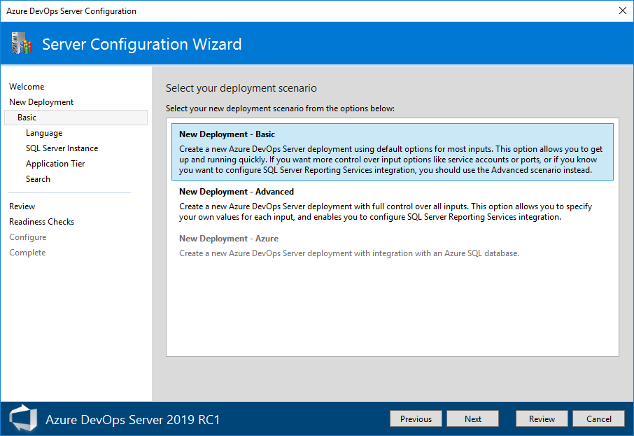
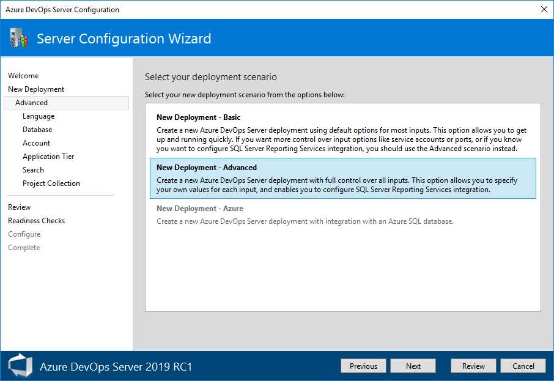

# Install Azure DevOps Server or TFS on a single server

**Azure DevOps Server 2019 RC1** | **TFS 2018** | **TFS 2017** | **TFS 2015**

There are three different options to use to install Azure DevOps Server or Team Foundation Server (TFS):

* Single-server install, which is covered in this guide
* Dual-server install
* Multiple-server install

The simplest way to set up Azure DevOps Server or TFS is to put everything on a single server. To confirm that this configuration is appropriate for your team, see the [hardware recommendations](../requirements.md#hardware-recommendations). If not, consider a [dual-server](../install/dual-server.md) or [multiple-server](../install/multiple-server.md) configuration instead.

> [!NOTE]
> If you upgrade from an earlier TFS version, see [Compatibility with TFS versions](../compatibility.md) and the [Release notes](../whats-new.md#tfs-2018-rc1).

## Preparation

1. Prepare a single computer that satisfies the [system requirements](../requirements.md) for Azure DevOps Server or TFS. 

1. If you don't plan to use SQL Server Express, set up an [appropriate version of Microsoft SQL Server](../requirements.md#sql-server). When you set up SQL Server for Azure DevOps Server or TFS, at a minimum install the Database Engine and Full-Text and Semantic Extractions for Search features.

	We recommend that you use SQL Server Express only for personal or evaluation deployments. Paid copies of Azure DevOps Server or TFS include a SQL Server Standard license. For more information, see [Azure DevOps Server pricing](https://azure.microsoft.com/pricing/details/devops/azure-devops-services/) and [Team Foundation Server pricing](https://www.visualstudio.com/team-services/tfs-pricing). If you use the included license, you can use it only for databases created with those products.

1. The account you use to configure the installation must be a member of the [sysadmin server role in SQL Server](https://msdn.microsoft.com/library/ms188659.aspx). 

    > [!NOTE]
    > Installing Azure DevOps Server or TFS involves a complex set of operations that require a high degree of privilege. These operations include creating databases, provisioning logins for service accounts, and more. Technically, all that's required is:
    > - Membership in the serveradmin role. 
    > - ALTER ANY LOGIN, CREATE ANY DATABASE, and VIEW ANY DEFINITION server-scoped permissions. 
    > - CONTROL permission on the master database. 
    > 
    >  Membership in the sysadmin server role confers all of these memberships and permissions. It's the easiest way to ensure that configuration succeeds. If necessary, you can revoke these memberships and permissions after installation. 

## Installation

1. Download Azure DevOps Server or TFS through one of the following channels:
	* [Visual Studio Downloads](https://visualstudio.microsoft.com/downloads/), which is the simplest method 
	* [Visual Studio Dev Essentials](https://msdn.microsoft.com/library/hh442898.aspx)
	* [Volume Licensing Service Center](https://www.microsoft.com/Licensing/servicecenter/default.aspx)

1. Start the installation. 

     The installer places executables onto your machine, and then starts the Server Configuration Center.

## Configuration

Configure Azure DevOps Server or TFS by using your selected scenario. The easiest way to set it up on a single server is to use the Server Configuration Wizard with the **New Deployment - Basic** scenario. 

> [!NOTE]
> For previous versions of TFS, use the Basic Configuration Wizard.
>

This scenario is optimized for simplicity by using default options for most inputs. If you want full control over all inputs, use the **New Deployment - Advanced** scenario instead. 

With the **New Deployment - Basic** scenario, select the following settings:

- **Language**: Select the language to use for configuring.
- **SQL Server Instance**: Select whether to install SQL Server Express or use an existing SQL Server instance.
- **Application Tier**: Select the website settings to use, which includes whether to use HTTP or HTTPS bindings. For more information, see [Web site settings](/azure/devops/security/websitesettings).
- **Search**: Select whether to install and configure Code Search features or use an existing search service. For more information, see [Configure search](/azure/devops/project/search/administration#config-tfs).

If you use the **New Deployment - Advanced** scenario, select the following additional settings:
    

- **Account**: Select the service account that your processes run as. The default value used in the Basic scenario is `NT AUTHORITY\NETWORK SERVICE` in domain-joined scenarios and `LOCAL SERVICE` in workgroup scenarios.
- **Application Tier**: 
    - Under **SSH Settings**, select whether to enable SSH and the port it should listen on. The default value used in the Basic scenario is to configure SSH on port 22.
    - Under **File Cache Location**, select the location of the file cache used for frequently accessed resources. The default value used in the Basic scenario is the path `TfsData\ApplicationTier\_fileCache` on the local drive, which has the most free space.
- **Project Collection**: Select whether to create a project collection in which to store your projects. Enter the name of that collection. The default behavior in the Basic scenario is to create a project collection named **DefaultCollection**.

After you review your selections and select **Verify**, the wizard runs readiness checks to validate your environment and your setting selections. If it's successful, you can configure your deployment. Otherwise, fix any errors and rerun the readiness checks.

## Next steps

* [Create a project](https://docs.microsoft.com/azure/devops/organizations/projects/create-project)
* [Upgrade your deployment](../upgrade/get-started.md)