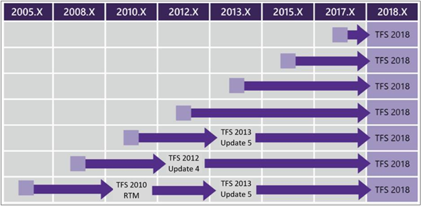

# Upgrade your deployment to the latest version of Azure DevOps Server or Team Foundation Server

**Azure DevOps Server 2019 RC** | **TFS 2018** | **TFS 2017** | **TFS 2015**

The general process for upgrading an existing deployment of Azure DevOps Server is to:

1. **Prepare your environment**

    New [system requirements](../requirements.md) may require an upgrade to hardware or software. Either way, an upgrade is a good time to consider whether the current environment is meeting your needs, or if it makes sense to make changes.

1. **Expect the best, prepare for the worst**

    Even though Azure DevOps Server upgrades are reliable, it always makes sense to prepare for a worst case scenario. The most important step is to make sure you have a complete and consistent set of [database backups](../admin/backup/config-backup-sched-plan.md) is available.

    > [!NOTE]
    > If you're upgrading in place and not moving to new hardware, consider a [dry run](pre-production.md) of your upgrade in a pre-production environment.

1. **Do the upgrade**!

    Once the preparation is done, you'll need to install the new version of Azure DevOps Server. Get the binaries and run through the installation process to upgrade your servers.

1. **Configure new features**

    You might need to [configure each project](/azure/devops/work/customize/configure-features-after-upgrade) to gain access to new features made available. You don't have to make all configurations immediately, but some features aren't available until they're configured. Depending on the project, make changes using the Azure DevOps Server setup wizard or manually in the **Management Console**.

## Previous versions

For previous versions of Team Foundation Server, the following **Upgrade Matrix** shows the proper steps to upgrade, based on what version you're upgrading from:

### Before you upgrade to TFS 2018

Since TFS 2017.2, the [old work item form <Layout> tag has been deprecated](https://blogs.msdn.microsoft.com/devops/2017/05/22/announcing-the-deprecation-of-the-old-work-item-form-in-tfs/) and is no longer supported in Azure DevOps Server. If you're upgrading your server and have a collection where the new work item form hasn't been enabled, you might have the following warning during validation:

> [VS403364]: This release introduces major updates to the work item form layout and functionality and deprecates legacy custom controls. Consequently, the upgrade process will update all work item type definitions to use the new work item form WebLayout element and remove all custom controls. For more information and recommended upgrade steps, see the Deployment Guide.

We recommend that you review [Handling a TFS 2018 upgrade from old form to new form](https://blogs.msdn.microsoft.com/devops/2017/05/22/announcing-the-deprecation-of-the-old-work-item-form-in-tfs) for further guidance.

### Before you upgrade to TFS 2017

If you use TFS with Project Server integration to synchronize your data, you should review the following articles:  

- [Synchronize TFS with Project Server](/azure/devops/work/tfs-ps-sync/sync-ps-tfs) on how native integration with Project Server is no longer supported. Instead a solution is provided by our partner, Tivitie.
- [Remove integration of TFS with Project Server](/azure/devops/work/tfs-ps-sync/remove-tfs-ps-integration) for steps on how to remove the integration. This step is to be completed after synchronization.

We also recommend that you review the options when [upgrading from TFS 2008 or TFS 2010](/azure/devops/work/customize/upgrade-tfs-2008-or-2010). With on the amount of customization you've made to your work tracking process, you'll want to choose between the options described.  

## Complexity

Upgrading a TFS deployment can differ depending on the specifics of your existing deployment. Factors that influence the complexity and duration of your upgrade include:

- Number of servers involved in the deployment
- A deployment configuration using SharePoint integration or reporting
- Size of the databases
- Version of the upgrade

In all cases, the general process is logically the same. Make sure your environment is ready, prepare, and do the upgrade.

## Downtime

Your TFS deployment will be offline for the duration of the upgrade and upgrade times can differ depending on the size of the deployment. You can keep your upgrades comparably fast by [cleaning up unnecessary data](/azure/devops/tfs-server/upgrade/clean-up-data). It also helps if you're keeping up with the latest versions of Azure DevOps Server.

> [!TIP]
> If you're upgrading a database to TFS 2015, consider using [TfsPreUpgrade](pre-upgrade.md). It performs the most expensive parts of the upgrade from TFS 2013 QU4/QU5 in the background, allowing you to continue using TFS, which can cut offline time significantly for large databases.

## See also

[Walkthrough a TFS Express upgrade](express.md)

[Walkthrough a standard upgrade scenario](walkthrough.md)

[Walkthrough an upgrade from TFS 2005 to TFS 2015](tfs-2005-to-2015.md)