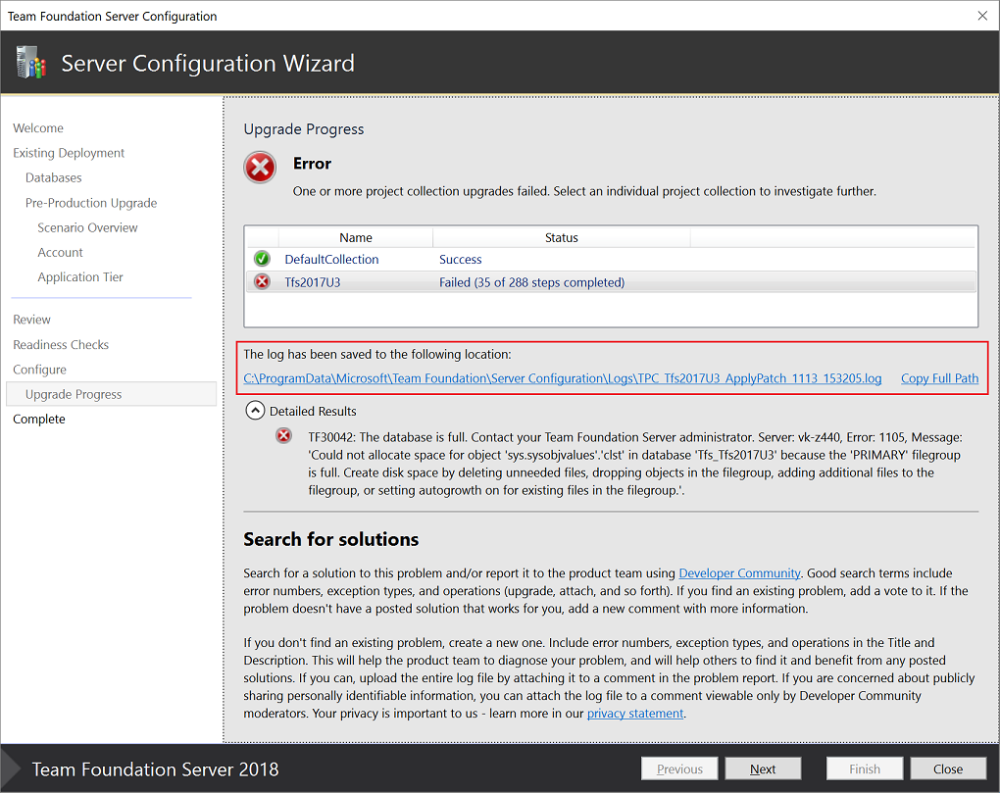
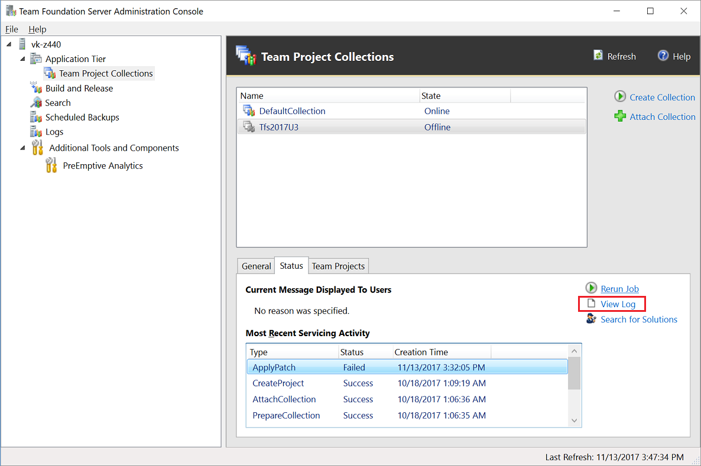
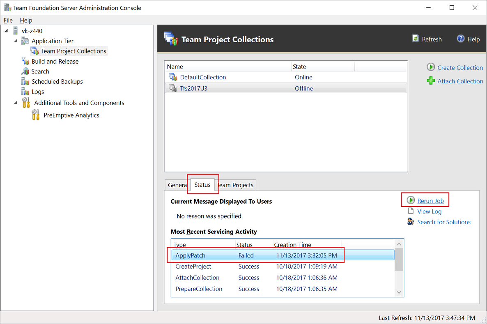

# Handling project collection upgrade failures

[!INCLUDE [temp](../_shared/version-tfs-all-versions.md)]

When one or more of your project collections has an upgrade failure,
you'll want to:

1. Resolve the issue.

2. Re-run the upgrade job for the project collection.

## Resolve the issue

Some upgrade failures are easy to diagnose and resolve. For example, your
database might have run out of disk space. For other kinds of failures, start by searching the [Azure DevOps Server support Knowledge Center](https://azure.microsoft.com/support/devops/), or the
[Developer Community](https://developercommunity.visualstudio.com/spaces/22/index.html).
Good search terms include "upgrade", the error message(s) reported in the
collection upgrade log file, and the names of any failed steps from that
log file.

If you kept the server configuration wizard open during collection upgrade, you can 
open the collection logs right from there.

If you closed the server configuration wizard while your collections were
upgrading, you'll need to open up the logs from the Azure DevOps Server Administration Console.

If you find an existing problem report for your issue, add a vote to 
it. If the problem report does not have a solution that works for you, add a new comment
to the problem with your additional information. If you don't find an existing problem at 
all, create a new one. Make sure to use the same terms you were searching for so that
others will be able to benefit from any posted solutions.
 
If you are still stuck, the best way to help the product team diagnose and solve your 
issue is to upload your entire log file. If you are concerned about publicly sharing personally 
identifiable information, you can attach the log file to a comment viewable only by Developer 
Community moderators. 

## Re-run the upgrade job

After you have resolved the issue, you'll need to re-run the upgrade job
for the collection(s) that failed. Select a collection in the
Azure DevOps Server Administration Console, select the **Status** tab, select the failed job, and
then select the **Rerun Job** link.

