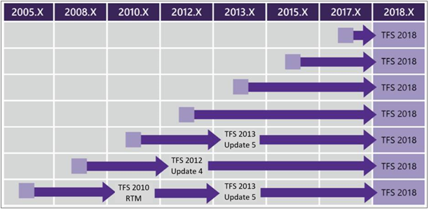

# Upgrade your deployment to the latest version of Azure DevOps Server

[!INCLUDE [temp](../_shared/version-tfs-2015-earlier.md)]

The general process you use to upgrade an existing deployment of Azure DevOps Server, previously named Visual Studio Team Foundation Server (TFS), is as follows:

- **Prepare your environment**.

    New [system requirements](../requirements.md) might require an upgrade to hardware or software. Either way, an upgrade is a good time to consider whether the current environment meets your needs, or if it makes sense to make changes.

- **Expect the best, prepare for the worst**.

    Even though Azure DevOps Server upgrades are reliable, it always makes sense to prepare for a worst-case scenario. Make sure you have a complete and consistent set of [database backups](../admin/backup/config-backup-sched-plan.md) available.

    > [!NOTE]
    > If you upgrade in place and don't move to new hardware, consider a [dry run](pre-production.md) of your upgrade in a pre-production environment.

- **Do the upgrade**.

    After you finish your preparation, install the new version. Get the binaries and run through the installation process to upgrade your servers.

- **Configure new features**. <!--- QUESTION: what needs to be said here for 2019? -->

	::: moniker range="azure-devops-2019"
    You might need to manually configure some work tracking options by updating XML definition files.

	::: moniker-end

	::: moniker range="<= tfs-2018"
    You might need to [configure each project](/azure/devops/work/customize/configure-features-after-upgrade) to gain access to new features that were made available. You don't have to make all configurations immediately, but some features aren't available until they're configured. Based on your project, use the Configure Features wizard to make changes or make changes manually by updating XML definition files.

	::: moniker-end

## Previous versions

For previous versions of Azure DevOps on-premises servers, the following upgrade matrix shows the proper steps to upgrade based on the version you upgrade from:

<!--- Image needs update --> 

## Before you upgrade to Azure DevOps Server 2019 <!---NEW SECTION --> 

When upgrading your on-premises deployment to Azure DevOps Server 2019 you should be aware of the following two items that impact work tracking customization and reporting. 

### Availability of Inheritance process model for new project collections

Azure DevOps Server 2019 provides support for using the Inheritance process model to customize your work tracking experience. You can only get access to this feature by creating a new project collection. Existing project collections will only support the On-premises XML process model.

If you choose the Inheritance process model for new project collections, you also automatically choose the Analytics Service to support reporting. You won't be able to add SQL Server reporting services to projects you add on the new project collections. 
If you choose On-premises XML process model for new project collections, you have access to both the Analytics Service and SQL Server reporting services. This is also true for existing collections that you upgrade. 
 
So, you'll want to consider your work tracking customization and reporting requirements as you move forward with new project collections. To learn more about these choices, see the following articles:

- [Inheritance process model](/azure/devops/organizations/settings/work/inheritance-process-model)  
- [On-premises process model](/azure/devops/reference/on-premises-xml-process-model?view=azure-devops-2019)  
- [Analytics service](/azure/devops/report/analytics/what-is-analytics)
- [SQL Reporting Services](/azure/devops/report/sql-reports/reporting-services-reports) 

### Deprecation of the Configure Features wizard

In the past, the Configure Features wizard was used to update default process templates with updates made to them. This feature is no longer supported in Azure DevOps Server 2019.

<!--- QUESTION: Any manual changes that need to be made? If they upgrade from ??? - what might they need to do here? -->

## Before you upgrade to TFS 2018

Since TFS 2017.2, the [old work item form <Layout> tag was deprecated](https://blogs.msdn.microsoft.com/devops/2017/05/22/announcing-the-deprecation-of-the-old-work-item-form-in-tfs/) and is no longer supported. If you upgrade your server and have a collection where the new work item form isn't enabled, you might see the following warning during validation:

> [VS403364]: This release introduces major updates to the work item form layout and functionality and deprecates legacy custom controls. Consequently, the upgrade process will update all work item type definitions to use the new work item form WebLayout element and remove all custom controls. For more information and recommended upgrade steps, see the Deployment Guide.

For more information, see [Handle a TFS 2018 upgrade from the old form to the new form](https://blogs.msdn.microsoft.com/devops/2017/05/22/announcing-the-deprecation-of-the-old-work-item-form-in-tfs).

## Before you upgrade to TFS 2017

Review the options when you [upgrade from TFS 2008 or TFS 2010](/azure/devops/work/customize/upgrade-tfs-2008-or-2010). Choose between the options described based on how much you customized your work-tracking process.

## Complexity

Upgrading an Azure DevOps on-premises deployment can differ based on the specifics of your existing deployment. Factors that influence the complexity and duration of your upgrade include the:

- Number of servers deployed
- Deployment configuration, integration with Reporting, SharePoint Products,  or Project Server 
- Size of the databases
- Version of the upgrade.

In all cases, the general process is logically the same. Make sure your environment is ready. Then prepare and do the upgrade.

## Downtime

Your Azure DevOps on-premises deployment is offline for the duration of the upgrade. Upgrade times can differ based on the size of the deployment. To keep your upgrades comparably fast, [clean up unnecessary data](/azure/devops/tfs-server/upgrade/clean-up-data). It also helps if you keep up with the latest versions of Azure DevOps Server.

## Related articles

- [Walk through a TFS Express upgrade](express.md)
- [Walk through a standard upgrade scenario](walkthrough.md)
- [Walk through an upgrade from TFS 2005 to TFS 2015](tfs-2005-to-2015.md)

