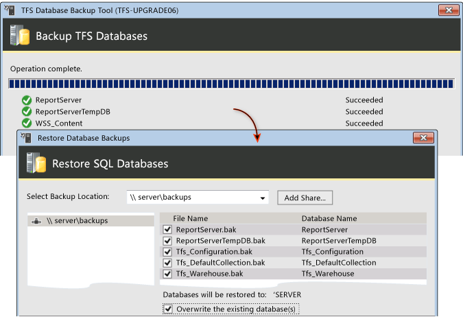
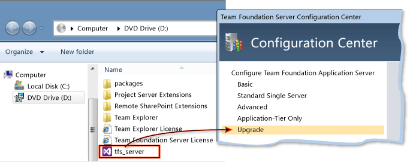

# Back up and restore data for TFS

[!INCLUDE [temp](../../_shared/version-tfs-2013-2015.md)]




## How to back up and restore TFS data to new hardware

If you haven't installed TFS on the new hardware yet, you'll want to
do that now. You can use TFS custom backup and restore tools to manage
your data.

> [!TIP]
> If you're upgrading from TFS 2012 with update 2 (TFS 2012.2) or
> higher, you can use the TFS built-in functionality to create your back
> up and restore it.

First you're going to back up your data, including the encryption key
on the report server that you used with the previous version of TFS.
Next, you're going to restore your data to the SQL Server instance you
set up in step 2. With the restore complete, you'll use the SQL Server
Reporting tool to restart the report server database, restore its
encryption key, and then verify access to the report server. If you
installed SharePoint, you'll use a SharePoint command line tool to
attach and upgrade your content database.

## Prerequisites

You must be a member of the administrators security group on Windows
server of the new hardware and the old.

If you plan to configure reporting, you must also be a member of the
administrators security group on the server that is running SQL Server
Reporting Services. If you plan to configure SharePoint Products, you
must be a member of the farm administrators group on the SharePoint
Products administration site. If you did not install the Database Engine
that will host the configuration database or a database administrator
manages the instance of SQL Server that you are using, you must be a
member of sysadmin Server role in SQL Server.


### Back up your data

If you haven't installed TFS on the new hardware yet, you'll want to
do that now to access the TFS custom backup and restore tools. You're
going to back up all of your TFS data, including the encryption key for
the report server.

> [!TIP]
> All your data needs to be backed up to the same point in time in order
> for the restore and upgrade to work correctly. The only reason to not
> back up a database would be, for example, if you have reporting in the
> old TFS instance, but you're not going to use reporting in the new TFS
> instance.

To run the Team Foundation Server installer:

  1.  Insert the Team Foundation Server DVD in the drive and launch the
      tfs\_server.exe file to begin the installation.

  2.  On the license terms dialog box, accept the license terms and then
      choose **Install Now**.

      If you want to install Team Foundation Server to a specific location
      in the file system, choose the browse button (...) next to the
      default install location.

To back up the encryption key for reporting services:

  1.  Launch **Reporting Services Configuration
      Manager**.

      The Reporting Services Configuration Connection dialog box opens.

  2.  Specify the name of the report server you used with the previous
      version of TFS and then choose **Connect**.

  3.  In the navigation bar on the left side, choose 
      **Encryption Keys**, and then choose 
      **Backup**.

      The Encryption Key Information dialog box opens.

  4.  In **File Location**, specify the location
      where you want to store a copy of this key.

      Consider storing this key on the new hardware, so that it's easily
      accessible when you restore the Reporting Services databases.

  5.  In **Password**, specify a password for
      the file.

      Don't forget the password! You'll need it later on to restore
      the Reporting Services databases.

  6.  In **Confirm Password**, specify the password
      for the file again.

  7.  Choose **OK**.

To back up your databases:

  1.  Launch TFSBackup.exe.

      The TFSBackup.exe tool is in the Tools folder where you installed
      Team Foundation Server. The default location is C:\\Program
      Files\\TFS 12.0\\Tools.

  2.  In **Source SQL Server Instance**, enter the
      name of the SQL Server instance that hosts the TFS databases you
      want to back up and choose **Connect**.

  3.  In Select databases to backup, choose the databases to back up.

      For more hlep: [List of TFS 2010 databases on MSDN](https://msdn.microsoft.com/library/ms400720(v=vs.100).aspx) and 
      [List of TFS 2012 databases on MSDN](https://msdn.microsoft.com/library/ms400720(v=vs.110).aspx).

  4.  In **Backup Databases to**, enter the name of
      a network share that is configured with read/write access for
      Everyone, or accept the default location in the file system of the
      SQL Server you connected to in step 2.

        > **Note:**
        > If you want to overwrite backups stored in this network location, you
        > can choose **Overwrite existing database backups at
        > this location**.

  5.  Choose **Backup Now**.

      The Backup tool reports progress on each database being backed up.

  6.  Choose **Close**.


### Restore your data

To restore your TFS data:

  1.  Launch TFSRestore.exe.

      The TFSRestore.exe tool is in the Tools folder where you installed
      Team Foundation Server. The default location is C:\\Program
      Files\\TFS 12.0\\Tools.

  2.  In **Target SQL Server Instance**, enter the
      SQL Server instance you will use as the data tier and choose 
      **Connect**.

  3.  Choose **Add Share** and enter the UNC path
      to the network share that is configured with read/write access to
      Everyone where you stored the backups of your TFS data. For
      example, \\\\servername\\sharename\\.

      If the backup files are located on the file system of the server
      that is running TFSRestore.exe, you can use the drop down box to
      select a local drive.

        > **Note:**
        > The service account for the instance of SQL Server you identified at the
        > start of this procedure must have read access to this share.

  4.  In the left hand navigation pane, choose the network share or local
      disk you identified in the previous step.

      The TFS Restore Tool displays the database backups stored on the
      file share.

  5.  Select the check boxes for the databases you want to restore to the
      SQL Server you identified at the start of this procedure.

        > [!IMPORTANT]
        > For SharePoint, you must only restore the WSS\_Content database. Do not
        > restore the WSS\_AdminContent or WSS\_Config databases. You want the new
        > SharePoint Foundation versions of these databases, not the ones from the
        > previous version of SharePoint or from a SharePoint installation running
        > on any other server.

  6.  Choose **Overwrite the existing database(s)**
      and then choose **Restore**.

      The Database Restore Tool restores your data and displays
      progress reports.

  7.  Choose **Close**.


### Fix up the report server

To restart the Reporting Services database and restore its encryption key: 

  1.  Launch the Report Server Configuration tool and restore the original
      reporting database and its encryption key to your new instance of
      SQL Server Reporting Services.

  2.  In **Reporting Services Configuration
      Connection**, specify the name of the server where you
      installed Reporting Services for TFS 2013 and choose 
      **Connect**.

  3.  On the **Database** page, choose 
      **Change Database**.

      The Report Server Database Configuration Wizard appears.

  4.  Choose **Choose an existing report server
      database** and then choose **Next**.

  5.  In **Server Name**, type the name of the SQL
      server you used in the TFS Database Restore Tool to restore your
      report server databases and choose **Next**.

  6.  Choose the report server database you restored with the TFS Database
      Restore Tool and then choose **Next**.

      If you haven't changed the name, the default database name
      is ReportServer.

  7.  On the **Credentials** page, choose 
      **Next**.

  8.  On the **Summary** page, review the
      information and then choose **Next**.

      The wizard configures the database and displays progress reports.

  9.  On **Encryption Keys** page, choose 
      **Restore**.

      The **Restore Encryption Key** window opens.

  10. In **File Location**, specify the location of
      the backup file for the encryption key. In 
      **Password**, specify the password you used when
      you backed up the encryption key, and then choose 
      **OK**.

      The status of the restoration appears in Results.

  11. On the **Scale-out Deployment** page, choose
      the previous report server from the scale-out deployment status page
      and choose **Remove Server**.

  12. On the **Report Manager URL** page, use the
      hyperlink in **URL** to launch the Report
      Manager site.

      The report manager site appears. Your report server has
      been restored.

  13. Choose **Exit** to close 
      **Reporting Services Configuration Manager**.


### Fix up SharePoint server

To run the STSADM command line tool for SharePoint:

  1.  Open a Command Prompt as an administrator on the new hardware that
      is running SharePoint Foundation.

  2.  Change directories to this location:

      ```Drive:\\Program Files\\Common Files\\Microsoft Shared\\Web Server Extensions\\15\\bin\\```

      Where *Drive* is the drive letter.

  3.  In the command prompt, type the following command:

      ```stsadm.exe -o addcontentdb -url http://WSSServerName /sites -databasename contentdatabase -databaseserver SQLServerName```

      Where:

        -   *WSSServerName* is the name of the
            SharePoint server;

        -   *contentdatabase* is the name of
            the content database;

        -   *SQLServerName* is the name of the
          SQL Server that hosts the content database.

  4.  In the command prompt, type the following command:

      ```stsadm.exe -o addpermissionpolicy -url http://WSSServerName -userlogin Domain\\UserName -permissionlevel "full control"```

      Where:

      1.  *WSSServerName* is the name of the
          SharePoint server;

      2.  *Domain\\UserName* is the user name
          and domain of the account used to run the TFS SharePoint
          configuration wizard and install SharePoint.


## Next Step: Run the TFS Upgrade Wizard

Run the Team Foundation Server install from the product DVD and then use
the Upgrade Configuration wizard to upgrade your installation.

For more information, see: [Run the TFS Upgrade Wizard](../run-upgrade-wizard.md)


